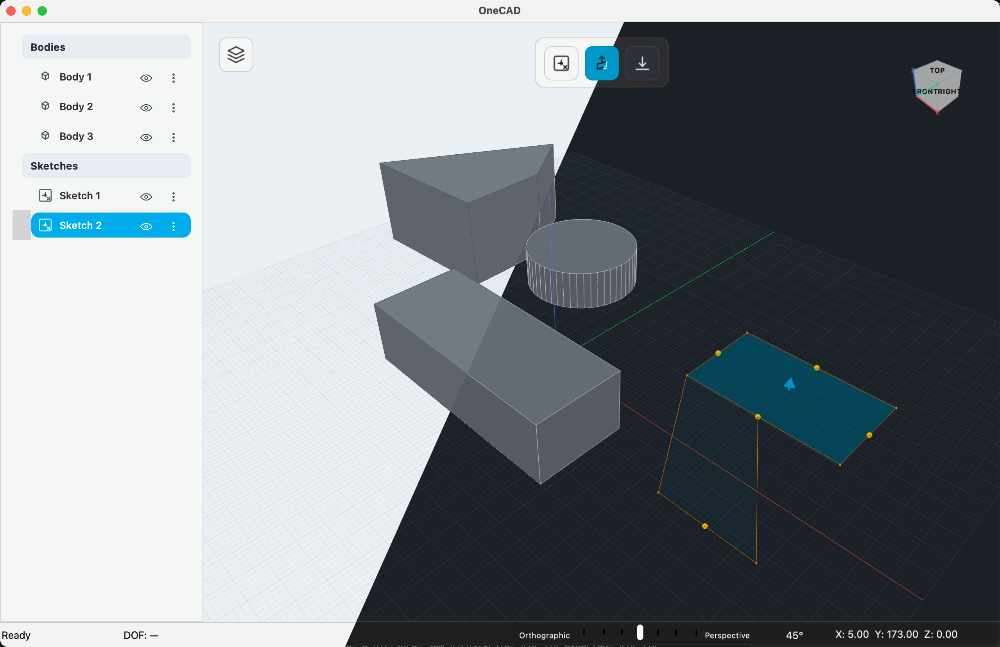

# OneCAD


> **⚠️ VibeCoding Alert**: Full codebase generated with AI. Project in active development—manual review & validation required.




## Overview

**OneCAD** is a free, open-source 3D CAD application for makers and hobbyists. Sketch 2D geometry, add constraints, create faces, then extrude to 3D. Inspired by Shapr3D, built with C++20 + Qt6 + OpenCASCADE.

### Current Status: Phase 2 Complete, Phase 3 In Progress

- ✅ Full sketching engine (~15,500 LOC)
- ✅ 15 constraint types with automatic inference
- ✅ PlaneGCS solver integration (1450 LOC)
- ✅ Extrude v1a with draft angle + Revolve complete
- ✅ Boolean operations (Union/Cut) working
- 🚀 Phase 3 (3D modeling) ~45% complete

### Implementation Matrix (Implemented vs Planned)

| Feature Area | Status | Notes |
|--------------|--------|-------|
| Sketching engine + constraints | ✅ Implemented | 7 tools, 15 constraints, PlaneGCS solver, loop detection |
| Selection & picking | ✅ Implemented | Deep select, click cycling, mesh-based 3D picking |
| Rendering (Shaded + Edges) | ✅ Implemented | BodyRenderer + SceneMeshStore + preview meshes |
| Adaptive Grid3D | ✅ Implemented | Pixel-targeted spacing |
| Extrude v1a | ✅ Implemented | SketchRegion, drag-to-commit, preview, draft angle (439 LOC) |
| Revolve | ✅ Implemented | Profile+Axis selection, drag interaction, boolean mode (427 LOC) |
| Boolean Union/Cut | ✅ Implemented | BRepAlgoAPI_Fuse/Cut + ModifyBodyCommand |
| Command + Undo/Redo | ✅ Implemented | Full CommandProcessor with transactions (197 LOC) |
| ViewCube | ✅ Implemented | 3D navigation widget |
| Extrude v1b | ⏳ Planned | Face input, smart boolean, override badge |
| Boolean Intersect | ⏳ Planned | BRepAlgoAPI_Common |
| Push/Pull | ⏳ Planned | Face offset + auto-boolean |
| Fillet/Chamfer | ⏳ Planned | BRepFilletAPI, edge chaining |
| Shell | ⏳ Planned | BRepOffsetAPI_MakeThickSolid |
| Patterns (Linear/Circular) | ⏳ Planned | Feature-level patterns |
| Feature history / regen | ⏳ Planned | DependencyGraph + RegenerationEngine |
| Native save/load (.onecad) | ⏳ Planned | JSON ops + BREP cache |
| STEP I/O | ⏳ Planned | Import/export pipeline |

### Technology Stack

- **C++20** — Modern C++ (CMake enforced)
- **Qt6** — GUI framework
- **OpenCASCADE (OCCT)** — Geometric modeling kernel
- **Eigen3** — Linear algebra
- **PlaneGCS** — Constraint solver
- **OpenGL 4.1 Core** — Rendering

### Platform Support (v1.0)

- **macOS 14+** (Apple Silicon native) — primary target
- **Intel Mac** — v2.0 planned
- **Linux/Windows** — future consideration

---

## Quick Links

- 📖 **[DEVELOPMENT.md](DEVELOPMENT.md)** — Setup, architecture, best practices, debugging
- 📋 **[docs/SPECIFICATION.md](docs/SPECIFICATION.md)** — Full product requirements (3700+ lines)
- 🗺️ **[docs/PHASES.md](docs/PHASES.md)** — Implementation roadmap
- 🔧 **[docs/ELEMENT_MAP.md](docs/ELEMENT_MAP.md)** — Topological naming system
- 🤖 **[.github/copilot-instructions.md](.github/copilot-instructions.md)** — AI development guidelines

---

## Key Features

### Sketching Engine (Phase 2 Complete)
- **7 tools**: Line, Arc, Circle, Rectangle, Ellipse, Mirror, Trim (2618 LOC total)
- **5 entity types**: Point, Line, Arc, Circle, Ellipse (with construction geometry toggle)
- **Constraint solver**: PlaneGCS with 15 constraint types (1450 LOC)
- **Automatic inference**: AutoConstrainer with 7 inference rules (1091 LOC)
- **Smart snapping**: SnapManager with 8 snap types, 2mm radius (1166 LOC)
- **Loop detection**: LoopDetector with DFS cycles + hole detection (1985 LOC)
- **Face builder**: OCCT bridge with wire repair (719 LOC)

### 3D Modeling (Phase 3 ~45%)
- ✅ **Extrude**: SketchRegion → body, preview, draft angle (439 LOC)
- ✅ **Revolve**: Profile+Axis, drag interaction, boolean mode (427 LOC)
- ✅ **Boolean ops**: Union/Cut via BRepAlgoAPI (92 LOC)
- ⏳ **Push/Pull**: Face offset (planned)
- ⏳ **Fillet/Chamfer**: Edge modification (planned)
- ⏳ **Shell**: Hollow solid (planned)
- ⏳ **Patterns**: Linear/Circular arrays (planned)

### User Experience
- **Zero-friction startup**: Open to blank document
- **Visual feedback**: Blue/green constraint states (DOF tracking)
- **Contextual toolbars**: Predictive tool suggestions
- **Real-time preview**: Extrude/Revolve with drag-to-commit
- **ViewCube**: 3D navigation widget
- **Undo/redo**: Full transaction support with command grouping

---

## Repository Structure

```
OneCAD/
├── src/
│   ├── app/              # Application lifecycle, CommandProcessor, Document
│   ├── core/
│   │   ├── sketch/       # Sketch entities, tools, constraints (~8000 LOC)
│   │   │   ├── tools/    # 7 tools (Line, Arc, Circle, Rectangle, Ellipse, Mirror, Trim)
│   │   │   ├── solver/   # ConstraintSolver + PlaneGCS adapter
│   │   │   └── constraints/  # 15 constraint types
│   │   └── loop/         # LoopDetector, FaceBuilder
│   ├── kernel/           # OCCT wrappers, ElementMap (topological naming, 955 LOC)
│   ├── render/           # Camera3D, Grid3D, SketchRenderer (2472 LOC), BodyRenderer
│   └── ui/
│       ├── viewport/     # 3D + sketch interaction
│       ├── toolbar/      # ContextToolbar
│       ├── tools/        # ExtrudeTool (439), RevolveTool (427), BooleanOperation
│       └── viewcube/     # ViewCube navigation
├── tests/                # Prototype executables
├── docs/                 # SPECIFICATION.md (3700+), PHASES.md
├── third_party/          # PlaneGCS (42MB static lib)
└── resources/            # Icons, shaders
```

---

## Contributing

### For Developers

Start here: **[DEVELOPMENT.md](DEVELOPMENT.md)** contains:
- ✅ Environment setup (macOS, Linux)
- ✅ Build instructions
- ✅ Architecture overview
- ✅ Code best practices (C++20, Qt, naming conventions)
- ✅ Guide to key systems (sketch engine, solver, rendering)
- ✅ Common development tasks (adding tools, constraints, debugging)
- ✅ Testing strategy (prototype executables)

### Quick Build

```bash
# Clone repository
git clone https://github.com/yourusername/OneCAD.git
cd OneCAD

# See DEVELOPMENT.md for full setup instructions
```

---

## License

MIT or Apache 2.0 (to be determined)

---

## Acknowledgments

- **OpenCASCADE (OCCT)**: Geometric modeling kernel
- **PlaneGCS**: Constraint solver
- **Qt6**: GUI framework
- **Eigen3**: Linear algebra library
- Inspired by **Shapr3D**, **FreeCAD**, **SketchUp**

---

## Project Status

| Phase | Status | Progress |
|-------|--------|----------|
| **Phase 1** Foundation | In Progress | ~75% |
| ↳ 1.1 Project & Rendering | ✅ | ~95% |
| ↳ 1.2 OCCT Kernel | Partial | ~40% |
| ↳ 1.3 Topological Naming | ✅ | ~90% |
| ↳ 1.4 Command & Document | In Progress | ~75% |
| **Phase 2** Sketching | ✅ Complete | 100% |
| **Phase 3** Solid Modeling | 🚀 In Progress | ~45% |
| ↳ 3.1 I/O Foundation | Not Started | 0% |
| ↳ 3.2 Parametric Engine | Not Started | 0% |
| ↳ 3.3 Modeling Operations | In Progress | ~60% |
| ↳ 3.4 Pattern Operations | Not Started | 0% |
| ↳ 3.5 UI Polish | Not Started | 0% |
| **Phase 4** Advanced Modeling | 📋 Planned | 0% |
| **Phase 5** Optimization | 📋 Planned | 0% |

See [docs/PHASES.md](docs/PHASES.md) for detailed roadmap.

---

**Want to contribute?** Check out [DEVELOPMENT.md](DEVELOPMENT.md) to get started!
