# OneCAD Software Specification Document

## Project: OneCAD — Beginner-Friendly 3D CAD for Makers

**Version:** 1.3  
**Target Platform:** macOS 14+ (Apple Silicon) — v1  
**Architecture:** Qt 6 + C++ + OpenCASCADE Technology (OCCT)  
**License:** Open Source (MIT or Apache 2.0)  
**Repository:** GitHub

---

## Table of Contents

1. [Executive Summary](#1-executive-summary)
2. [Technology Stack](#2-technology-stack)
3. [Modeling Paradigm](#3-modeling-paradigm)
4. [Units System](#4-units-system)
5. [Sketch System](#5-sketch-system)
6. [Construction Geometry & Face Creation](#6-construction-geometry--face-creation)
7. [Grid System](#7-grid-system)
8. [3D Modeling Operations](#8-3d-modeling-operations)
9. [Selection System](#9-selection-system)
10. [User Interface](#10-user-interface)
11. [Interaction Design](#11-interaction-design)
12. [Camera & Viewport](#12-camera--viewport)
13. [Data Model & Entity Management](#13-data-model--entity-management)
14. [Command & Undo/Redo System](#14-command--undoredo-system)
15. [File System](#15-file-system)
16. [Rendering System](#16-rendering-system)
17. [Error Handling](#17-error-handling)
18. [Performance Requirements](#18-performance-requirements)
19. [Preferences System](#19-preferences-system)
20. [OCCT Integration](#20-occt-integration)
21. [PlaneGCS Integration](#21-planegcs-integration)
22. [Platform & Distribution](#22-platform--distribution)
23. [Open Source Strategy](#23-open-source-strategy)
24. [Implementation Roadmap](#24-implementation-roadmap)
25. [Future Versions](#25-future-versions)
26. [Glossary](#26-glossary)
27. [Appendix](#27-appendix)

---

## 1. Executive Summary

### 1.1 Product Vision

**OneCAD** is a free, open-source 3D CAD application designed for hobbyists and makers. It provides an intuitive sketch-first workflow inspired by Shapr3D, enabling users to create 3D models for 3D printing, woodworking, and DIY projects without the complexity of professional CAD tools or the cost of commercial alternatives.

### 1.2 Core Philosophy

| Principle | Implementation |
|-----------|----------------|
| **Sketch-first workflow** | Draw 2D construction geometry, create faces, then extrude to 3D |
| **Direct modeling default** | Push/pull faces, immediate results |
| **Optional parametric history** | Feature tree available when needed |
| **Minimal contextual UI** | Show only relevant tools for current selection |
| **Automatic loop detection** | Shapr3D-style region highlighting |
| **Sketch-first workflow** | Draw 2D construction geometry, create faces, then extrude to 3D |
| **Direct modeling default** | Push/pull faces, immediate results |
| **Optional parametric history** | Feature tree available when needed |
| **Minimal contextual UI** | Show only relevant tools for current selection |
| **Automatic loop detection** | Shapr3D-style region highlighting |
| **Open source** | Community-driven development on GitHub |
| **Zero-friction startup** | Immediate entry to empty document (no welcome screen) |

### 1.3 Target User Profile

**Primary Persona: The Maker**
- Hobbyists creating parts for 3D printing
- Woodworkers designing furniture and jigs
- DIY enthusiasts building enclosures and brackets
- Students learning CAD fundamentals

**User Expectations:**
- No prior CAD experience required
- Results within minutes, not hours
- Focus on making, not learning complex software

### 1.4 Version Scope Summary

| Feature | v1.0 | v2.0 | Future |
|---------|:----:|:----:|:------:|
| Basic sketch tools (line, arc, circle, rectangle, ellipse) | ✅ | | |
| Automatic loop detection & region highlighting | ✅ | | |
| Constraint system | ✅ | | |
| Multi-sketch support with references | ✅ | | |
| Sketch on face with edge projection | ✅ | | |
| Extrude (one direction + draft angle) | ✅ | | |
| Extrude (symmetric, asymmetric, to face) | | ✅ | |
| Revolve | ✅ | | |
| Boolean operations | ✅ | | |
| Push/pull direct modeling | ✅ | | |
| Fillet & chamfer (variable radius) | ✅ | | |
| Linear & circular patterns | ✅ | | |
| Pattern along path | | ✅ | |
| Shell operation | | ✅ | |
| Spline/Bezier curves | | ✅ | |
| Text in sketches | | ✅ | |
| STEP import/export | ✅ | | |
| Native file format | ✅ | | |
| STL/OBJ export | | ✅ | |
| Full ElementMap (topological naming) | ✅ | | |
| View cube | ✅ | | |
| Light & dark themes | ✅ | | |
| Intel Mac support | | ✅ | |
| Onboarding tutorial | | ✅ | |
| iCloud preferences sync | | ✅ | |
| Auto-update | | ✅ | |
| Plugin API | | | ✅ |
| AI features | | | ✅ |

---

## 2. Technology Stack

### 2.1 Core Technologies

| Component | Technology | Version | Rationale |
|-----------|------------|---------|-----------|
| **UI Framework** | Qt 6 Widgets | 6.6+ | Cross-platform, mature CAD UI patterns |
| **Rendering** | Qt RHI | — | Metal backend on macOS |
| **Geometry Kernel** | OpenCASCADE | 7.8+ | Industry-standard B-rep, LGPL licensed |
| **Constraint Solver** | PlaneGCS | — | FreeCAD's proven 2D solver |
| **Linear Algebra** | Eigen3 | 3.4+ | High-performance, SIMD optimized |
| **Language** | C++20 | — | Modern features, performance |
| **Build System** | CMake | 3.25+ | Industry standard |

### 2.2 Platform Requirements — v1.0

| Requirement | Specification |
|-------------|---------------|
| **Operating System** | macOS 14 Sonoma or later |
| **Architecture** | Apple Silicon (M1/M2/M3/M4) native only |
| **GPU** | Metal-capable (all Apple Silicon) |
| **RAM** | 8 GB minimum, 16 GB recommended |
| **Storage** | 500 MB for application |

### 2.3 System Architecture Diagram


---

## 3. Modeling Paradigm

### 3.1 Hybrid Direct + Parametric Mode

OneCAD follows Shapr3D's hybrid approach with intelligent mode selection:


### 3.2 Mode Behavior Matrix

| Sketch State | User Preference | Behavior |
|--------------|-----------------|----------|
| Fully constrained | Not set | Prompt user, save choice |
| Fully constrained | Regenerate | Parametric regeneration |
| Fully constrained | Direct | No body update |
| Under-constrained | Any | Direct mode (no regeneration) |
| Mixed constraints | Any | Prompt user |

### 3.3 Parametric Mode Details

**When Enabled:**
- Feature tree recorded in document
- Operations stored with parameters
- Sketch edits trigger regeneration (if constrained)
- ElementMap tracks topology through operations

**When Disabled (Direct Mode):**
- Immediate geometry modification
- No automatic history
- Simpler mental model
- Lower memory footprint

### 3.4 Mode Configuration

| Setting | Location | Options |
|---------|----------|---------|
| Default mode for new documents | Preferences | Direct / Parametric |
| Sketch edit behavior | Preferences | Always Ask / Regenerate if Constrained / Always Direct |
| Per-document override | Document Properties | Inherit / Direct / Parametric |

---

## 4. Units System

### 4.1 Specification

| Setting | Value |
|---------|-------|
| **Supported Systems** | Metric only (v1) |
| **Default Unit** | Millimeters (mm) |
| **Display Precision** | User configurable (default 2 decimal places) |
| **Internal Representation** | Millimeters (double precision) |

### 4.2 Available Units

| Unit | Abbreviation | Conversion to mm |
|------|--------------|------------------|
| Millimeters | mm | 1.0 |
| Centimeters | cm | 10.0 |
| Meters | m | 1000.0 |

### 4.3 Unit Input Behavior

**Automatic Conversion:**
When user types a value with different unit than document default, the system automatically converts:

| Document Unit | User Types | System Interprets | Display Shows |
|---------------|------------|-------------------|---------------|
| mm | `25` | 25 mm | 25.00 mm |
| mm | `2.5 cm` | 25 mm | 25.00 mm |
| mm | `0.1 m` | 100 mm | 100.00 mm |

---

## 5. Sketch System

### 5.1 Core Concepts


### 5.2 Sketch Plane & Origin

**Plane Selection Options:**
- Standard planes: XY, XZ, YZ (through world origin)
- Existing planar face on any body

**Origin Placement:**

| Sketch Location | Origin Position |
|-----------------|-----------------|
| Standard plane (XY, XZ, YZ) | World origin (0, 0, 0) |
| Face on body | Center of face bounding box |

### 5.3 Multiple Sketches

| Capability | Supported |
|------------|-----------|
| Multiple sketches on same plane | ✅ Yes |
| Sketches referencing other sketches | ✅ Yes |
| Project edges from other sketches | ✅ Yes |
| Project edges from bodies | ✅ Yes |

### 5.4 Sketch on Face — Edge Projection

When user creates a sketch on an existing body face:


**Projected Edge Properties:**
- Displayed as construction geometry (dashed, muted color)
- Locked — cannot be directly edited
- Can be used as constraint references
- Updates if source face changes (with validation)

### 5.5 Face Change Validation

When a body face is modified and sketches reference it:


**Validation Prompt:**
> "This operation will affect sketches that reference this face. The following sketches may become invalid and require manual adjustment: [Sketch 1, Sketch 2]. Continue?"

### 5.6 Sketch Tools — v1.0

| Tool | Description | Shortcut | Parameters |
|------|-------------|----------|------------|
| **Line** | Single line segment | L | Start point, end point |
| **Rectangle** | Four-sided shape | R | Corner points or center + size |
| **Circle** | Circle by center and radius | C | Center, radius |
| **Arc** | Arc segment | A | Three points or center + angles |
| **Ellipse** | Ellipse by center and radii | E | Center, major radius, minor radius |

### 5.7 Sketch Exit Behavior

| Scenario | Behavior |
|----------|----------|
| Exit with complete faces | Normal exit, faces available for operations |
| Exit with only construction geometry | Keep all construction geometry in sketch |
| Exit with incomplete elements | Keep incomplete elements as construction |

**No geometry is deleted on sketch exit.** All construction geometry is preserved for future editing.

### 5.8 Constraint System

**Default Behavior:** Geometry remains free (unconstrained) until user explicitly adds constraints.

**Optional Auto-Constrain:** Preference setting to infer constraints during drawing.

| Setting | Behavior |
|---------|----------|
| Auto-constrain OFF (default) | No automatic constraints |
| Auto-constrain ON | Infer horizontal/vertical/coincident from cursor position |

### 5.9 Supported Constraints

| Category | Constraints |
|----------|-------------|
| **Positional** | Coincident, Horizontal, Vertical, Midpoint, On-Curve |
| **Relational** | Parallel, Perpendicular, Tangent, Concentric, Equal |
| **Dimensional** | Distance, Horizontal Distance, Vertical Distance, Angle, Radius, Diameter |
| **Symmetry** | Symmetric about line |

### 5.10 Degrees of Freedom (DOF)

| Entity | Base DOF |
|--------|----------|
| Point | 2 |
| Line Segment | 4 |
| Circle | 3 |
| Arc | 5 |
| Ellipse | 5 |

**Visual Feedback Colors:**

| State | Color | Meaning |
|-------|-------|---------|
| Fully constrained | Green | 0 DOF remaining |
| Under-constrained | Blue | DOF > 0 |
| Over-constrained | Orange | Redundant constraints |
| Conflicting | Red | Constraints cannot be solved |

---

## 6. Construction Geometry & Face Creation

### 6.1 Construction-First Workflow

**Core Principle:** All sketch geometry is construction geometry by default. Faces are created explicitly from detected closed loops.

```mermaid
flowchart TD
    A[User draws geometry] --> B[All lines are construction — dashed]
    B --> C[System continuously detects closed loops]
    C --> D[Valid regions auto-highlighted]
    D --> E{User action}
    E -->|Hover over region| F[Region preview highlight]
    E -->|Click region| G[Region selected]
    E -->|Continue drawing| B
    G --> H[Create Face command available]
    H --> I[Face created — solid fill]
```



### 6.2 Automatic Loop Detection

The system continuously analyzes sketch geometry to detect closed loops:


**Detection Behavior:**
- Runs automatically as user draws
- No manual "detect loops" button needed
- Regions highlighted in real-time
- Shapr3D-style visual feedback

### 6.3 Region Highlighting

| State | Visual Appearance |
|-------|-------------------|
| Potential region (not hovered) | Subtle fill, 10% opacity |
| Hovered region | Highlighted fill, 30% opacity |
| Selected region | Solid fill, 50% opacity |
| Face created | Solid fill, distinct color |

### 6.4 Face Properties

| Capability | Supported |
|------------|-----------|
| Multiple faces per sketch | ✅ Yes |
| Faces with holes (nested loops) | ✅ Yes |
| Partial face creation (some loops only) | ✅ Yes |
| Overlapping loops | Resolved by region detection |
| Self-intersecting loops | Detected and flagged as invalid |

### 6.5 Face Selection for Operations

**Workflow:**
1. System detects all valid regions in sketch
2. User hovers to preview individual regions
3. User clicks to select region(s)
4. User can select multiple regions (Shift+Click or box select)
5. Each region can be extruded separately or together

| Selection | Extrude Result |
|-----------|----------------|
| Single region | Single body |
| Multiple regions (same height) | Multiple bodies or single compound |
| Multiple regions (different heights) | Separate operations |

### 6.6 Construction Geometry Visibility After Face Creation

| Setting | Behavior |
|---------|----------|
| Default | Construction geometry hidden automatically |
| User preference | Can show construction geometry |
| Per-sketch toggle | Show/hide construction in model navigator |

### 6.7 Limitations — v1.0

| Feature | v1.0 Status |
|---------|-------------|
| Convert face edge back to construction | ❌ Not supported |
| Convert construction to face edge directly | ❌ Not supported (use Create Face) |

---

## 7. Grid System

### 7.1 Grid Specification

| Property | Behavior |
|----------|----------|
| **Visibility** | Always visible in sketch mode (user can hide) |
| **Toggle** | View menu or keyboard shortcut (G) |
| **Snap-to-Grid** | Enabled by default |
| **Snap Toggle** | Hold Alt to temporarily disable |
| **Grid Spacing** | Adaptive to zoom level |

### 7.2 Adaptive Grid Spacing


**Spacing Tiers:**

| Visible Area Width | Grid Spacing |
|-------------------|--------------|
| < 10 mm | 0.1 mm |
| 10 - 50 mm | 0.5 mm |
| 50 - 100 mm | 1 mm |
| 100 - 500 mm | 5 mm |
| 500 mm - 1 m | 10 mm |
| 1 - 5 m | 50 mm |
| > 5 m | 100 mm |

**Spacing Selection Logic:**
- Target ~30-50 grid lines visible on screen
- Smooth transitions during zoom (no jarring changes)
- Major/minor grid line distinction

### 7.3 Grid Appearance

| Element | Light Mode | Dark Mode |
|---------|------------|-----------|
| Major grid lines | #D0D0D0 | #505050 |
| Minor grid lines | #E8E8E8 | #383838 |
| Origin X axis | #FF4444 | #FF6666 |
| Origin Y axis | #44FF44 | #66FF66 |
| Origin Z axis | #4444FF | #6666FF |

---

## 8. 3D Modeling Operations

### 8.1 Operations Overview — v1.0

```mermaid
mindmap
  root((v1.0 Operations))
    Profile Based
      Extrude
        One direction
        Draft angle
      Revolve
    Boolean
      Union
      Subtract
      Intersect
    Direct Modeling
      Push/Pull Face
      Offset Face
    Modification
      Fillet — variable radius
      Chamfer — variable distance
    Pattern
      Linear Pattern
      Circular Pattern
```



### 8.2 Extrude Operation

#### 8.2.1 Basic Behavior

| Property | Specification |
|----------|---------------|
| **Direction** | Positive normal to sketch plane (default) |
| **Flip Direction** | User drags in opposite direction |
| **Distance Input** | Drag with on-screen editable value |
| **Draft Angle** | Secondary parameter (0° to 89°) |
| **Multi-face** | User selects which faces to extrude |

#### 8.2.2 Direction Determination


#### 8.2.3 Draft Angle

| Property | Specification |
|----------|---------------|
| Range | 0° to 89° |
| Default | 0° (no draft) |
| Input method | Secondary field in panel OR select axis/sketch line |
| Positive angle | Tapers inward (for mold release) |
| Negative angle | Tapers outward |

#### 8.2.4 v2.0 Additions

- Symmetric extrude (both directions equally)
- Asymmetric extrude (different distances each direction)
- Extrude to face/surface
- Extrude through all

### 8.3 Revolve Operation

| Property | Specification |
|----------|---------------|
| **Axis Selection** | User selects sketch line as axis |
| **Angle** | 0° to 360°, default 360° |
| **Direction** | Clockwise or counter-clockwise |
| **Multi-face** | User selects which faces to revolve |

### 8.4 Boolean Operations

| Operation | Description | Shortcut |
|-----------|-------------|----------|
| **Union** | Combine bodies into one | U |
| **Subtract** | Remove tool body from target | B |
| **Intersect** | Keep only overlapping volume | I |

**Workflow:**
1. Select target body (primary selection — blue)
2. Select tool body/bodies (secondary selection — violet)
3. Choose boolean operation
4. Preview shows result
5. Confirm or cancel

**Failure Feedback:**
When boolean fails (e.g., non-intersecting bodies):
- Visual indication of problem (highlight gap between bodies)
- Clear error message explaining cause
- Suggestion for resolution if applicable

### 8.5 Push/Pull Direct Modeling

| Property | Specification |
|----------|---------------|
| **Input** | Selected planar face |
| **Positive Distance** | Extrude outward (union with body) |
| **Negative Distance** | Cut inward (subtract from body) |
| **Multi-body scenario** | User selects which body to modify |
| **Adjacent Faces** | Automatically extended/trimmed |

**Body Selection for Push/Pull:**


### 8.6 Fillet Operation

| Property | Specification |
|----------|---------------|
| **Input** | Selected edge(s) |
| **Radius** | Per-edge radius supported |
| **Chain Selection** | Auto-select tangent edges (optional) |
| **Preview** | Real-time during radius adjustment |

**Variable Radius Workflow:**
1. Select multiple edges
2. All edges get same initial radius
3. User can click individual edge to set different radius
4. Each edge shows its radius value

### 8.7 Chamfer Operation

| Property | Specification |
|----------|---------------|
| **Input** | Selected edge(s) |
| **Distance** | Per-edge distance supported |
| **Mode** | Equal distance (v1) |
| **Preview** | Real-time during distance adjustment |

### 8.8 Pattern Operations

#### 8.8.1 Linear Pattern

| Property | Specification |
|----------|---------------|
| **Source** | Body or feature (context-dependent) |
| **Direction** | User-defined vector or edge reference |
| **Count** | Number of instances (including original) |
| **Spacing** | Distance between instances |
| **Mode** | Spacing or total extent |

#### 8.8.2 Circular Pattern

| Property | Specification |
|----------|---------------|
| **Source** | Body or feature (context-dependent) |
| **Axis** | User-selected line or edge |
| **Count** | Number of instances (including original) |
| **Angle** | Total angle or per-instance angle |
| **Mode** | Equal spacing or specific angle |

#### 8.8.3 Pattern Source Selection

| Context | Pattern Operates On |
|---------|---------------------|
| Direct modeling mode | Entire body |
| Parametric mode, body selected | Entire body |
| Parametric mode, feature selected | Individual feature |

### 8.9 Operation Preview

| Property | Specification |
|----------|---------------|
| **Style** | Full shaded preview |
| **Opacity** | Low opacity (30-40%) |
| **Update** | Real-time during parameter changes |
| **Performance** | Use coarse tessellation for preview |

---

## 9. Selection System

### 9.1 Selection Architecture


### 9.2 Selection Priority by Context

**Sketch Mode:**
1. Sketch vertex (highest)
2. Sketch edge
3. Sketch region
4. Construction geometry

**Modeling Mode:**
1. Vertex (highest)
2. Edge
3. Face
4. Body (lowest)

### 9.3 Click Cycling

When multiple entities overlap at cursor position:
- First click: Select highest priority entity
- Second click (same position): Select next entity
- Continue clicking: Cycle through all entities
- Click elsewhere: Reset cycle

### 9.4 Selection Colors

| Selection State | Light Mode | Dark Mode | Description |
|-----------------|------------|-----------|-------------|
| **Pre-selection (hover)** | Faded blue (#8080FF40) | Faded blue (#6060FF40) | Hover feedback |
| **Primary selection** | Vibrant blue (#2060FF) | Vibrant blue (#4080FF) | Selected entity |
| **Secondary selection** | Violet (#8040FF) | Violet (#A060FF) | Tool body in boolean |
| **Invalid selection** | Orange (#FF8020) | Orange (#FFA040) | Cannot apply operation |

### 9.5 Selection Modifiers

| Modifier | Behavior |
|----------|----------|
| **None** | Replace current selection |
| **Shift + Click** | Add to selection |
| **Cmd + Click** | Toggle in selection |

### 9.6 Box Selection

| Direction | Behavior | Default |
|-----------|----------|---------|
| Left-to-right | Select entities fully inside box | |
| Right-to-left | Select entities touching box (crossing) | ✅ Default |

**User Configurable:** Preference to swap behaviors or set single mode.

### 9.7 Selection Persistence

| Scenario | Behavior |
|----------|----------|
| Switch to compatible tool | Selection persists |
| Switch to incompatible tool | Selection cleared |
| Enter sketch mode | 3D selection cleared |
| Exit sketch mode | Sketch selection cleared |

**Compatible Tool Examples:**
- Face selected → Switch Extrude ↔ Push/Pull: Selection persists
- Edge selected → Switch Fillet ↔ Chamfer: Selection persists
- Body selected → Switch to Extrude: Selection cleared (needs face)

---

## 10. User Interface

### 10.1 Design Principles

| Principle | Implementation |
|-----------|----------------|
| **Minimal UI** | Show only relevant options for current context |
| **Contextual Tools** | Available actions change based on selection |
| **Progressive Disclosure** | Advanced options hidden until needed |
| **Visual Clarity** | Clear distinction between states |
| **Theme Support** | Light and dark modes |

### 10.2 Startup Experience (v1.0)

**Behavior:**
- Application launches directly into an empty new document ("Untitled 1").
- No "Welcome Screen", "Dashboard", or "Recent Files" window on startup.
- Focus is on immediate creation.

### 10.3 Main Window Layout

```mermaid
flowchart TB
    subgraph MainWindow["Main Window"]
        subgraph TopArea["Top Area"]
            MENU[Menu Bar]
            TOOLBAR[Context Toolbar — changes based on selection]
        end
        
        subgraph CenterArea["Center Split View"]
            subgraph LeftPanel["Left Panel — Collapsible"]
                NAV[Model Navigator — collapsed by default]
            end
            
            subgraph Viewport["3D Viewport"]
                CANVAS[Qt RHI Canvas]
                GRID[Sketch Grid]
                GIZMO[Operation Handles]
                VALUE[On-screen Value Display]
                VCUBE[View Cube — top right corner]
            end
            
            subgraph RightPanel["Right Panel — Collapsible"]
                PROPS[Property Inspector]
            end
        end
        
        subgraph BottomArea["Bottom Area"]
            STATUS[Status Bar: Tool | DOF | Coordinates]
        end
    end
```

### 10.3 Theme Support

| Theme | Description |
|-------|-------------|
| **Light Mode** | Light backgrounds, dark text |
| **Dark Mode** | Dark backgrounds, light text |
| **System** | Follow macOS appearance setting |

### 10.4 Contextual Toolbar

Location: **Top of window** (traditional position)

| Selection State | Visible Tools |
|-----------------|---------------|
| Nothing selected | New Sketch, Import |
| In sketch mode | Line, Rectangle, Circle, Arc, Ellipse, Constraints, Create Face |
| Sketch region selected | Extrude, Revolve |
| Body selected | Push/Pull, Pattern, Boolean group, Export |
| Edge(s) selected | Fillet, Chamfer |
| Two+ bodies selected | Union, Subtract, Intersect |
| Face on body selected | Push/Pull, Offset, New Sketch on Face, Extrude |

### 10.5 Context Menu (Right-Click)

Traditional hierarchical context menu:

```
┌─────────────────────────┐
│ ● Extrude              │  ← Primary action (bold)
│   Revolve              │
│   ─────────────────────│
│   Create Face          │
│   Add Constraint    ▶  │  ← Submenu
│   ─────────────────────│
│   Delete         ⌫     │
│   Hide                 │
│   Show All             │
│   ─────────────────────│
│   Properties...        │
└─────────────────────────┘
```

### 10.6 Property Inspector

**When nothing selected:**
- Show empty state with helpful tips
- "Select an entity to view its properties"
- Quick action suggestions

**When sketch entity selected:**
- Entity type and ID
- Coordinates/dimensions (editable)
- Applied constraints list
- DOF status

**When body selected:**
- Body name (editable)
- Volume
- Surface area
- Bounding box dimensions
- Face/edge/vertex count

**When operation active:**
- Operation name
- All parameters (editable fields)
- Preview toggle
- Apply / Cancel buttons

### 10.7 Model Navigator

**Location:** Left panel (collapsible)

**Default State:** All items collapsed

**Structure:**
```
📁 Document
├── 📦 Bodies
│   ├── Body 1
│   ├── Body 2
│   └── Body 1 + Body 2  (combined name example)
├── ✏️ Sketches
│   ├── Sketch 1 (on XY Plane)
│   └── Sketch 2 (on Body 1 Face 3)
└── 📋 Feature History (if parametric)
    ├── Extrude 1
    ├── Fillet 1
    └── Boolean Union 1
```

**Interactions:**
- Click: Select item
- Double-click body: Isolate (hide all others)
- Double-click sketch: Enter sketch edit mode
- Right-click: Context menu
- Eye icon: Toggle visibility

---

## 11. Interaction Design

### 11.1 Tool Activation Model

**Click-to-Activate:**


**Tool remains active** until:
- User completes operation
- User presses Escape
- User selects different tool

### 11.2 Dimension Input — Drag with Editable Value


**Key Behavior:**
- Typing a number **replaces** the current value (not append)
- Tab moves between parameters (e.g., distance → draft angle)
- Unit suffix in different unit auto-converts (e.g., "2.5 cm" → 25 mm)

### 11.3 Mouse/Trackpad Navigation

| Input | Action |
|-------|--------|
| **Left click** | Select entity |
| **Left drag (empty area)** | Box selection |
| **Left drag (on handle)** | Drag operation handle |
| **Right click** | Context menu |
| **Right drag** | Orbit camera |
| **Middle drag** | Pan camera |
| **Two-finger drag** | Pan camera |
| **Scroll wheel** | Zoom (centered on cursor) |
| **Pinch gesture** | Zoom (centered on gesture) |
| **Double-click face** | Start sketch on face |
| **Double-click sketch** | Enter sketch edit mode |

### 11.4 Keyboard Shortcuts

**Global:**

| Shortcut | Action |
|----------|--------|
| **Cmd+N** | New document |
| **Cmd+O** | Open document |
| **Cmd+S** | Save |
| **Cmd+Shift+S** | Save As |
| **Cmd+Z** | Undo |
| **Cmd+Shift+Z** | Redo |
| **Cmd+A** | Select all (context-dependent) |
| **Delete / Backspace** | Delete selected |
| **Escape** | Cancel / Deselect |
| **Space / Enter** | Confirm operation |

**Tools:**

| Shortcut | Tool |
|----------|------|
| **S** | Toggle sketch mode |
| **L** | Line |
| **R** | Rectangle |
| **C** | Circle |
| **A** | Arc |
| **E** | Extrude |
| **V** | Revolve |
| **F** | Fillet |
| **H** | Chamfer |
| **P** | Push/Pull |
| **U** | Union |
| **B** | Subtract |
| **I** | Intersect |

**View:**

| Shortcut | Action |
|----------|--------|
| **1** | Front view |
| **2** | Back view |
| **3** | Left view |
| **4** | Right view |
| **5** | Top view |
| **6** | Bottom view |
| **7** | Isometric view |
| **0** | Zoom to fit |
| **G** | Toggle grid visibility |

---

## 12. Camera & Viewport

### 12.1 Default View

| Property | Value |
|----------|-------|
| Initial view | Isometric |
| Initial zoom | Fit default grid (100mm visible) |

### 12.2 Orbit Center

**User Configurable Options:**

| Option | Behavior |
|--------|----------|
| World origin | Always orbit around (0, 0, 0) |
| Geometry center | Orbit around bounding box center of all geometry |
| Selection center | Orbit around selected entity center |
| Cursor point | Orbit around 3D point under cursor when orbit started |

**Default:** Geometry center (or world origin if no geometry)

### 12.3 Zoom Behavior

| Property | Specification |
|----------|---------------|
| Zoom center | Cursor position |
| Zoom speed | Configurable in preferences |
| Zoom limits | Min: 0.001mm visible, Max: 1km visible |

### 12.4 View Cube

**Location:** Top-right corner of viewport

**Appearance:**
```
    ┌─────────┐
    │   TOP   │
    │ L  F  R │
    │  BOTTOM │
    └─────────┘
```

**Interactions:**
- Click face: Snap to that standard view
- Click edge: Snap to edge view
- Click corner: Snap to isometric from that corner
- Drag on cube: Orbit camera
- Visual feedback: Highlight hovered element

**Standard Views from View Cube:**

| Click Target | View |
|--------------|------|
| Front face | Front view (-Y) |
| Back face | Back view (+Y) |
| Left face | Left view (-X) |
| Right face | Right view (+X) |
| Top face | Top view (+Z) |
| Bottom face | Bottom view (-Z) |
| Top-front-right corner | Isometric |

---

## 13. Data Model & Entity Management

### 13.1 Entity Identification

**Hierarchical Path with UUIDs:**

```
document-uuid/
├── body-uuid-1/
│   ├── face-uuid-1
│   ├── face-uuid-2
│   │   ├── edge-uuid-1
│   │   └── edge-uuid-2
│   └── ...
├── body-uuid-2/
└── sketch-uuid-1/
    ├── line-uuid-1
    ├── circle-uuid-1
    └── constraint-uuid-1
```

**Path Format:** `{parent-uuid}/{entity-uuid}`

**Benefits:**
- Globally unique identification
- Hierarchical relationships preserved
- Stable references for undo/redo
- Compatible with ElementMap

### 13.2 Entity Naming

**Auto-Generated Names:**

| Entity Type | Name Pattern | Example |
|-------------|--------------|---------|
| Body | "Body {n}" | Body 1, Body 2 |
| Sketch | "Sketch {n}" | Sketch 1 |
| Feature | "{Operation} {n}" | Extrude 1, Fillet 2 |

**Combined Body Naming:**
When bodies are combined via boolean union:
- Result name: "{Body A} + {Body B}"
- Example: "Body 1 + Body 2"

**User Rename:**
- Double-click name in navigator to edit
- Names stored in document, not derived

### 13.3 Topological Naming — ElementMap

**Implementation:** Full ElementMap from day 1


**ElementMap Tracks:**
- Which original faces contributed to each new face
- Which operation created/modified each element
- History chain for parametric regeneration
- Lightweight geometric descriptors for each element (bbox center/diagonal, area/length/volume) to re-identify when history is ambiguous

**Why Critical:**
- Prevents "topological naming problem"
- Enables reliable parametric updates
- Sketches on faces survive body modifications
- Very difficult to retrofit — must implement from start

**ElementMap Data Model:**
- ElementId: hierarchical `{parent-uuid}/{entity-uuid}` (matches Entity Registry)
- ElementKind: Body/Face/Edge/Vertex
- Fields per entry: `TopoDS_Shape`, descriptor, sources (list of contributing ElementIds), creating operation ID
- Reverse lookup: `TopoDS_Shape -> ElementId` using `TopTools_ShapeMapHasher`

**Update Algorithm (per modeling op):**
- Query OCCT history (`IsDeleted`, `Modified`, `Generated` or `TopTools_History`):
  - `Deleted`: remove entry
  - `Modified`: pick best match (history list prioritized; descriptor similarity fallback), update descriptor/opId
  - `Generated`: create child ElementIds under the source ElementId, infer kind from shape type
- Persist mappings in document/scene for regeneration, selection, constraints

**Selection & Constraints:**
- Persistent selections should use TNaming selector or ElementMap resolution backed by descriptors to survive recompute (e.g., sketch-on-face, fillet targets).

### 13.4 Entity Deletion Cascade


**Prompt Message:**
> "Deleting this sketch will affect the following bodies that were created from it: [Body 1, Body 2]. What would you like to do?"
> - Delete sketch and dependent bodies
> - Delete sketch only (bodies will become independent)
> - Cancel

---

## 14. Command & Undo/Redo System

### 14.1 Command Pattern Architecture


### 14.2 Undo/Redo Specifications

| Property | Specification |
|----------|---------------|
| Undo depth | Unlimited (memory permitting) |
| Object identity | Preserved across undo/redo |
| Transaction grouping | Related ops = single undo point |
| Redo clearing | New operation clears redo stack |
| Memory management | Old commands pruned if memory critical |

### 14.3 Transaction Grouping

Operations that create multiple internal commands appear as single undo:

| User Action | Internal Commands | Undo Shows |
|-------------|-------------------|------------|
| Create rectangle | 4 lines + 4 constraints | "Create Rectangle" |
| Pattern (5 copies) | 5 body creations | "Linear Pattern" |
| Fillet (3 edges) | 3 fillet operations | "Fillet" |

---

## 15. File System

### 15.1 File Locations

| Type | Location |
|------|----------|
| **Documents (default)** | `~/Documents/OneCAD/` |
| **Autosave** | `~/Library/Application Support/OneCAD/Autosave/` |
| **Preferences** | `~/Library/Preferences/com.onecad.app.plist` |
| **Cache** | `~/Library/Caches/OneCAD/` |
| **Logs** | `~/Library/Logs/OneCAD/` |

### 15.2 File Formats — v1.0

| Format | Extension | Direction | Description |
|--------|-----------|-----------|-------------|
| **OneCAD Native** | `.onecad` | Read/Write | Full model with optional history |
| **STEP** | `.step`, `.stp` | Import/Export | Industry standard exchange |

### 15.3 Native Format Structure


### 15.4 Autosave

| Property | Value |
|----------|-------|
| Interval | 5 minutes (configurable) |
| Location | Application Support directory |
| Format | Native format with `.autosave` extension |
| Naming | `{original-name}-{timestamp}.autosave` |
| Cleanup | Remove autosaves older than 7 days |

### 15.5 Recent Files

| Property | Value |
|----------|-------|
| Count | 10 files |
| Location | File menu |
| Persistence | Stored in preferences |
| Missing file handling | Show grayed with "(not found)" |

---

## 16. Rendering System

### 16.1 Qt RHI Configuration

| Property | Specification |
|----------|---------------|
| Backend | Metal (macOS) |
| Render mode | On-demand (not continuous) |
| VSync | Enabled |
| Sample count | 4x MSAA |

### 16.2 Display Modes

| Mode | Description | Default |
|------|-------------|:-------:|
| **Shaded + Edges** | Solid shading with edge overlay | ✅ |
| **Shaded** | Solid shading only | |
| **Wireframe** | Edges only | |

### 16.3 Tessellation Strategy

**Progressive Tessellation:**


| Phase | Tessellation Quality | Purpose |
|-------|---------------------|---------|
| Immediate | Coarse (fast) | Instant feedback |
| Background | Fine (quality) | Final display |
| Cached | Fine | Reuse on view changes |

**Tessellation Parameters:**

| Quality | Linear Deflection | Angular Deflection |
|---------|-------------------|-------------------|
| Coarse | 1.0 mm | 5° |
| Medium | 0.1 mm | 1° |
| Fine | 0.01 mm | 0.5° |

### 16.4 Visual Elements

| Element | Description |
|---------|-------------|
| Pre-selection highlight | Hover feedback |
| Selection highlight | Selected entities |
| Construction geometry | Dashed lines, muted color |
| Grid | Adaptive spacing, toggleable |
| Origin axes | RGB XYZ indicator |
| View cube | Clickable orientation control |
| Operation handles | Drag handles for current operation |
| Value display | On-screen dimension during operations |
| Region highlighting | Auto-detected closed loop regions |

---

## 17. Error Handling

### 17.1 Error Handling Strategy

**Dual-Layer Approach:**
1. Log technical details for debugging
2. Show user-friendly message in UI

```mermaid
flowchart TD
    A[Error Occurs] --> B[Log Technical Details]
    B --> C[Generate User Message]
    C --> D[Show in UI]
    
    subgraph "Log Entry"
        E[Timestamp]
        F[Error Code]
        G[Stack Trace]
        H[Context Data]
    end
    
    subgraph "User Message"
        I[Clear Description]
        J[Possible Cause]
        K[Suggested Action]
    end
```

### 17.2 OCCT Operation Failures

| Failure Type | User Message | Suggested Action |
|--------------|--------------|------------------|
| Boolean no intersection | "The selected bodies do not overlap." | "Move bodies closer together or check alignment." |
| Invalid geometry | "The geometry could not be processed." | "Try simplifying the shape or check for self-intersections." |
| Operation failed | "The operation could not be completed." | "Try with different parameters or contact support." |

### 17.3 Constraint Solver Failures

| Failure Type | Behavior |
|--------------|----------|
| Cannot solve | Revert to last valid state |
| Over-constrained | Highlight conflicting constraints |
| Redundant constraint | Allow but show warning |

**Revert Behavior:**
- Geometry snaps back to last valid position
- Warning message shows briefly
- Constraint remains in system but marked invalid

### 17.4 Memory Management

| Threshold | Action |
|-----------|--------|
| Warning level (configurable) | Show warning dialog |
| Critical level | Suggest closing other apps, offer to save |
| Emergency | Force autosave, prevent new operations |

**Warning Dialog:**
> "Memory usage is high. Consider saving your work and closing unused applications. Current usage: X GB / Y GB available."

### 17.5 File Corruption — v1.0

| Scenario | Behavior |
|----------|----------|
| Native file corrupted | Fail to open with clear error message |
| STEP file malformed | Show import error, skip invalid entities |

**Error Message:**
> "Unable to open '{filename}'. The file appears to be corrupted or in an unsupported format."

---

## 18. Performance Requirements

### 18.1 Target Metrics

| Metric | Target | Minimum Acceptable |
|--------|--------|-------------------|
| Viewport FPS (idle) | 60 | 30 |
| Viewport FPS (orbit) | 60 | 30 |
| Selection response | < 30 ms | < 100 ms |
| Extrude operation | < 100 ms | < 300 ms |
| Boolean (simple) | < 300 ms | < 1 s |
| Boolean (complex) | < 2 s | < 5 s |
| File open (10 MB) | < 1 s | < 3 s |
| Cold start | < 2 s | < 4 s |
| Loop detection update | < 50 ms | < 100 ms |

### 18.2 Scalability Targets

| Complexity | Bodies | Faces | Expected Performance |
|------------|--------|-------|---------------------|
| Simple | < 50 | < 5,000 | Full 60 FPS |
| Medium | 50-200 | < 50,000 | Smooth interaction |
| Large | 200-500 | < 200,000 | Usable, operations slower |
| **Target Max** | **500** | **500,000** | **UI responsive, operations may be slow** |

### 18.3 Large Model Behavior

At maximum complexity (500 bodies):
- UI remains responsive at all times
- Operations may take longer (progress shown)
- All features remain available
- No features disabled due to complexity

### 18.4 Background Operations

**All geometry operations run on background thread:**

```mermaid
flowchart LR
    A[User Initiates Operation] --> B[Show Progress Indicator]
    B --> C[Execute on Background Thread]
    C --> D[Update UI on Main Thread]
    D --> E[Hide Progress Indicator]
    
    C --> F{User Cancels?}
    F -->|Yes| G[Abort Operation]
    G --> H[Revert State]
```

**Cancellation:**
- Operations > 500 ms show cancel button
- Clean abort with state reversion
- No partial results left in document

---

## 19. Preferences System

### 19.1 Preference Categories

#### General

| Preference | Type | Default | Options |
|------------|------|---------|---------|
| Theme | Enum | System | Light, Dark, System |
| Language | Enum | System | English (v1) |
| Check for updates | Bool | false | — |

#### Units

| Preference | Type | Default | Options |
|------------|------|---------|---------|
| Display unit | Enum | mm | mm, cm, m |
| Precision | Int | 2 | 0-6 decimal places |

#### Sketch

| Preference | Type | Default | Options |
|------------|------|---------|---------|
| Auto-constrain | Bool | false | — |
| Grid visible | Bool | true | — |
| Snap to grid | Bool | true | — |
| Construction visibility after face | Enum | Hidden | Hidden, Visible |

#### Modeling

| Preference | Type | Default | Options |
|------------|------|---------|---------|
| Default draft angle | Float | 0° | 0-89° |
| Sketch edit behavior | Enum | Ask | Ask, Regenerate if Constrained, Always Direct |
| Preview opacity | Float | 0.35 | 0.1-0.5 |

#### View

| Preference | Type | Default | Options |
|------------|------|---------|---------|
| Default view | Enum | Isometric | Front, Top, Isometric, etc. |
| Orbit center | Enum | Geometry | World Origin, Geometry, Selection, Cursor |
| Show view cube | Bool | true | — |
| Zoom speed | Float | 1.0 | 0.5-2.0 |

#### Selection

| Preference | Type | Default | Options |
|------------|------|---------|---------|
| Box select mode | Enum | Crossing | Inside, Crossing, User Direction |

#### Files

| Preference | Type | Default | Options |
|------------|------|---------|---------|
| Autosave interval | Int | 5 | 1-30 minutes |
| Autosave enabled | Bool | true | — |
| Create backup on save | Bool | true | — |
| Recent files count | Int | 10 | 5-20 |

#### Performance

| Preference | Type | Default | Options |
|------------|------|---------|---------|
| Tessellation quality | Enum | Medium | Low, Medium, High |
| Memory warning threshold | Int | 80% | 50-95% |

### 19.2 Preference Storage

| Property | Value |
|----------|-------|
| Location | macOS Preferences system |
| Format | Property list |
| Bundle ID | com.onecad.app |
| iCloud sync | v2.0 |

---

## 20. OCCT Integration

### 20.1 Required Modules

| Module | Purpose |
|--------|---------|
| TKernel | Foundation classes |
| TKMath | Mathematical utilities |
| TKG2d | 2D geometry |
| TKG3d | 3D geometry |
| TKGeomBase | Basic geometric entities |
| TKBRep | B-Rep topology |
| TKTopAlgo | Topological algorithms |
| TKPrim | Primitive creation |
| TKBO | Boolean operations |
| TKFillet | Fillets and chamfers |
| TKOffset | Offsets and drafts |
| TKXS | STEP I/O |
| TKMesh | Tessellation |

### 20.2 Key Operations Mapping

| OneCAD Operation | OCCT Class/Method |
|------------------|-------------------|
| Extrude | BRepPrimAPI_MakePrism |
| Revolve | BRepPrimAPI_MakeRevol |
| Union | BRepAlgoAPI_Fuse |
| Subtract | BRepAlgoAPI_Cut |
| Intersect | BRepAlgoAPI_Common |
| Fillet | BRepFilletAPI_MakeFillet |
| Chamfer | BRepFilletAPI_MakeChamfer |
| Draft | BRepOffsetAPI_DraftAngle |
| Push/Pull | BRepPrimAPI_MakePrism + BRepAlgoAPI_Fuse/Cut |
| Offset Face | BRepOffsetAPI_MakeOffset |
| Tessellation | BRepMesh_IncrementalMesh |
| STEP Import | STEPControl_Reader |
| STEP Export | STEPControl_Writer |

### 20.3 OCCT Licensing

| Property | Value |
|----------|-------|
| License | LGPL 2.1 with Open CASCADE Exception |
| Commercial use | ✅ Permitted |
| Attribution required | ✅ Yes |
| Source disclosure | Only if OCCT modified |

---

## 21. PlaneGCS Integration

### 21.1 Solver Configuration

| Property | Value |
|----------|-------|
| Primary algorithm | DogLeg |
| Fallback algorithm | Levenberg-Marquardt |
| Tolerance | 1e-10 |
| Max iterations | 100 |
| Redundancy detection | Enabled |

### 21.2 Solver Behavior

| Scenario | Behavior |
|----------|----------|
| Solution found | Update geometry positions |
| No solution | Revert to last valid state |
| Redundant constraint | Allow with warning |
| Conflicting constraints | Highlight conflicts, revert |

---

## 22. Platform & Distribution

### 22.1 Application Identity

| Property | Value |
|----------|-------|
| Application name | OneCAD |
| Bundle identifier | com.onecad.app |
| Version scheme | Semantic (1.0.0) |

### 22.2 Distribution — v1.0

| Method | Status |
|--------|--------|
| Direct download (website) | ✅ Primary |
| Homebrew Cask | ✅ Supported |
| Mac App Store | ❌ Not in v1 |

### 22.3 Code Signing — v1.0

| Property | Status |
|----------|--------|
| Developer certificate | ❌ Not in v1 |
| Notarization | ❌ Not in v1 |
| Distribution | Local build / ad-hoc |

**Note:** Users will need to allow app in System Preferences > Security.

### 22.4 Auto-Update — v1.0

| Property | Status |
|----------|--------|
| Auto-update | ❌ Not in v1 |
| Update check | ❌ Not in v1 |
| Manual update | Download new version from website |

---

## 23. Open Source Strategy

### 23.1 Repository

| Property | Value |
|----------|-------|
| Platform | GitHub |
| Visibility | Public |
| License | MIT or Apache 2.0 |

### 23.2 Repository Structure

```
onecad/
├── CMakeLists.txt
├── LICENSE
├── README.md
├── CONTRIBUTING.md (v2)
├── src/
│   ├── app/              # Application layer
│   │   ├── commands/     # Command implementations
│   │   ├── tools/        # Tool state machines
│   │   └── document/     # Document management
│   ├── core/             # CAD core layer
│   │   ├── sketch/       # Sketch engine
│   │   ├── modeling/     # Modeling operations
│   │   ├── pattern/      # Pattern engine
│   │   └── loop/         # Loop detection
│   ├── kernel/           # OCCT wrappers
│   │   ├── shape/        # Shape wrappers
│   │   ├── elementmap/   # Topological naming
│   │   └── solver/       # PlaneGCS wrapper
│   ├── render/           # Qt RHI rendering
│   │   ├── viewport/     # Main viewport
│   │   ├── tessellation/ # Mesh generation
│   │   └── visual/       # Visual feedback
│   ├── ui/               # Qt Widgets UI
│   │   ├── mainwindow/   # Main window
│   │   ├── toolbar/      # Contextual toolbar
│   │   ├── inspector/    # Property inspector
│   │   ├── navigator/    # Model navigator
│   │   └── viewcube/     # View cube widget
│   └── io/               # File I/O
│       ├── native/       # Native format
│       └── step/         # STEP import/export
├── tests/
├── resources/
│   ├── icons/
│   ├── themes/
│   └── shaders/
└── third_party/
    ├── occt/
    ├── eigen/
    └── planegcs/
```

### 23.3 CI/CD

| Property | Value |
|----------|-------|
| Platform | GitHub Actions |
| Trigger | Every commit to main branch |
| Build targets | macOS (Apple Silicon) |
| Artifacts | Application bundle |

### 23.4 Governance — v1.0

| Property | Value |
|----------|-------|
| Decision making | Project maintainer |
| Issue templates | Not in v1 |
| PR templates | Not in v1 |
| Code of conduct | Not in v1 |

### 23.5 Documentation Strategy — v1.0

| Type | Strategy |
|------|----------|
| **Code Documentation** | Minimal, focus on self-explanatory code. No extensive comments/Doxygen. |
| **User Manual** | None for v1.0. Defer to v2.0. |
| **Help System** | None for v1.0. |

---

## 24. Implementation Roadmap

### 24.1 Timeline Overview

```mermaid
gantt
    title OneCAD v1.0 Development — 14 Months
    dateFormat YYYY-MM
    
    section Phase 1: Foundation
    Project setup, CMake, dependencies      :p1a, 2025-02, 3w
    Qt 6 application shell                  :p1b, after p1a, 3w
    OCCT wrapper layer                      :p1c, after p1b, 4w
    ElementMap implementation               :p1d, after p1c, 3w
    Qt RHI viewport + Metal                 :p1e, after p1d, 4w
    Camera navigation + View cube           :p1f, after p1e, 2w
    
    section Phase 2: Sketching
    Sketch plane + grid system              :p2a, 2025-06, 3w
    PlaneGCS integration                    :p2b, after p2a, 3w
    Sketch tools (line, rect, circle, arc)  :p2c, after p2b, 4w
    Loop detection engine                   :p2d, after p2c, 3w
    Region highlighting                     :p2e, after p2d, 2w
    Constraint system + UI                  :p2f, after p2e, 4w
    Face creation workflow                  :p2g, after p2f, 2w
    Sketch on face + edge projection        :p2h, after p2g, 3w
    
    section Phase 3: Modeling
    Extrude with draft angle                :p3a, 2025-10, 3w
    Revolve                                 :p3b, after p3a, 2w
    Boolean operations + failure feedback   :p3c, after p3b, 3w
    Push/Pull direct modeling               :p3d, after p3c, 3w
    Fillet + Chamfer (variable)             :p3e, after p3d, 3w
    Linear + Circular patterns              :p3f, after p3e, 3w
    
    section Phase 4: Polish
    Selection system (cycling, colors)      :p4a, 2026-01, 3w
    Undo/Redo system                        :p4b, after p4a, 2w
    Native file format                      :p4c, after p4b, 3w
    STEP import/export                      :p4d, after p4c, 2w
    Light/Dark theme                        :p4e, after p4d, 2w
    Contextual toolbar                      :p4f, after p4e, 2w
    Performance optimization                :p4g, after p4f, 3w
    Testing + bug fixes                     :p4h, after p4g, 4w
```

### 24.2 Phase 1: Foundation (Months 1-4)

**Deliverables:**
- CMake build system with all dependencies
- Qt 6 main window with menu structure
- OCCT C++ wrapper classes
- **ElementMap implementation for topological naming**
- Qt RHI viewport displaying shapes via Metal
- Orbit, pan, zoom camera controls
- View cube with click interaction

**Critical:** ElementMap must be implemented in Phase 1 to avoid costly refactoring.

### 24.3 Phase 2: Sketching (Months 5-8)

**Deliverables:**
- Sketch plane selection (standard planes + faces)
- Adaptive grid with snap
- PlaneGCS constraint solver
- Line, Rectangle, Circle, Arc, Ellipse tools
- **Automatic loop detection engine**
- **Real-time region highlighting**
- Constraint application and visualization
- Construction geometry workflow
- Face creation from detected regions
- Sketch on face with automatic edge projection

### 24.4 Phase 3: Modeling (Months 9-12)

**Deliverables:**
- Extrude with draft angle support
- Revolve operation
- Boolean union, subtract, intersect with failure feedback
- Push/pull face manipulation with body selection
- Variable radius fillet
- Variable distance chamfer
- Linear and circular patterns

### 24.5 Phase 4: Polish (Months 13-14)

**Deliverables:**
- Complete selection system with cycling and colors
- Full undo/redo with transactions
- Native file format with ElementMap
- STEP import/export
- Light and dark themes
- Contextual toolbar
- Progressive tessellation
- Performance optimization
- Testing and bug fixes

---

## 25. Future Versions

### 25.1 v2.0 Planned Features

| Category | Features |
|----------|----------|
| **Extrude** | Symmetric, asymmetric, to face, through all |
| **New Operations** | Shell, sweep, loft |
| **Sketch Tools** | Spline/Bezier curves, text |
| **Patterns** | Pattern along path |
| **Export** | STL, OBJ, 3MF |
| **Import** | IGES |
| **Platform** | Intel Mac support (Universal Binary) |
| **UX** | Onboarding tutorial, in-app help |
| **Infrastructure** | Auto-update (Sparkle), iCloud preferences sync |
| **File Recovery** | Partial recovery from corrupted files |

### 25.2 Future Roadmap

| Version | Focus |
|---------|-------|
| v2.0 | Extended operations, more formats, Intel support |
| v3.0 | Windows/Linux support, plugin API |
| v4.0 | iPad version with Apple Pencil |
| v5.0 | AI-assisted features, collaboration |

---

## 26. Glossary

| Term | Definition |
|------|------------|
| **B-Rep** | Boundary Representation — solid modeling using faces, edges, vertices |
| **Construction Geometry** | Sketch elements used for reference, not creating faces |
| **Direct Modeling** | Modifying geometry without parametric history |
| **DOF** | Degrees of Freedom — free parameters in sketch |
| **ElementMap** | System for tracking topology through modeling operations |
| **Face** | Closed region in sketch ready for 3D operations |
| **Loop** | Closed path of connected edges in a sketch |
| **OCCT** | OpenCASCADE Technology — geometry kernel |
| **Parametric** | Model with editable feature history |
| **PlaneGCS** | 2D geometric constraint solver |
| **Push/Pull** | Direct face manipulation technique |
| **Qt RHI** | Qt's GPU abstraction layer |
| **Region** | Area enclosed by a detected loop |
| **Topological Naming** | Stable identification of geometry through operations |

---

## 27. Appendix

### 27.1 Reference Links

**Qt Framework:**
- Qt 6: https://www.qt.io/product/qt6
- Qt RHI: https://doc.qt.io/qt-6/topics-graphics.html
- Qt Licensing: https://doc.qt.io/qt-6/licensing.html

**OpenCASCADE:**
- Documentation: https://dev.opencascade.org/doc/overview/html/
- Qt Samples: https://dev.opencascade.org/doc/occt-7.6.0/overview/html/samples_qt_overview.html
- Licensing: https://dev.opencascade.org/resources/licensing

**FreeCAD/PlaneGCS:**
- FreeCAD: https://github.com/FreeCAD/FreeCAD
- PlaneGCS: https://github.com/FreeCAD/FreeCAD/tree/main/src/Mod/Sketcher/App/planegcs

**Eigen:**
- Documentation: https://eigen.tuxfamily.org/dox/

### 27.2 Color Reference

**Selection Colors (Light Mode):**
| State | Hex | RGB |
|-------|-----|-----|
| Pre-selection | #8080FF40 | 128, 128, 255, 64 |
| Primary | #2060FF | 32, 96, 255 |
| Secondary | #8040FF | 128, 64, 255 |
| Invalid | #FF8020 | 255, 128, 32 |

**Selection Colors (Dark Mode):**
| State | Hex | RGB |
|-------|-----|-----|
| Pre-selection | #6060FF40 | 96, 96, 255, 64 |
| Primary | #4080FF | 64, 128, 255 |
| Secondary | #A060FF | 160, 96, 255 |
| Invalid | #FFA040 | 255, 160, 64 |

**Constraint Status Colors:**
| State | Hex |
|-------|-----|
| Fully constrained | #40C040 (Green) |
| Under-constrained | #4080FF (Blue) |
| Over-constrained | #FFA000 (Orange) |
| Conflicting | #FF4040 (Red) |

---

## Document History

| Version | Date | Changes |
|---------|------|---------|
| 1.0 | 2025-01 | Initial specification |
| 1.1 | 2025-01 | Added product decisions, v1/v2 scope, construction-first workflow |
| 1.2 | 2025-01 | Comprehensive update with detailed behaviors: sketch system, loop detection, selection cycling, ElementMap, error handling, all preferences |
| 1.3 | 2026-01 | Refined based on deep-dive Q&A: Startup behavior, Draft angle input, Documentation strategy |

---

*End of OneCAD Specification Document v1.3*
