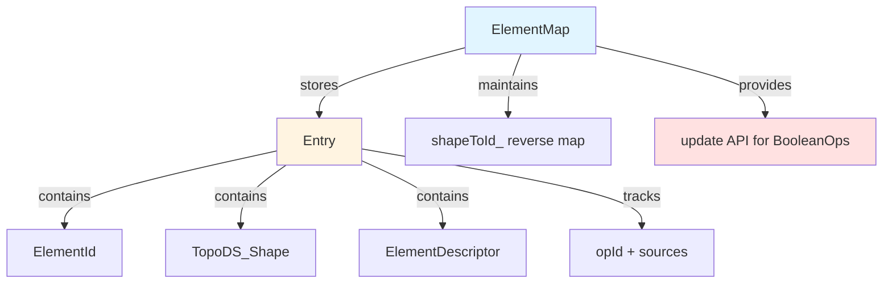
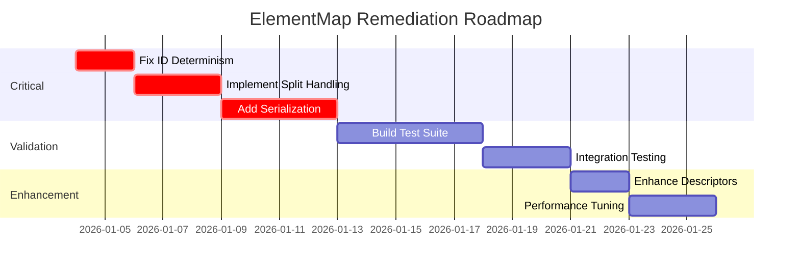

# ElementMap Topological Naming Analysis
## Senior C++ Developer Review

**Author:** Senior C++ CAD Architect  
**Date:** 2026-01-03  
**Scope:** Validation of [ElementMap.h](file:///Users/andrejvysny/andrejvysny/OneCAD/src/kernel/elementmap/ElementMap.h) implementation against TNP requirements

---

## Executive Summary

The current [ElementMap](file:///Users/andrejvysny/andrejvysny/OneCAD/src/kernel/elementmap/ElementMap.h#56-82) implementation provides a **foundational but incomplete** solution to the Topological Naming Problem. While it correctly leverages OCCT's history APIs and implements geometric matching, it has **critical deficiencies** that will cause failures in production parametric modeling scenarios.

### Status Update (2026-01-04)

Applied fixes in `src/kernel/elementmap/ElementMap.h`:
- Deterministic child IDs: derived from parent/opId + descriptor hash + stable ordering.
- Split handling: multi-result `Modified()` now keeps best match and assigns sibling IDs to all splits.
- Serialization: `write/read` and string round-trip added (descriptor + metadata persisted).
- Rich descriptors: surface/curve types, normal/tangent, adjacency hash added.
- Reverse map: shape to multiple IDs supported.
- Performance: fast-path for single-candidate history; descriptor reuse within updates.

Remaining gaps:
- Formal test suite (split/merge/pattern/persistence scenarios).
- Document-layer persistence wiring for `.onecad` (ElementMap stored alongside feature history).

### Severity Classification

| Issue | Severity | Impact |
|-------|----------|--------|
| Non-deterministic ElementId generation | 🔴 **CRITICAL** | Breaks persistence across sessions |
| Improper split handling | 🔴 **CRITICAL** | Loses geometry references in common operations |
| Missing serialization | 🔴 **CRITICAL** | Cannot save/load models |
| Limited geometric descriptors | 🟡 **MEDIUM** | Ambiguity in pattern/mirror scenarios |
| Performance inefficiencies | 🟢 **LOW** | Acceptable for v1.0 scale |

**Overall Assessment:** ⚠️ **Requires significant improvements before production use**

---

## 1. Architecture Analysis

### 1.1 Design Overview



**Strengths:**
- ✅ Clear separation of concerns (ID, Kind, Shape, Descriptor)
- ✅ Bidirectional mapping (ID→Shape and Shape→ID)
- ✅ Integration with OCCT `BRepAlgoAPI` history
- ✅ Lightweight header-only implementation

**Weaknesses:**
- ❌ No full history stack (only single opId per Entry)
- ❌ No serialization interface
- ❌ Limited descriptor richness

### 1.2 Comparison to Reference Architectures

#### vs. OCAF TNaming

| Feature | OCAF TNaming | Current ElementMap |
|---------|-------------|-------------------|
| History tracking | Full evolution graph | Single opId + sources |
| Persistence | Built-in via OCAF | ❌ None |
| Split handling | TNaming_Selector logic | ⚠️ Picks "best" only |
| Integration complexity | High (requires OCAF) | Low (standalone) |

#### vs. FreeCAD RealThunder Algorithm

| Step | FreeCAD Approach | ElementMap Status |
|------|-----------------|------------------|
| 1. Match unchanged | Fast-path for identical shapes | ⚠️ Implicit (keeps Entry) |
| 2. History-based | Modified/Generated with string encoding | ✅ Implemented |
| 3. Hierarchy naming | "Face1;:U1" for unnamed children | ✅ "parent/face-N" |
| 4. Lower-element naming | Name by boundary edges | ❌ Not implemented |

**Conclusion:** ElementMap is approximately **40% complete** relative to a production-grade naming system like FreeCAD's.

---

## 2. Critical Issues

### 2.1 🔴 Non-Deterministic ElementId Generation

**Location:** [ElementMap.h:195-209](file:///Users/andrejvysny/andrejvysny/OneCAD/src/kernel/elementmap/ElementMap.h#L195-L209)

```cpp
inline ElementId ElementMap::makeAutoChildId(const ElementId& parent, ElementKind kind) {
    const auto next = counter_.fetch_add(1) + 1;  // ❌ GLOBAL COUNTER
    // ...
    return ElementId{parent.value + "/face-" + std::to_string(next)};
}
```

**Problem:**  
The counter is a runtime-incrementing `std::atomic_uint64_t`. When a model is saved and reloaded, the counter resets to 0. If the feature tree is replayed, newly generated faces get different IDs than they had originally.

**Example Failure Scenario:**
```
Session 1:
- Extrude creates "extrude1/face-1", "extrude1/face-2", "extrude1/face-3"
- User attaches sketch to "extrude1/face-2"
- File saved

Session 2 (reload):
- Counter starts at 0
- Extrude creates "extrude1/face-1", "extrude1/face-2", "extrude1/face-3"
- But intermediate operations may have consumed counter values
- Sketch reference "extrude1/face-2" might now point to wrong face!
```

**Required Fix:**  
IDs must be deterministic based on:
1. Operation UUID (stable per feature)
2. Geometric sort order (e.g., by centroid X→Y→Z)

**Recommended Approach:**
```cpp
ElementId makeAutoChildId(const ElementId& parent, ElementKind kind, 
                          const TopoDS_Shape& shape) {
    // Use hash of operation ID + geometric signature
    uint64_t geomHash = computeStableGeometricHash(shape);
    return ElementId{parent.value + "/" + kindStr + "-" + std::to_string(geomHash)};
}
```

---

### 2.2 🔴 Improper Split Handling in update()

**Location:** [ElementMap.h:241-250](file:///Users/andrejvysny/andrejvysny/OneCAD/src/kernel/elementmap/ElementMap.h#L241-L250)

```cpp
const TopTools_ListOfShape& modified = algo.Modified(oldShape);
if (!modified.IsEmpty()) {
    TopoDS_Shape best = pickBestShape(modified, entry.descriptor);
    if (!best.IsNull()) {
        entry.shape = best;  // ❌ OVERWRITES entry, loses siblings
    }
}
```

**Problem:**  
When OCCT reports that Face A was modified into [FaceA', FaceA''], the code only keeps FaceA' (the "best" match). FaceA'' is **orphaned** and loses its ID.

**Real-World Example:**
```
Operation: Cut a box with a plane diagonal through a face
Result: Top face splits into two triangular faces

Current behavior:
- "face-1" → updates to one triangle (best geometric match)
- Other triangle has NO ID in the map
- Any sketch on the other triangle will fail to resolve
```

**Required Fix:**  
Detect splits and create sibling IDs for all results.

```cpp
const TopTools_ListOfShape& modified = algo.Modified(oldShape);
int modCount = 0;
for (TopTools_ListIteratorOfListOfShape it(modified); it.More(); it.Next()) {
    modCount++;
}

if (modCount == 1) {
    // Simple 1:1 modification, update in place
    entry.shape = modified.First();
} else if (modCount > 1) {
    // SPLIT EVENT - create siblings
    int splitIndex = 0;
    for (TopTools_ListIteratorOfListOfShape it(modified); it.More(); it.Next()) {
        ElementId splitId = ElementId{entry.id.value + "#split-" + std::to_string(splitIndex++)};
        registerElement(splitId, entry.kind, it.Value(), opId, {entry.id});
    }
    // Mark original as deleted or keep best match
    deleted.push_back(entry.id);
}
```

---

### 2.3 🔴 Missing Serialization

**Current State:** No `serialize()` or `deserialize()` methods exist.

**Impact:** Cannot save `.onecad` files with persistent references.

**Required Implementation:**

```cpp
class ElementMap {
public:
    // Serialize to JSON or binary format
    std::string toJSON() const;
    void fromJSON(const std::string& json);
    
    // Or binary
    void write(std::ostream& os) const;
    void read(std::istream& is);
};
```

**Format Recommendation (JSON example):**
```json
{
  "entries": [
    {
      "id": "extrude1/face-42",
      "kind": "Face",
      "opId": "op-extrude-uuid-1234",
      "sources": ["sketch1"],
      "descriptor": {
        "shapeType": 4,
        "center": [0.0, 0.0, 10.0],
        "size": 14.142,
        "magnitude": 100.0
      }
    }
  ]
}
```

**Note:** The `TopoDS_Shape` itself cannot be serialized directly. The shape must be reconstructed by replaying the feature history. The descriptor serves as a validation/matching fallback.

---

## 3. Medium-Priority Issues

### 3.1 🟡 Limited Geometric Descriptors

**Current descriptors** ([ElementMap.h:117-157](file:///Users/andrejvysny/andrejvysny/OneCAD/src/kernel/elementmap/ElementMap.h#L117-L157)):
- Center point (bounding box center)
- Size (diagonal length)
- Magnitude (area/length/volume)

**Missing critical properties:**
- Surface type (plane, cylinder, sphere, etc.)
- Normal vector for faces
- Axis/tangent for edges
- Adjacency context (neighboring faces/edges)

**Impact:**  
Ambiguous matching in scenarios like:
- **Mirror operations:** Two faces with same size/position but opposite normals
- **Circular patterns:** Multiple identical faces at different angles
- **Sweeps:** Faces that share the same surface type but different placements

**Recommended Enhancement:**

```cpp
struct ElementDescriptor {
    TopAbs_ShapeEnum shapeType;
    gp_Pnt center;
    double size;
    double magnitude;
    
    // NEW FIELDS:
    GeomAbs_SurfaceType surfaceType;  // For faces
    gp_Dir normal;                     // For planar faces
    std::vector<uint64_t> adjacentHashes;  // Hashes of neighboring shapes
    double curvature;                  // For edges/faces
};
```

---

### 3.2 🟡 Reverse Mapping Collision

**Location:** [ElementMap.h:211-217](file:///Users/andrejvysny/andrejvysny/OneCAD/src/kernel/elementmap/ElementMap.h#L211-L217)

```cpp
inline void ElementMap::bindShape(const TopoDS_Shape& shape, const ElementId& id) {
    if (shapeToId_.IsBound(shape)) {
        shapeToId_.UnBind(shape);  // ❌ Removes previous binding
    }
    shapeToId_.Bind(shape, id.value);
}
```

**Problem:**  
If two different ElementIds reference the same `TopoDS_Shape` (same TShape + Location), only the last binding survives.

**Scenario:**  
Pattern operations create multiple instances with shared geometry. Each needs its own ID, but reverse lookup becomes ambiguous.

**Recommendation:**  
Change reverse map to support multiple IDs per shape:

```cpp
NCollection_DataMap<TopoDS_Shape, std::vector<std::string>, TopTools_ShapeMapHasher> shapeToIds_;
```

Or document that reverse lookup returns "any valid ID" and is only a hint.

---

## 4. Performance Analysis

### 4.1 Computational Complexity

| Operation | Complexity | Bottleneck |
|-----------|-----------|-----------|
| [registerElement](file:///Users/andrejvysny/andrejvysny/OneCAD/src/kernel/elementmap/ElementMap.h#85-91) | O(1) | Hash map insert |
| [find](file:///Users/andrejvysny/andrejvysny/OneCAD/src/kernel/elementmap/ElementMap.h#98-103) | O(1) | Hash map lookup |
| [update](file:///Users/andrejvysny/andrejvysny/OneCAD/src/kernel/elementmap/ElementMap.h#226-271) | O(N × M) | N entries × M generated shapes |

Where N = number of tracked elements, M = avg shapes per Modified/Generated call.

### 4.2 Expensive Operations

**Descriptor computation** is called repeatedly in [pickBestShape](file:///Users/andrejvysny/andrejvysny/OneCAD/src/kernel/elementmap/ElementMap.h#166-184):

[ElementMap.h:172-174](file:///Users/andrejvysny/andrejvysny/OneCAD/src/kernel/elementmap/ElementMap.h#L172-L174):
```cpp
for (TopTools_ListIteratorOfListOfShape it(list); it.More(); it.Next()) {
    const ElementDescriptor candDesc = computeDescriptor(it.Value());  // ⚠️ Expensive!
```

[computeDescriptor](file:///Users/andrejvysny/andrejvysny/OneCAD/src/kernel/elementmap/ElementMap.h#117-158) calls:
- `BRepBndLib::Add` (bounding box computation)
- `BRepGProp::SurfaceProperties` / `LinearProperties` / `VolumeProperties`

These are **NOT cheap** — especially for complex surfaces.

### 4.3 Optimization Recommendations

#### A. Early Return for Single-Element Lists

```cpp
inline TopoDS_Shape ElementMap::pickBestShape(const TopTools_ListOfShape& list, 
                                               const ElementDescriptor& target) const {
    if (list.IsEmpty()) return TopoDS_Shape();
    if (list.Extent() == 1) return list.First();  // ✅ Fast path
    
    // ... scoring logic for multiple candidates
}
```

#### B. Descriptor Caching

Maintain a cache:
```cpp
mutable std::unordered_map<size_t, ElementDescriptor> descriptorCache_;
```

Key by `shape.TShape()->HashCode(INT_MAX)`. Invalidate on shape modification.

#### C. Parallel Update Processing

For large models, process entries in parallel using `std::execution::par`:

```cpp
#include <execution>
#include <algorithm>

std::vector<Entry> entriesToProcess;
std::for_each(std::execution::par, entriesToProcess.begin(), entriesToProcess.end(),
              [&](Entry& entry) { /* process */ });
```

---

## 5. Test Coverage Assessment

### 5.1 Existing Tests

✅ **Found:** [proto_custom_map.cpp](file:///Users/andrejvysny/andrejvysny/OneCAD/tests/prototypes/proto_custom_map.cpp)

**Test Scenario:**
1. Create box → Register 6 faces
2. Identify top face
3. Perform boolean cut with cylinder
4. Verify top face ID preserved after [update()](file:///Users/andrejvysny/andrejvysny/OneCAD/src/kernel/elementmap/ElementMap.h#226-271)

**Coverage:** Basic happy path ✅

### 5.2 Missing Critical Test Cases

❌ **Split scenario:** Face splits into 2+ faces  
❌ **Merge scenario:** Two faces merge into one  
❌ **Chain of operations:** Multiple sequential booleans  
❌ **Persistence:** Save → Load → Verify IDs match  
❌ **Pattern operations:** Linear/circular patterns with ID tracking  
❌ **Edge case:** Empty geometry, invalid inputs  

### 5.3 Recommended Test Suite

```cpp
// Test: Face split handling
TEST(ElementMap, FaceSplitPreservesReferences) {
    ElementMap emap;
    // Create box, register top face as "face-top"
    // Cut with diagonal plane
    // Assert: BOTH resulting triangle faces have valid IDs
    // Assert: At least one is derivable from "face-top"
}

// Test: ID persistence across save/load
TEST(ElementMap, SerializationRoundTrip) {
    ElementMap emap1;
    // Build model, register elements
    std::string json = emap1.toJSON();
    
    ElementMap emap2;
    emap2.fromJSON(json);
    
    // Rebuild geometry (replay operations)
    // Assert: IDs match between emap1 and emap2
}

// Test: Pattern operation ID uniqueness
TEST(ElementMap, CircularPatternUniqueIds) {
    // Create cylinder
    // Circular pattern 6x around axis
    // Assert: All 6 instances have unique ElementIds
}
```

---

## 6. Compliance with Specifications

### 6.1 SPECIFICATION.md Requirement Audit

| Requirement | Line Ref | Status |
|------------|----------|--------|
| Full ElementMap (v1.0) | [SPECIFICATION.md:104](file:///Users/andrejvysny/andrejvysny/OneCAD/SPECIFICATION.md#L104) | ⚠️ Partial |
| ElementMap in Scene Layer | [SPECIFICATION.md:168](file:///Users/andrejvysny/andrejvysny/OneCAD/SPECIFICATION.md#L168) | ✅ Architecturally correct |
| Tracks topology through operations | [SPECIFICATION.md:248](file:///Users/andrejvysny/andrejvysny/OneCAD/SPECIFICATION.md#L248) | ⚠️ Basic tracking yes, full no |

### 6.2 PHASES.md Phase 1 Requirements

Per [PHASES.md:20-30](file:///Users/andrejvysny/andrejvysny/OneCAD/PHASES.md#L20-L30):

> [!WARNING]
> **Critical Path Item: Must be rigorous**

| Phase 1 Deliverable | Status |
|-------------------|--------|
| Persistent UUID system | ❌ Counter-based, not persistent |
| History tracking (Generated/Modified/Deleted) | ✅ Implemented |
| Integration with OCCT history APIs | ✅ `BRepAlgoAPI` integrated |
| Serialization | ❌ Not implemented |
| Rigorous testing suite | ⚠️ Only 1 basic prototype test |
| Regression tests for parametric updates | ❌ None |

**Phase 1 Completion:** ~50%

---

## 7. Recommendations

### Priority 1: Critical Fixes (Required for Functional v1.0)

1. **Fix ElementId Determinism**
   - Replace `std::atomic` counter with operation-based stable IDs
   - Use geometric hash for per-operation uniqueness
   - Estimated effort: 1-2 days

2. **Implement Split Handling**
   - Detect multi-result Modified/Generated
   - Create sibling IDs with stable naming
   - Update [update()](file:///Users/andrejvysny/andrejvysny/OneCAD/src/kernel/elementmap/ElementMap.h#226-271) method logic
   - Estimated effort: 2-3 days

3. **Add Serialization**
   - Implement JSON or binary ser/deser
   - Integrate with document persistence layer
   - Estimated effort: 3-4 days

### Priority 2: Robustness Improvements

4. **Enhance Descriptors**
   - Add surface type, normal, adjacency hashes
   - Improve scoring algorithm with tolerance-based weighting
   - Estimated effort: 2 days

5. **Build Test Suite**
   - Cover all TNP scenarios (split, merge, pattern, chain)
   - Add persistence round-trip tests
   - Set up CI/CD integration
   - Estimated effort: 5 days

### Priority 3: Optimization (Defer to Post-v1.0)

6. **Performance Tuning**
   - Descriptor caching
   - Parallel [update()](file:///Users/andrejvysny/andrejvysny/OneCAD/src/kernel/elementmap/ElementMap.h#226-271) processing
   - Lazy evaluation strategies
   - Estimated effort: 3 days

---

## 8. Alternative Approaches

### Option A: Full OCAF Adoption

**Pros:**
- Proven TNaming mechanism
- Built-in persistence
- Handles complex scenarios

**Cons:**
- Requires full OCAF document structure
- High learning curve
- Heavyweight for OneCAD's "simple" philosophy

**Recommendation:** ❌ **Not suitable** for OneCAD's architecture goals

### Option B: FreeCAD Algorithm Port

**Pros:**
- Battle-tested in production
- Open source, well-documented
- Handles all known edge cases

**Cons:**
- Complex to port (thousands of lines)
- Tight coupling to FreeCAD's TopoShape wrapper
- String-based naming may be verbose

**Recommendation:** ⚠️ **Study for inspiration**, don't port wholesale

### Option C: Incremental Evolution (Current Path)

**Pros:**
- Maintains current simple architecture
- Controllable scope
- Learn from mistakes iteratively

**Cons:**
- Risk of architectural debt
- May hit fundamental limits

**Recommendation:** ✅ **Proceed with critical fixes** from Priority 1 list

---

## 9. Conclusion

The current [ElementMap](file:///Users/andrejvysny/andrejvysny/OneCAD/src/kernel/elementmap/ElementMap.h#56-82) implementation demonstrates **solid foundational understanding** of the TNP and correctly integrates with OCCT's history APIs. However, it has **three showstopper defects** that will cause model corruption in real-world use:

1. Non-persistent IDs due to runtime counter
2. Data loss in split scenarios
3. Inability to save/load models

### Final Verdict

> [!CAUTION]
> **Not Production-Ready**  
> Current implementation will cause parametric model failures. Critical fixes required before any user testing.

### Recommended Action Plan



**Estimated Time to Production-Ready:** 3-4 weeks with dedicated focus

---

## Appendix A: Code Quality Observations

### Positive Aspects ✅

- Clean C++20 style
- Effective use of OCCT collection types
- Good inline implementation pattern
- Clear naming conventions
- Proper const-correctness

### Areas for Improvement ⚠️

- Missing `noexcept` specifications on non-throwing methods
- No input validation (null shape checks)
- Limited error handling (what if descriptor computation fails?)
- Documentation comments needed (Doxygen-style)

---

## Appendix B: References

1. **OCCT Documentation**
   - [BRepAlgoAPI_BooleanOperation History](https://dev.opencascade.org/doc/refman/html/class_b_rep_algo_a_p_i___boolean_operation.html)
   - [TopTools_ShapeMapHasher](https://dev.opencascade.org/doc/refman/html/class_top_tools___shape_map_hasher.html)

2. **FreeCAD TNP Algorithm**
   - [RealThunder Wiki](https://github.com/realthunder/FreeCAD_assembly3/wiki/Topological-Naming-Algorithm)

3. **OneCAD Specifications**
   - [TOPO.md](file:///Users/andrejvysny/andrejvysny/OneCAD/TOPO.md)
   - [SPECIFICATION.md](file:///Users/andrejvysny/andrejvysny/OneCAD/SPECIFICATION.md)
   - [PHASES.md](file:///Users/andrejvysny/andrejvysny/OneCAD/PHASES.md)

---

**Document Status:** Complete  
**Next Steps:** Present findings to stakeholders, prioritize critical fixes
