# OneCAD Software Specification Document

## Project: OneCAD — Beginner-Friendly 3D CAD for Makers

**Version:** 1.4  
**Target Platform:** macOS 14+ (Apple Silicon) — v1  
**Architecture:** Qt 6 + C++ + OpenCASCADE Technology (OCCT)  
**License:** Open Source (MIT or Apache 2.0)  
**Repository:** GitHub

---

## Table of Contents

1. [Executive Summary](#1-executive-summary)
2. [Technology Stack](#2-technology-stack)
3. [Modeling Paradigm](#3-modeling-paradigm)
4. [Units System](#4-units-system)
5. [Sketch System](#5-sketch-system)
6. [Construction Geometry & Face Creation](#6-construction-geometry--face-creation)
7. [Grid System](#7-grid-system)
8. [3D Modeling Operations](#8-3d-modeling-operations)
9. [Selection System](#9-selection-system)
10. [Adaptive User Interface](#10-adaptive-user-interface)
11. [Interaction Design](#11-interaction-design)
12. [Camera & Viewport System](#12-camera--viewport-system)
13. [Transformation Gizmo System](#13-transformation-gizmo-system)
14. [Data Model & Entity Management](#14-data-model--entity-management)
15. [Topological Naming System](#15-topological-naming-system)
16. [Command & Undo/Redo System](#16-command--undoredo-system)
17. [File System](#17-file-system)
18. [Rendering System](#18-rendering-system)
19. [Error Handling & Visual Debugging](#19-error-handling--visual-debugging)
20. [Performance Requirements](#20-performance-requirements)
21. [Preferences System](#21-preferences-system)
22. [OCCT Integration](#22-occt-integration)
23. [PlaneGCS Integration](#23-planegcs-integration)
24. [Platform & Distribution](#24-platform--distribution)
25. [Open Source Strategy](#25-open-source-strategy)
26. [Implementation Roadmap](#26-implementation-roadmap)
27. [Future Versions](#27-future-versions)
28. [Glossary](#28-glossary)
29. [Appendix](#29-appendix)

---

## 1. Executive Summary

### 1.1 Product Vision

**OneCAD** is a free, open-source 3D CAD application designed for hobbyists and makers. It provides an intuitive sketch-first workflow inspired by Shapr3D, enabling users to create 3D models for 3D printing, woodworking, and DIY projects without the complexity of professional CAD tools or the cost of commercial alternatives.

### 1.2 Core Philosophy

| Principle | Implementation |
|-----------|----------------|
| **Sketch-first workflow** | Draw 2D construction geometry, create faces, then extrude to 3D |
| **Direct modeling default** | Push/pull faces, immediate results |
| **Optional parametric history** | Feature tree available when needed |
| **Adaptive contextual UI** | Predictive tool suggestions based on selection |
| **Automatic loop detection** | Shapr3D-style region highlighting |
| **Open source** | Community-driven development on GitHub |
| **Zero-friction startup** | Immediate entry to empty document (no welcome screen) |
| **Visual feedback** | Blue/green sketch states, real-time previews |

### 1.3 Target User Profile

**Primary Persona: The Maker**
- Hobbyists creating parts for 3D printing
- Woodworkers designing furniture and jigs
- DIY enthusiasts building enclosures and brackets
- Students learning CAD fundamentals

**User Expectations:**
- No prior CAD experience required
- Results within minutes, not hours
- Focus on making, not learning complex software

### 1.4 Version Scope Summary

| Feature | v1.0 | v2.0 | Future |
|---------|:----:|:----:|:------:|
| Basic sketch tools (line, arc, circle, rectangle, ellipse) | ✅ | | |
| Automatic loop detection & region highlighting | ✅ | | |
| Constraint system with blue/green feedback | ✅ | | |
| Multi-sketch support with references | ✅ | | |
| Sketch on face with edge projection | ✅ | | |
| Extrude (one direction + draft angle) | ✅ | | |
| Extrude (symmetric, asymmetric, to face) | | ✅ | |
| Revolve | ✅ | | |
| Boolean operations | ✅ | | |
| Push/pull direct modeling | ✅ | | |
| Fillet & chamfer (variable radius) | ✅ | | |
| Linear & circular patterns | ✅ | | |
| Pattern along path | | ✅ | |
| Shell operation | | ✅ | |
| Spline/Bezier curves | | ✅ | |
| Text in sketches | | ✅ | |
| STEP import/export | ✅ | | |
| Native file format | ✅ | | |
| STL/OBJ export | | ✅ | |
| Full ElementMap (topological naming) | ✅ | | |
| Resolution Engine for TNP | ✅ | | |
| Adaptive UI with tool prediction | ✅ | | |
| Command Search | ✅ | | |
| Transformation Gizmo | ✅ | | |
| View cube | ✅ | | |
| Inertial camera physics | ✅ | | |
| Light & dark themes | ✅ | | |
| Intel Mac support | | ✅ | |
| Onboarding tutorial | | ✅ | |
| iCloud preferences sync | | ✅ | |
| Auto-update | | ✅ | |
| Plugin API | | | ✅ |
| AI features | | | ✅ |

---

## 2. Technology Stack

### 2.1 Core Technologies

| Component | Technology | Version | Rationale |
|-----------|------------|---------|-----------|
| **UI Framework** | Qt 6 Widgets | 6.6+ | Cross-platform, mature CAD UI patterns |
| **Rendering** | Qt RHI (OpenGL backend) | — | Context sharing with OCCT |
| **Geometry Kernel** | OpenCASCADE | 7.8+ | Industry-standard B-rep, LGPL licensed |
| **Constraint Solver** | PlaneGCS | — | FreeCAD's proven 2D solver |
| **Linear Algebra** | Eigen3 | 3.4+ | High-performance, SIMD optimized |
| **Language** | C++20 | — | Modern features, performance |
| **Build System** | CMake | 3.25+ | Industry standard |

### 2.2 Platform Requirements — v1.0

| Requirement | Specification |
|-------------|---------------|
| **Operating System** | macOS 14 Sonoma or later |
| **Architecture** | Apple Silicon (M1/M2/M3/M4) native only |
| **GPU** | Metal-capable (all Apple Silicon) |
| **RAM** | 8 GB minimum, 16 GB recommended |
| **Storage** | 500 MB for application |

### 2.3 System Architecture Diagram

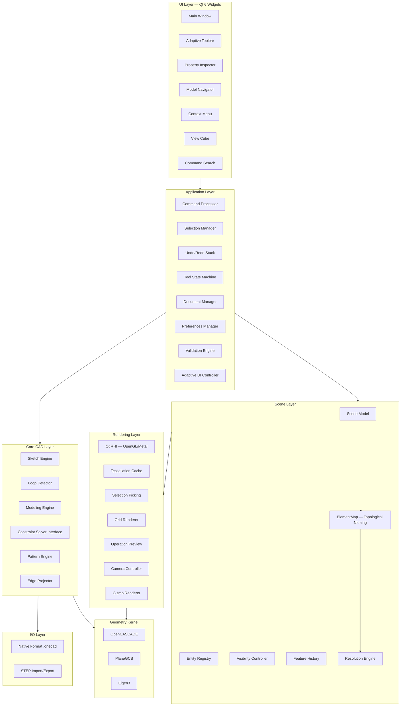

### 2.4 Qt RHI Configuration

For macOS with OCCT integration, force OpenGL backend for context sharing:

```cpp
// In main.cpp, before QGuiApplication
QQuickWindow::setGraphicsApi(QSGRendererInterface::OpenGL);
```

This allows OCCT's OpenGL pipeline to share context with Qt's rendering, enabling seamless compositing of UI overlays on the CAD viewport.

---

## 3. Modeling Paradigm

### 3.1 Hybrid Direct + Parametric Mode

OneCAD follows Shapr3D's hybrid approach with intelligent mode selection:

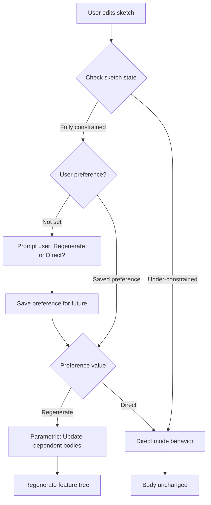

### 3.2 Mode Behavior Matrix

| Sketch State | User Preference | Behavior |
|--------------|-----------------|----------|
| Fully constrained | Not set | Prompt user, save choice |
| Fully constrained | Regenerate | Parametric regeneration |
| Fully constrained | Direct | No body update |
| Under-constrained | Any | Direct mode (no regeneration) |
| Mixed constraints | Any | Prompt user |

### 3.3 Parametric Mode Details

**When Enabled:**
- Feature tree recorded in document
- Operations stored with parameters
- Sketch edits trigger regeneration (if constrained)
- ElementMap tracks topology through operations

**When Disabled (Direct Mode):**
- Immediate geometry modification
- No automatic history
- Simpler mental model
- Lower memory footprint

### 3.4 Mode Configuration

| Setting | Location | Options |
|---------|----------|---------|
| Default mode for new documents | Preferences | Direct / Parametric |
| Sketch edit behavior | Preferences | Always Ask / Regenerate if Constrained / Always Direct |
| Per-document override | Document Properties | Inherit / Direct / Parametric |

---

## 4. Units System

### 4.1 Specification

| Setting | Value |
|---------|-------|
| **Supported Systems** | Metric only (v1) |
| **Default Unit** | Millimeters (mm) |
| **Display Precision** | User configurable (default 2 decimal places) |
| **Internal Representation** | Millimeters (double precision) |

### 4.2 Available Units

| Unit | Abbreviation | Conversion to mm |
|------|--------------|------------------|
| Millimeters | mm | 1.0 |
| Centimeters | cm | 10.0 |
| Meters | m | 1000.0 |

### 4.3 Unit Input Behavior

**Automatic Conversion:**
When user types a value with different unit than document default, the system automatically converts:

| Document Unit | User Types | System Interprets | Display Shows |
|---------------|------------|-------------------|---------------|
| mm | `25` | 25 mm | 25.00 mm |
| mm | `2.5 cm` | 25 mm | 25.00 mm |
| mm | `0.1 m` | 100 mm | 100.00 mm |

---

## 5. Sketch System

### 5.1 Core Concepts

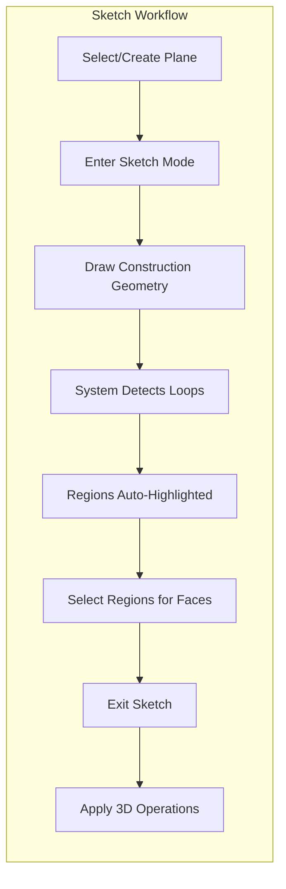

### 5.2 Sketch Plane & Origin

**Plane Selection Options:**
- Standard planes: XY, XZ, YZ (through world origin)
- Existing planar face on any body

**Origin Placement:**

| Sketch Location | Origin Position |
|-----------------|-----------------|
| Standard plane (XY, XZ, YZ) | World origin (0, 0, 0) |
| Face on body | Center of face bounding box |

### 5.3 Multiple Sketches

| Capability | Supported |
|------------|-----------|
| Multiple sketches on same plane | ✅ Yes |
| Sketches referencing other sketches | ✅ Yes |
| Project edges from other sketches | ✅ Yes |
| Project edges from bodies | ✅ Yes |

### 5.4 Sketch on Face — Edge Projection

When user creates a sketch on an existing body face:

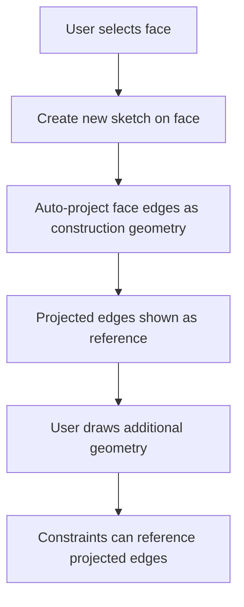

**Projected Edge Properties:**
- Displayed as construction geometry (dashed, muted color)
- Locked — cannot be directly edited
- Can be used as constraint references
- Updates if source face changes (with validation via ElementMap)

### 5.5 Face Change Validation

When a body face is modified and sketches reference it:

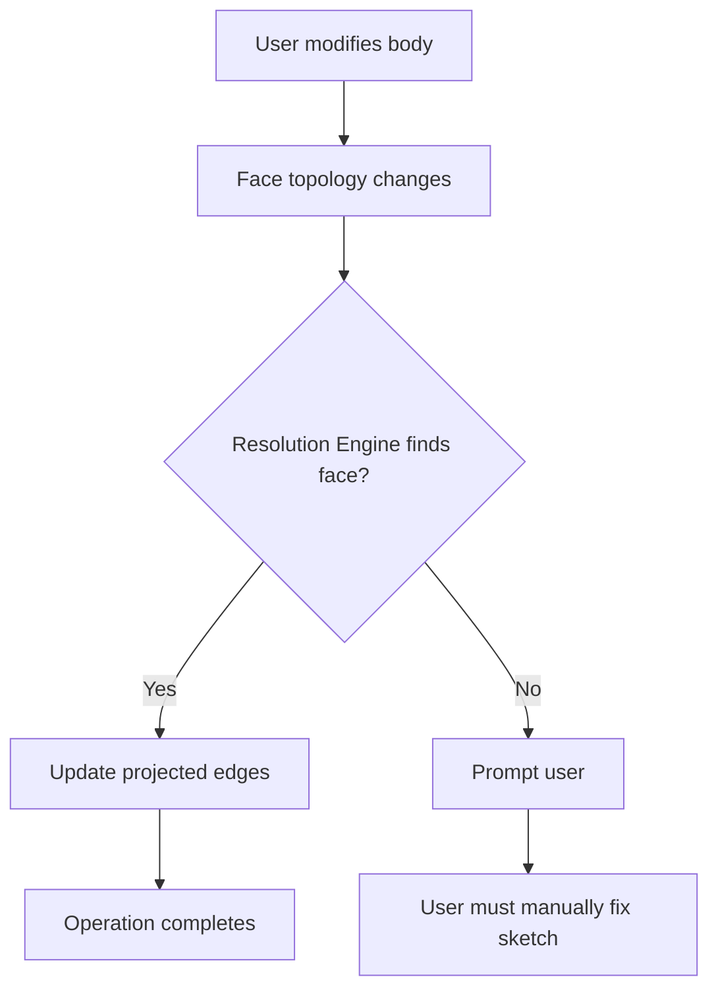

**Validation Prompt:**
> "This operation will affect sketches that reference this face. The following sketches may become invalid and require manual adjustment: [Sketch 1, Sketch 2]. Continue?"

### 5.6 Sketch Tools — v1.0

| Tool | Description | Shortcut | Parameters |
|------|-------------|----------|------------|
| **Line** | Single line segment | L | Start point, end point |
| **Rectangle** | Four-sided shape | R | Corner points or center + size |
| **Circle** | Circle by center and radius | C | Center, radius |
| **Arc** | Arc segment | A | Three points or center + angles |
| **Ellipse** | Ellipse by center and radii | O | Center, major radius, minor radius |

### 5.7 Sketch Entry and Exit Mechanics

**Entry Behavior:**
- Selecting a planar face or standard plane and pressing Space or clicking sketch tool initiates mode
- Camera animates to look "Normal To" the plane (orthographic auto-align)
- Grid appears aligned to sketch plane

**Exit Behavior:**

| Scenario | Behavior |
|----------|----------|
| Exit with complete faces | Normal exit, faces available for operations |
| Exit with only construction geometry | Keep all construction geometry in sketch |
| Exit with incomplete elements | Keep incomplete elements as construction |
| Orbit camera away | Sketch mode remains active in "3D Sketch" state |
| Click "Exit Sketching" button | Explicit exit |

**No geometry is deleted on sketch exit.** All construction geometry is preserved for future editing.

### 5.8 Construction Sketching Toggle

**Session-based toggle** allows users to switch drawn lines to construction geometry (dotted lines):

| Toggle State | Drawing Behavior |
|--------------|------------------|
| Normal (default) | Lines can form faces |
| Construction | Lines are reference only (dashed) |

**Auto-reset:** Toggle resets to Normal upon exiting sketch mode.

### 5.9 Constraint System

**Default Behavior:** Geometry remains free (unconstrained) until user explicitly adds constraints.

**Optional Auto-Constrain:** Preference setting to infer constraints during drawing.

| Setting | Behavior |
|---------|----------|
| Auto-constrain OFF (default) | No automatic constraints |
| Auto-constrain ON | Infer horizontal/vertical/coincident from cursor position |

**Auto-Snapping During Drawing:**
- Cursor magnetically snaps to grid points, vertices, extension lines
- When drawing roughly horizontal/vertical, ghost constraint icon appears
- Clicking confirms the inferred constraint

### 5.10 Supported Constraints

| Category | Constraints |
|----------|-------------|
| **Positional** | Coincident, Horizontal, Vertical, Midpoint, On-Curve |
| **Relational** | Parallel, Perpendicular, Tangent, Concentric, Equal |
| **Dimensional** | Distance, Horizontal Distance, Vertical Distance, Angle, Radius, Diameter |
| **Symmetry** | Symmetric about line |

### 5.11 Degrees of Freedom (DOF) and Visual Feedback

| Entity | Base DOF |
|--------|----------|
| Point | 2 |
| Line Segment | 4 |
| Circle | 3 |
| Arc | 5 |
| Ellipse | 5 |

**Visual Feedback Colors (Shapr3D-style):**

| State | Color | Meaning | Psychology |
|-------|-------|---------|------------|
| Under-constrained | **Blue** | DOF > 0, geometry can move | Encourages exploration |
| Fully constrained | **Green** | 0 DOF remaining | Signifies stability, "goal achieved" |
| Over-constrained | Orange | Redundant constraints | Warning state |
| Conflicting | Red | Cannot be solved | Error state |

**Green State Psychology:** This binary color system gamifies the best practice of fully defining sketches. Users learn to seek the "Green State" to ensure predictable parametric updates.

### 5.12 Sketch Geometry Data Model — Implementation Details

**Implementation Decisions:**

| Aspect | Decision | Rationale |
|--------|----------|-----------|
| **Line parameterization** | Two endpoints P1(x₁,y₁), P2(x₂,y₂) | Simplest representation, direct PlaneGCS mapping |
| **Arc parameterization** | Center + radius + start/end angles | Natural for constraints, efficient rendering |
| **Construction geometry type** | Boolean flag `isConstruction` | Simpler than separate class hierarchy |
| **Coordinate storage** | Sketch-local 2D, convert to world 3D | Single source of truth, avoid sync bugs |

**Data Structures:**

```cpp
// src/core/sketch/SketchEntity.h
namespace onecad::core::sketch {

class SketchEntity {
public:
    using ID = std::string;  // UUID
    virtual ~SketchEntity() = default;

    ID id() const { return m_id; }
    bool isConstruction() const { return m_isConstruction; }
    void setConstruction(bool value) { m_isConstruction = value; }

    virtual EntityType type() const = 0;
    virtual BoundingBox2d bounds() const = 0;

protected:
    ID m_id;
    bool m_isConstruction = false;
};

class SketchLine : public SketchEntity {
public:
    SketchPoint::ID startPoint() const { return m_startPoint; }
    SketchPoint::ID endPoint() const { return m_endPoint; }
private:
    SketchPoint::ID m_startPoint;
    SketchPoint::ID m_endPoint;
};

class SketchArc : public SketchEntity {
public:
    SketchPoint::ID center() const { return m_center; }
    double radius() const { return m_radius; }
    double startAngle() const { return m_startAngle; }  // Radians
    double endAngle() const { return m_endAngle; }
private:
    SketchPoint::ID m_center;
    double m_radius;
    double m_startAngle;
    double m_endAngle;
};

} // namespace onecad::core::sketch
```

**DOF Calculation:**
- Point: 2 DOF (x, y)
- Line: 0 additional DOF (endpoints are points)
- Arc: 3 DOF (radius, start angle, end angle; center is a point = 2 DOF)
- Circle: 1 DOF (radius; center is a point = 2 DOF)

### 5.13 Hybrid Modeling Behavior — Interaction Details

**Dragging Behavior:**

| Scenario | Behavior | Implementation |
|----------|----------|----------------|
| Unconstrained point drag | Connected lines stretch (rubber-band) | Update all connected edge geometry |
| First constraint added | Solver activates immediately | Provides instant blue/green feedback |
| Zero constraints | Bypass solver (performance optimization) | Direct position updates, no PlaneGCS call |
| Approaching unsolvable state | Spring-like resistance (gradual damping) | Damping factor = 1.0 / (1.0 + residual × 10.0) |

**Drag Resistance Algorithm:**

```cpp
void SketchEngine::onMouseDrag(const gp_Pnt2d& targetPos) {
    gp_Pnt2d currentPos = m_draggedPoint->position();

    // Attempt to solve at target position
    m_draggedPoint->setPosition(targetPos);
    m_solver->solve();

    double residual = m_solver->getResidual();
    if (residual > THRESHOLD) {
        // Apply spring-like resistance
        gp_Vec2d drag(currentPos, targetPos);
        double dampingFactor = 1.0 / (1.0 + residual * 10.0);
        gp_Pnt2d dampedPos = currentPos.Translated(drag.Scaled(dampingFactor));
        m_draggedPoint->setPosition(dampedPos);
    }
}
```

### 5.14 Auto-Constraining & Snapping System

**Configuration:**

| Setting | Default | Description |
|---------|---------|-------------|
| **Auto-constrain** | OFF | User must explicitly add constraints |
| **Snap radius** | 2.0mm (zoom-independent) | Constant mm distance at all zoom levels |
| **Snap priority** | Vertex > Grid | Geometric intent over alignment |
| **Ghost icons** | Enabled | Show faint constraint preview during drag |

**Snap Priority Implementation:**

```cpp
gp_Pnt2d SketchUI::computeSnappedPosition(const gp_Pnt2d& rawPos) {
    const double SNAP_TOLERANCE_MM = 2.0;
    const double snapRadiusPixels = SNAP_TOLERANCE_MM * m_camera->getPixelsPerMillimeter();

    // Priority 1: Existing vertices
    for (const auto& [id, point] : m_sketch->points()) {
        if (distance(rawPos, point->position()) < snapRadiusPixels) {
            return point->position();  // Snap to vertex
        }
    }

    // Priority 2: Grid
    if (m_gridSnapEnabled) {
        return snapToGrid(rawPos);
    }

    return rawPos;  // No snap
}
```

**Auto-Constraint Priority:**
1. Coincident (highest)
2. Tangent
3. Horizontal/Vertical
4. Parallel/Perpendicular (lowest)

**Ghost Icon Workflow:**
```
User drags endpoint near horizontal line
    ↓
Ghost "⊣" icon appears (faint blue)
    ↓
User clicks to place point
    ↓
Constraint applied automatically if ghost was present
    ↓
Icon becomes solid, line snaps horizontal
```

### 5.15 Dimensional Constraints Implementation

**Dimension Value Input:**

| Property | Specification |
|----------|---------------|
| **Initial behavior** | Accept current distance, keep selected for editing |
| **Input method** | Click-to-edit inline text field |
| **Expressions** | Basic math (+, -, *, /) supported |
| **Variables** | Not in v1 (defer to v2) |
| **Angle range** | -180° to +180° (signed) |

**Click-to-Edit Workflow:**

```cpp
void SketchRenderer::onDimensionClicked(DistanceConstraint* constraint) {
    // Create inline text field at dimension location
    QLineEdit* editor = new QLineEdit(m_viewport);
    editor->setText(QString::number(constraint->distance(), 'f', 2) + " mm");
    editor->selectAll();

    // Position at dimension text in viewport
    gp_Pnt2d textPos = constraint->getDimensionTextPosition();
    QPoint screenPos = worldToScreen(textPos);
    editor->move(screenPos);
    editor->show();
    editor->setFocus();

    connect(editor, &QLineEdit::editingFinished, [=]() {
        QString text = editor->text();
        double newValue = parseExpression(text);  // "25 + 10" → 35mm

        if (newValue > 0) {
            constraint->setDistance(newValue);
            m_sketch->solve();
        }
        editor->deleteLater();
    });
}
```

**Expression Parser (Basic Math):**

```cpp
double parseExpression(const QString& expr) {
    // Supports: +, -, *, /, parentheses
    QJSEngine engine;
    QString numericPart = expr.split(" ").first();  // Strip units
    QJSValue result = engine.evaluate(numericPart);
    return result.toNumber();
}
```

### 5.16 Constraint Visualization & Debugging

**Icon Visibility:**

| Setting | Default | Description |
|---------|---------|-------------|
| **Always visible** | No | Toggleable via View menu |
| **Show on hover** | Yes | Icons appear when entity hovered |
| **Icon size** | 16px constant | Does not scale with zoom |
| **Texture atlas** | 8×8 grid, 64 icons max | Single texture for all constraint types |

**DOF Indicator Locations:**
- **Status bar:** "DOF: 5 remaining" (persistent)
- **Floating badge:** Near cursor during drag (contextual)
- **Property Inspector:** Detailed breakdown with description

**DOF Description:**

```cpp
std::string Sketch::dofDescription() const {
    int dof = degreesOfFreedom();

    if (dof == 0) return "Fully constrained";
    if (dof == 1) return "1 DOF remaining — can translate along line";
    if (dof == 2) return "2 DOF remaining — can move in X and Y";
    if (dof == 3) return std::to_string(dof) + " DOF remaining — can move and rotate";
    return std::to_string(dof) + " DOF remaining";
}
```

**Conflict Resolution UI:**

```cpp
void SketchUI::showConflictDialog(const ConflictInfo& conflict) {
    QDialog dialog(this);
    dialog.setWindowTitle("Constraint Conflict Detected");

    QListWidget* constraintList = new QListWidget();
    for (const auto& id : conflict.conflictingConstraints) {
        constraintList->addItem(m_sketch->getConstraint(id)->toString());
    }

    QPushButton* removeButton = new QPushButton("Remove Selected");
    connect(removeButton, &QPushButton::clicked, [&]() {
        QString id = constraintList->selectedItems().first()->data(Qt::UserRole).toString();
        m_sketch->removeConstraint(id.toStdString());
        dialog.accept();
    });

    dialog.exec();  // Blocks until conflict resolved
}
```

**Constraint Error Gradient (Green → Yellow → Red):**

```cpp
QColor SketchRenderer::getConstraintErrorColor(double errorMM, double tolerance) {
    if (errorMM < tolerance) {
        return QColor(64, 192, 64);  // Green - satisfied
    } else if (errorMM < tolerance * 5) {
        // Yellow gradient (close but not satisfied)
        float t = (errorMM - tolerance) / (tolerance * 4);
        return QColor::fromRgbF(0.25 + 0.75 * t,   // Red: 64 → 255
                                0.75 - 0.25 * t,    // Green: 192 → 160
                                0.25 * (1 - t));    // Blue: 64 → 0
    } else {
        return QColor(255, 64, 64);  // Red - violated
    }
}
```

### 5.17 Sketch Coordinate System & Transformations

**Coordinate Storage Strategy:**

```cpp
class Sketch {
public:
    gp_Ax2 plane() const { return m_plane; }  // World-space plane definition

    // Coordinate transformations
    gp_Pnt toWorldCoords(const gp_Pnt2d& local) const {
        return m_plane.Location().Translated(
            gp_Vec(m_plane.XDirection()).Scaled(local.X()) +
            gp_Vec(m_plane.YDirection()).Scaled(local.Y())
        );
    }

    gp_Pnt2d toSketchCoords(const gp_Pnt& world) const {
        gp_Vec toPoint(m_plane.Location(), world);
        double x = toPoint.Dot(gp_Vec(m_plane.XDirection()));
        double y = toPoint.Dot(gp_Vec(m_plane.YDirection()));
        return gp_Pnt2d(x, y);
    }

private:
    gp_Ax2 m_plane;  // Origin + X/Y/Z axes in world space
    std::map<SketchEntity::ID, std::unique_ptr<SketchPoint>> m_points;  // 2D local coords
};
```

**Sketch Plane Selection UX:**

| Context | Behavior |
|---------|----------|
| Nothing selected | Create sketch on XY plane (world origin) |
| Planar face selected | Create sketch on that face |
| Standard plane shortcut | User chooses XY/XZ/YZ via menu |

**Sketch Origin Placement:**

| Sketch Location | Origin Position |
|-----------------|-----------------|
| Standard plane (XY/XZ/YZ) | World origin (0, 0, 0) |
| Face on body | Face bounding box center |

### 5.18 Sketch Rendering — OpenGL Implementation

**VBO-Based Geometry Rendering:**

```cpp
class SketchRenderer {
private:
    struct VertexData {
        float x, y;           // Position
        float r, g, b, a;     // Color (constraint state)
    };

    QOpenGLBuffer m_lineVBO;
    QOpenGLVertexArrayObject m_lineVAO;

public:
    void updateGeometry(const Sketch& sketch) {
        std::vector<VertexData> lineVertices;

        for (const auto& [id, line] : sketch.lines()) {
            gp_Pnt2d start = sketch.getPoint(line->startPoint())->position();
            gp_Pnt2d end = sketch.getPoint(line->endPoint())->position();

            QColor color = getConstraintStateColor(sketch.constraintState());

            lineVertices.push_back({start.X(), start.Y(),
                                    color.redF(), color.greenF(), color.blueF(), color.alphaF()});
            lineVertices.push_back({end.X(), end.Y(),
                                    color.redF(), color.greenF(), color.blueF(), color.alphaF()});
        }

        m_lineVBO.bind();
        m_lineVBO.allocate(lineVertices.data(), lineVertices.size() * sizeof(VertexData));
    }

    void render(const QMatrix4x4& viewProjection) {
        // Viewport frustum culling
        QRectF viewBounds = computeViewBounds(viewProjection);

        m_shader->bind();
        m_shader->setUniformValue("viewProjection", viewProjection);
        m_lineVAO.bind();
        glDrawArrays(GL_LINES, 0, m_lineVertexCount);
    }
};
```

**Arc Tessellation (Adaptive Quality):**

```cpp
int computeArcSegmentCount(const SketchArc& arc, const Camera3D& camera) {
    double radiusPixels = arc.radius() * camera.getPixelsPerMillimeter();
    double angleDegrees = std::abs(arc.endAngle() - arc.startAngle()) * 180.0 / M_PI;

    // Target: 1 segment per 5 degrees
    int segments = static_cast<int>(std::ceil(angleDegrees / 5.0));
    return std::clamp(segments, 8, 128);  // Clamp to reasonable range
}
```

**Viewport Culling Optimization:**

```cpp
void SketchRenderer::render(const QMatrix4x4& viewProjection) {
    QRectF viewBounds = computeViewBounds(viewProjection);

    // Cull entities outside viewport
    for (const auto& [id, line] : m_sketch->lines()) {
        if (!viewBounds.intersects(line->bounds())) {
            continue;  // Skip rendering
        }
        renderLine(line.get(), viewProjection);
    }
}
```

**Constraint Icon Atlas:**

```cpp
class ConstraintIconRenderer {
private:
    QOpenGLTexture* m_iconAtlas;  // 8×8 grid, 64 icons max, 32×32px each

public:
    void loadIconAtlas() {
        QImage atlas = generateIconAtlas({
            ConstraintType::Horizontal,    // Icon 0: ⊣
            ConstraintType::Vertical,      // Icon 1: ⊤
            ConstraintType::Perpendicular, // Icon 2: ⊥
            ConstraintType::Parallel,      // Icon 3: ∥
            ConstraintType::Tangent,       // Icon 4: ◉
            ConstraintType::Coincident,    // Icon 5: ●
        });
        m_iconAtlas = new QOpenGLTexture(atlas);
    }

    void render(const Sketch& sketch) {
        for (const auto& constraint : sketch.constraints()) {
            gp_Pnt2d pos = getConstraintIconPosition(constraint);
            int atlasIndex = getIconAtlasIndex(constraint->type());

            float u = (atlasIndex % 8) / 8.0f;
            float v = (atlasIndex / 8) / 8.0f;

            drawBillboard(pos, 16.0f, u, v);  // 16px constant size
        }
    }
};
```

### 5.19 Sketch Tool State Machines

**Tool Interface:**

```cpp
class SketchTool {
public:
    virtual ~SketchTool() = default;

    virtual void onMousePress(const gp_Pnt2d& pos) = 0;
    virtual void onMouseMove(const gp_Pnt2d& pos) = 0;
    virtual void onMouseRelease(const gp_Pnt2d& pos) = 0;
    virtual void onKeyPress(QKeyEvent* event) = 0;

    virtual bool isComplete() const = 0;
    virtual std::unique_ptr<SketchEntity> getResult() = 0;
};
```

**Line Tool Example:**

```cpp
class LineTool : public SketchTool {
public:
    void onMousePress(const gp_Pnt2d& pos) override {
        if (m_state == State::WaitingForStart) {
            m_startPoint = pos;
            m_state = State::WaitingForEnd;
        } else if (m_state == State::WaitingForEnd) {
            m_endPoint = pos;
            m_state = State::Complete;
        }
    }

    void onMouseMove(const gp_Pnt2d& pos) override {
        if (m_state == State::WaitingForEnd) {
            m_endPoint = pos;  // Live preview
        }
    }

    void onKeyPress(QKeyEvent* event) override {
        if (event->key() == Qt::Key_Escape) {
            // Cancel + delete partial geometry
            m_previewLine.reset();
            m_state = State::Complete;
        }
    }

    bool isComplete() const override {
        return m_state == State::Complete;
    }

private:
    enum class State { WaitingForStart, WaitingForEnd, Complete };
    State m_state = State::WaitingForStart;
    gp_Pnt2d m_startPoint, m_endPoint;
    std::unique_ptr<SketchLine> m_previewLine;
};
```

**Arc Dragging (Radius Fixed):**

```cpp
void SketchEngine::dragArcEndpoint(SketchArc* arc, bool isDraggingStart, const gp_Pnt2d& newPos) {
    gp_Pnt2d center = m_sketch->getPoint(arc->center())->position();
    double radius = arc->radius();

    // Project newPos onto circle (radius stays fixed)
    gp_Vec2d toNew(center, newPos);
    double distance = toNew.Magnitude();

    if (distance > 1e-6) {
        toNew.Normalize();
        toNew.Scale(radius);  // Force to circle radius

        double angle = std::atan2(toNew.Y(), toNew.X());
        if (isDraggingStart) {
            arc->setStartAngle(angle);
        } else {
            arc->setEndAngle(angle);
        }
    }
}
```

### 5.20 Sketch Validation & Error Handling

**Degenerate Geometry Prevention:**

```cpp
bool LineTool::validateLineLength(const gp_Pnt2d& start, const gp_Pnt2d& end) {
    double length = start.Distance(end);
    const double MIN_LENGTH = 0.01;  // 0.01mm minimum

    if (length < MIN_LENGTH) {
        showTooltip("Geometry too small (min 0.01mm)");
        return false;
    }
    return true;
}
```

**Sketch Validation Before Extrude:**

```cpp
struct ValidationResult {
    bool isValid;
    std::vector<std::string> errors;
};

ValidationResult validateSketchForExtrude(const Sketch& sketch) {
    ValidationResult result;
    result.isValid = true;

    // Check for self-intersections
    if (!findSelfIntersections(sketch).empty()) {
        result.isValid = false;
        result.errors.push_back("Sketch contains self-intersecting geometry");
    }

    // Check for closed regions
    auto regions = sketch.detectRegions();
    if (regions.empty()) {
        result.isValid = false;
        result.errors.push_back("No closed regions detected");
    }

    // Check for degenerate faces
    for (const auto& region : regions) {
        if (region.signedArea < 1e-6) {
            result.isValid = false;
            result.errors.push_back("Region has zero area");
        }
    }

    return result;
}

void ExtrudeTool::execute() {
    auto validation = validateSketchForExtrude(*m_sketch);

    if (!validation.isValid) {
        QMessageBox::critical(nullptr, "Invalid Sketch",
                              QString::fromStdList(validation.errors).join("\n"));
        return;
    }

    // Proceed with extrude...
}
```

**Coordinate Precision:**

```cpp
struct SketchPoint {
    gp_Pnt2d m_position;  // Raw double precision (no rounding)

    // Epsilon-based comparison for equality
    bool coincidentWith(const SketchPoint& other, double tolerance = 1e-6) const {
        return m_position.Distance(other.m_position) < tolerance;
    }
};
```

---

## 6. Construction Geometry & Face Creation

### 6.1 Construction-First Workflow

**Core Principle:** All sketch geometry is construction geometry by default. Faces are created explicitly from detected closed loops.

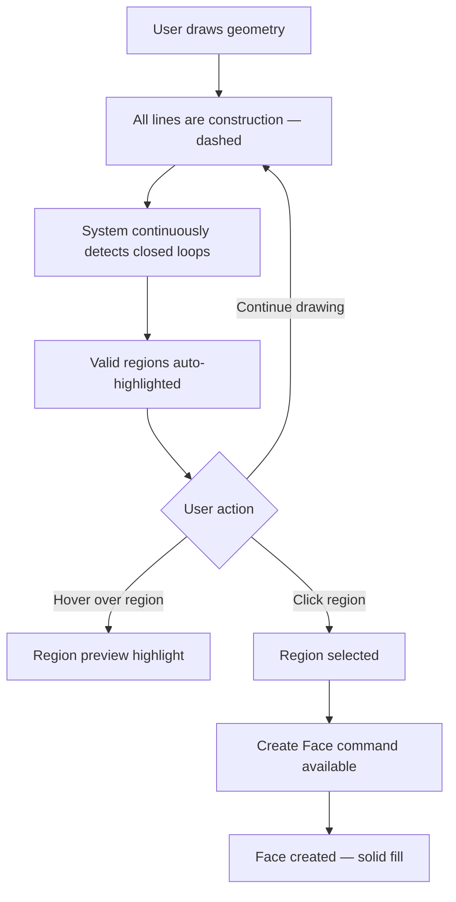

### 6.2 Automatic Loop Detection

The system continuously analyzes sketch geometry to detect closed loops:

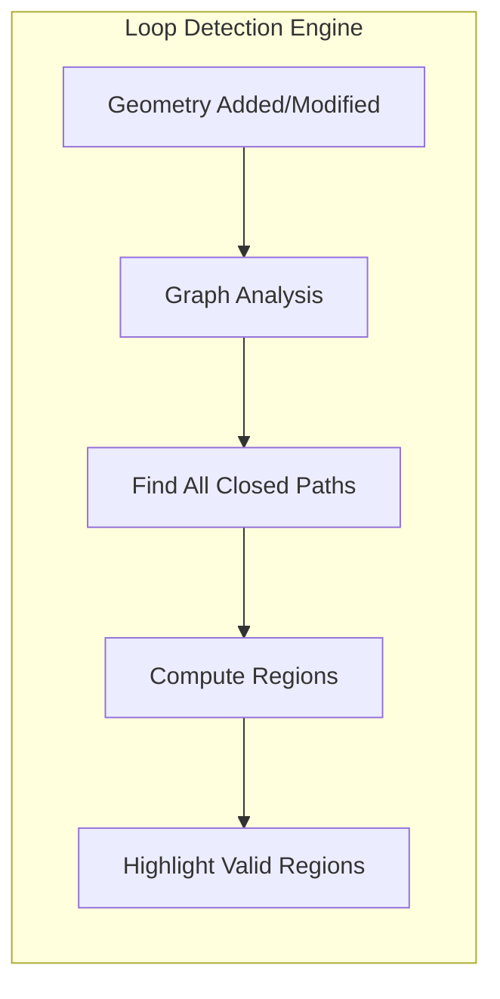

**Detection Behavior:**
- Runs automatically as user draws
- No manual "detect loops" button needed
- Regions highlighted in real-time
- Shapr3D-style visual feedback
- Performance target: < 50ms update time

### 6.3 Region Highlighting

| State | Visual Appearance |
|-------|-------------------|
| Potential region (not hovered) | Subtle fill, 10% opacity |
| Hovered region | Highlighted fill, 30% opacity |
| Selected region | Solid fill, 50% opacity |
| Face created | Solid fill, distinct color |

### 6.4 Face Properties

| Capability | Supported |
|------------|-----------|
| Multiple faces per sketch | ✅ Yes |
| Faces with holes (nested loops) | ✅ Yes |
| Partial face creation (some loops only) | ✅ Yes |
| Overlapping loops | Resolved by region detection |
| Self-intersecting loops | Detected and flagged as invalid |

### 6.5 Face Selection for Operations

**Workflow:**
1. System detects all valid regions in sketch
2. User hovers to preview individual regions
3. User clicks to select region(s)
4. User can select multiple regions (Shift+Click or box select)
5. Each region can be extruded separately or together

| Selection | Extrude Result |
|-----------|----------------|
| Single region | Single body |
| Multiple regions (same height) | Multiple bodies or single compound |
| Multiple regions (different heights) | Separate operations |

### 6.6 Construction Geometry Visibility After Face Creation

| Setting | Behavior |
|---------|----------|
| Default | Construction geometry hidden automatically |
| User preference | Can show construction geometry |
| Per-sketch toggle | Show/hide construction in model navigator |

### 6.7 Limitations — v1.0

| Feature | v1.0 Status |
|---------|-------------|
| Convert face edge back to construction | ❌ Not supported |
| Convert construction to face edge directly | ❌ Not supported (use Create Face) |

---

## 7. Grid System

### 7.1 Grid Specification

| Property | Behavior |
|----------|----------|
| **Visibility** | Always visible in sketch mode (user can hide) |
| **Toggle** | View menu or keyboard shortcut (G) |
| **Snap-to-Grid** | Enabled by default |
| **Snap Toggle** | Hold Alt to temporarily disable |
| **Grid Spacing** | Adaptive to zoom level |

### 7.2 Adaptive Grid Spacing

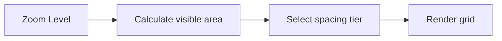

**Spacing Tiers:**

| Visible Area Width | Grid Spacing |
|-------------------|--------------|
| < 10 mm | 0.1 mm |
| 10 - 50 mm | 0.5 mm |
| 50 - 100 mm | 1 mm |
| 100 - 500 mm | 5 mm |
| 500 mm - 1 m | 10 mm |
| 1 - 5 m | 50 mm |
| > 5 m | 100 mm |

**Spacing Selection Logic:**
- Target ~30-50 grid lines visible on screen
- Smooth transitions during zoom (no jarring changes)
- Major/minor grid line distinction

### 7.3 Grid Appearance

| Element | Light Mode | Dark Mode |
|---------|------------|-----------|
| Major grid lines | #D0D0D0 | #505050 |
| Minor grid lines | #E8E8E8 | #383838 |
| Origin X axis | #FF4444 | #FF6666 |
| Origin Y axis | #44FF44 | #66FF66 |
| Origin Z axis | #4444FF | #6666FF |

---

## 8. 3D Modeling Operations

### 8.1 Operations Overview — v1.0

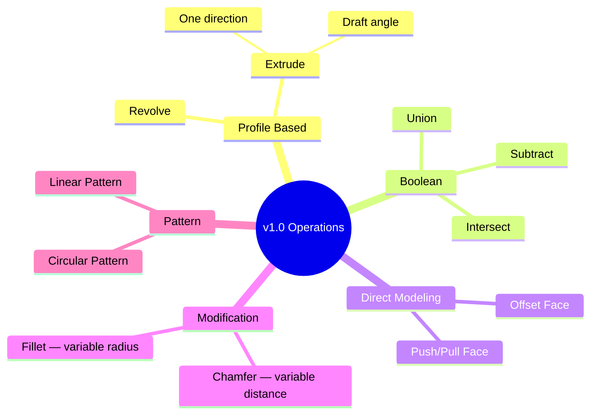

### 8.2 Extrude Operation

#### 8.2.1 Basic Behavior

| Property | Specification |
|----------|---------------|
| **Direction** | Positive normal to sketch plane (default) |
| **Flip Direction** | User drags in opposite direction |
| **Distance Input** | Drag with on-screen editable value |
| **Draft Angle** | Secondary parameter (0° to 89°) |
| **Multi-face** | User selects which faces to extrude |

#### 8.2.2 Direction Determination

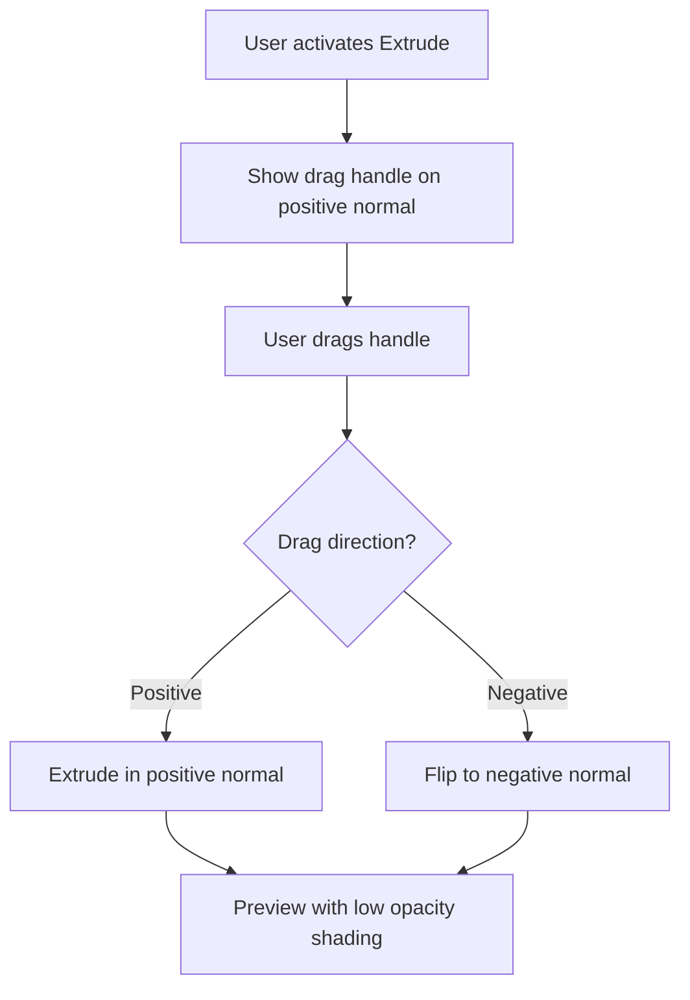

#### 8.2.3 Smart Boolean Integration

Shapr3D-style automatic boolean determination:

| Scenario | Automatic Result |
|----------|------------------|
| Extrude into existing body | Assume Cut (Subtract) |
| Extrude away from body | Assume Add (Union) |
| No intersection | New Body |

**Boolean Override Badge:** Small popup menu next to distance label allows explicit selection of Union, Subtract, Intersect, or New Body.

#### 8.2.4 Draft Angle

| Property | Specification |
|----------|---------------|
| Range | 0° to 89° |
| Default | 0° (no draft) |
| Input method | Secondary field in panel OR select axis/sketch line |
| Positive angle | Tapers inward (for mold release) |
| Negative angle | Tapers outward |

#### 8.2.5 v2.0 Additions

- Symmetric extrude (both directions equally)
- Asymmetric extrude (different distances each direction)
- Extrude to face/surface
- Extrude through all

### 8.3 Revolve Operation

| Property | Specification |
|----------|---------------|
| **Axis Selection** | User selects sketch line as axis |
| **Angle** | 0° to 360°, default 360° |
| **Direction** | Clockwise or counter-clockwise |
| **Multi-face** | User selects which faces to revolve |
| **Height (Helix)** | Optional parameter for helical shapes (v1.0) |

### 8.4 Boolean Operations

| Operation | Description | Shortcut |
|-----------|-------------|----------|
| **Union** | Combine bodies into one | U |
| **Subtract** | Remove tool body from target | B |
| **Intersect** | Keep only overlapping volume | I |

**Workflow:**
1. Select target body (primary selection — blue)
2. Select tool body/bodies (secondary selection — violet)
3. Choose boolean operation
4. Preview shows result
5. Confirm or cancel

**Keep Originals Option:** Checkbox to preserve input bodies after operation.

### 8.5 Push/Pull Direct Modeling

| Property | Specification |
|----------|---------------|
| **Input** | Selected planar face |
| **Positive Distance** | Extrude outward (union with body) |
| **Negative Distance** | Cut inward (subtract from body) |
| **Multi-body scenario** | User selects which body to modify |
| **Adjacent Faces** | Automatically extended/trimmed |

**Body Selection for Push/Pull:**
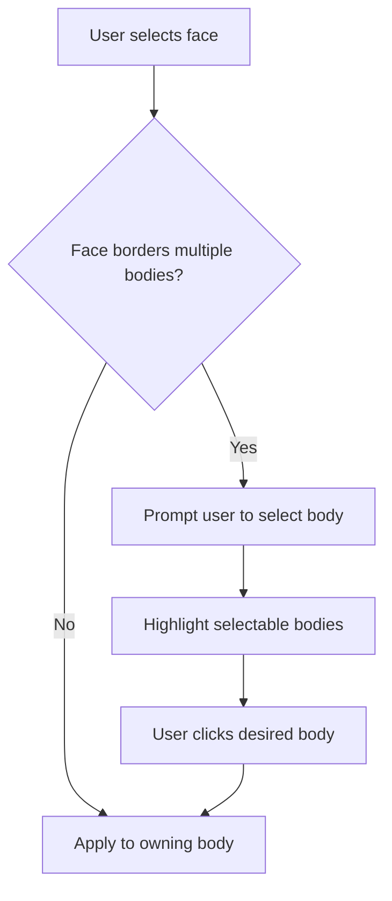

### 8.6 Fillet Operation

| Property | Specification |
|----------|---------------|
| **Input** | Selected edge(s) |
| **Radius** | Per-edge radius supported |
| **Chain Selection** | Auto-select tangent edges (optional) |
| **Preview** | Real-time during radius adjustment |
| **Interaction** | Drag arrow outward from edge |

**Variable Radius Workflow:**
1. Select multiple edges
2. All edges get same initial radius
3. User can click individual edge to set different radius
4. Each edge shows its radius value

### 8.7 Chamfer Operation

| Property | Specification |
|----------|---------------|
| **Input** | Selected edge(s) |
| **Distance** | Per-edge distance supported |
| **Mode** | Equal distance (v1) |
| **Preview** | Real-time during distance adjustment |
| **Interaction** | Drag arrow inward toward edge |

**Combined Fillet/Chamfer Tool:**
- Drag outward = Fillet (rounded)
- Drag inward = Chamfer (beveled)

### 8.8 Pattern Operations

#### 8.8.1 Linear Pattern

| Property | Specification |
|----------|---------------|
| **Source** | Body or feature (context-dependent) |
| **Direction** | User-defined vector or edge reference |
| **Count** | Number of instances (including original) |
| **Spacing** | Distance between instances |
| **Mode** | Spacing or total extent |

#### 8.8.2 Circular Pattern

| Property | Specification |
|----------|---------------|
| **Source** | Body or feature (context-dependent) |
| **Axis** | User-selected line or edge |
| **Count** | Number of instances (including original) |
| **Angle** | Total angle or per-instance angle |
| **Mode** | Equal spacing or specific angle |

#### 8.8.3 Pattern Source Selection

| Context | Pattern Operates On |
|---------|---------------------|
| Direct modeling mode | Entire body |
| Parametric mode, body selected | Entire body |
| Parametric mode, feature selected | Individual feature |

### 8.9 Operation Preview

| Property | Specification |
|----------|---------------|
| **Style** | Full shaded preview |
| **Opacity** | Low opacity (30-40%) |
| **Update** | Real-time during parameter changes |
| **Performance** | Use coarse tessellation for preview |

---

## 9. Selection System

### 9.1 Selection Architecture

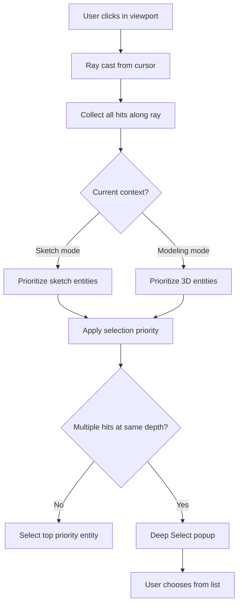

### 9.2 Selection Priority by Context

**Sketch Mode:**
1. Sketch vertex (highest)
2. Sketch edge
3. Sketch region
4. Construction geometry

**Modeling Mode:**
1. Vertex (highest)
2. Edge
3. Face
4. Body (lowest)

### 9.3 Deep Select Mechanism

When click is ambiguous (multiple entities at same pixel):

```
┌─────────────────┐
│ Face            │ ← Hover to highlight
│ Edge            │
│ Sketch Line     │
└─────────────────┘
```

- Small list appears under cursor
- Hover to preview highlight entity
- Click to confirm selection

### 9.4 Click Cycling (Alternative)

When multiple entities overlap at cursor position:
- First click: Select highest priority entity
- Second click (same position): Select next entity
- Continue clicking: Cycle through all entities
- Click elsewhere: Reset cycle

### 9.5 Selection Colors

| Selection State | Light Mode | Dark Mode | Description |
|-----------------|------------|-----------|-------------|
| **Pre-selection (hover)** | Faded blue (#8080FF40) | Faded blue (#6060FF40) | Hover feedback |
| **Primary selection** | Vibrant blue (#2060FF) | Vibrant blue (#4080FF) | Selected entity |
| **Secondary selection** | Violet (#8040FF) | Violet (#A060FF) | Tool body in boolean |
| **Invalid selection** | Orange (#FF8020) | Orange (#FFA040) | Cannot apply operation |

### 9.6 Selection Modifiers

| Modifier | Behavior |
|----------|----------|
| **None** | Replace current selection |
| **Shift + Click** | Add to selection |
| **Cmd + Click** | Toggle in selection |

### 9.7 Box Selection

| Direction | Behavior | Default |
|-----------|----------|---------|
| Left-to-right | Select entities fully inside box | |
| Right-to-left | Select entities touching box (crossing) | ✅ Default |

**User Configurable:** Preference to swap behaviors or set single mode.

### 9.8 Selection Persistence

| Scenario | Behavior |
|----------|----------|
| Switch to compatible tool | Selection persists |
| Switch to incompatible tool | Selection cleared |
| Enter sketch mode | 3D selection cleared |
| Exit sketch mode | Sketch selection cleared |

---

## 10. Adaptive User Interface

### 10.1 Design Philosophy

The Adaptive UI is OneCAD's central nervous system — a predictive engine that surfaces tools based on context, replacing traditional static toolbars. This follows Shapr3D's "content first, controls second" philosophy.

### 10.2 Startup Experience (v1.0)

| Property | Behavior |
|----------|----------|
| Launch | Directly into empty new document ("Untitled 1") |
| Welcome screen | None |
| Dashboard | None |
| Recent files | Available via File menu only |
| Focus | Immediate creation |

### 10.3 Main Window Layout — Five Functional Zones

```mermaid
flowchart TB
    subgraph MainWindow["Main Window"]
        subgraph TopBar["Zone 1: Top Bar — Global Navigation"]
            HOME[Home Button]
            PROJECT[Project Name + Sync]
            UNDO[Undo/Redo]
            MORE[More Menu: Import/Export/Settings]
        end
        
        subgraph LeftSidebar["Zone 2: Left Sidebar — Items Manager"]
            BODIES[Bodies List]
            SKETCHES[Sketches List]
            PLANES[Planes List]
            VISIBILITY[Visibility Toggles]
        end
        
        subgraph Viewport["Zone 3: Central Viewport"]
            CANVAS[3D Canvas]
            GRID[Sketch Grid]
            GIZMO[Transformation Gizmo]
            VALUE[On-screen Value Display]
            VCUBE[View Cube — top right]
        end
        
        subgraph RightSidebar["Zone 4: Right Sidebar — History/Inspector"]
            HISTORY[Feature History Timeline]
            PROPS[Property Inspector]
            CONSTRAINTS[Constraints Panel — sketch mode]
        end
        
        subgraph BottomDock["Zone 5: Bottom Dock — Adaptive Menu"]
            SEARCH[Command Search Bar]
            ADAPTIVE[Adaptive Tool Menu]
            STATUS[Status: Tool | DOF | Coordinates]
        end
    end
```

### 10.4 The Predictive Algorithm

The Adaptive UI monitors selection buffer and uses logic to determine valid tools:

| Selection Context | Predicted Tools | UX Logic |
|-------------------|-----------------|----------|
| Nothing selected | New Sketch, Import | Default state |
| Planar Face | Extrude, Offset, Shell, Move/Rotate | User wants volume or surface modification |
| Sketch Profile (closed) | Extrude, Revolve, Sweep, Loft | Profile → 3D conversion |
| Edge (Linear) | Fillet, Chamfer, Move, Project | Edge modification |
| Edge (Circular) | Fillet, Chamfer, Offset Edge | Hole/radius adjustment |
| Line + Face | Sweep, Revolve (axis inference) | System infers path/axis |
| Two Profiles | Loft | Transition between shapes |
| Two+ Bodies | Union, Subtract, Intersect | Boolean operations |

### 10.5 Noun-Verb Selection Paradigm

Instead of "click tool, then select geometry", OneCAD uses **"select geometry, then tool appears"**:

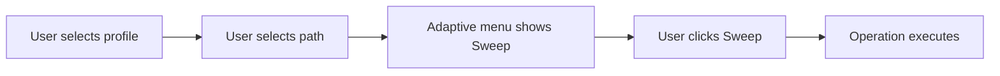

**Benefit:** Removes cognitive load of entering tool mode and figuring out what it needs.

### 10.6 Command Search

**Keyboard-activated search** for power users:

| Property | Specification |
|----------|---------------|
| Activation | Press `/` or `Cmd+K` |
| Appearance | Spotlight-style search bar |
| Function | Type tool name to activate |
| Examples | "Loft", "Sweep", "Extrude" |
| Benefit | Command-line efficiency with modern UI |

```
┌─────────────────────────────────┐
│ 🔍 loft                         │
│ ─────────────────────────────── │
│ 📐 Loft — Create surface...     │
│ 📋 Loft Settings                │
└─────────────────────────────────┘
```

### 10.7 Theme Support

| Theme | Description |
|-------|-------------|
| **Light Mode** | Light backgrounds, dark text |
| **Dark Mode** | Dark backgrounds, light text |
| **System** | Follow macOS appearance setting |

### 10.8 Context Menu (Right-Click)

Traditional hierarchical context menu:

```
┌─────────────────────────┐
│ ● Extrude              │  ← Primary action (bold)
│   Revolve              │
│   ─────────────────────│
│   Create Face          │
│   Add Constraint    ▶  │  ← Submenu
│   ─────────────────────│
│   Delete         ⌫     │
│   Hide                 │
│   Show All             │
│   ─────────────────────│
│   Properties...        │
└─────────────────────────┘
```

### 10.9 Property Inspector

**When nothing selected:**
- Show empty state with helpful tips
- "Select an entity to view its properties"
- Quick action suggestions

**When sketch entity selected:**
- Entity type and ID
- Coordinates/dimensions (editable)
- Applied constraints list
- DOF status with color indicator

**When body selected:**
- Body name (editable)
- Volume
- Surface area
- Bounding box dimensions
- Face/edge/vertex count

**When operation active:**
- Operation name
- All parameters (editable fields)
- Preview toggle
- Apply / Cancel buttons

### 10.10 Model Navigator (Items Manager)

**Location:** Left panel (collapsible)

**Default State:** All items collapsed

**Structure:**
```
📁 Document
├── 📦 Bodies
│   ├── 👁 Body 1
│   ├── 👁 Body 2
│   └── 👁 Body 1 + Body 2  (combined name)
├── ✏️ Sketches
│   ├── Sketch 1 (on XY Plane)
│   └── Sketch 2 (on Body 1 Face 3)
└── 📋 Feature History (if parametric)
    ├── Extrude 1
    ├── Fillet 1
    └── Boolean Union 1
```

**Interactions:**
- Click: Select item
- Double-click body: Isolate (hide all others)
- Double-click sketch: Enter sketch edit mode
- Right-click: Context menu
- Eye icon: Toggle visibility

### 10.11 History Sidebar

**Location:** Right panel (collapsible)

**Purpose:** Interface for History-Based Parametric Modeling (HBPM)

**Features:**
- Chronological list of operations as "cards"
- Hovering card highlights corresponding geometry
- Click card to edit parameters
- Rename steps for clarity
- Suppress steps (temporarily disable)
- Breakpoints to halt recomputation
- Merge History to collapse steps

**Bi-directional Linking:** "Left sidebar is what I have, Right sidebar is what I did"

---

## 11. Interaction Design

### 11.1 Tool Activation Model

**Click-to-Activate:**
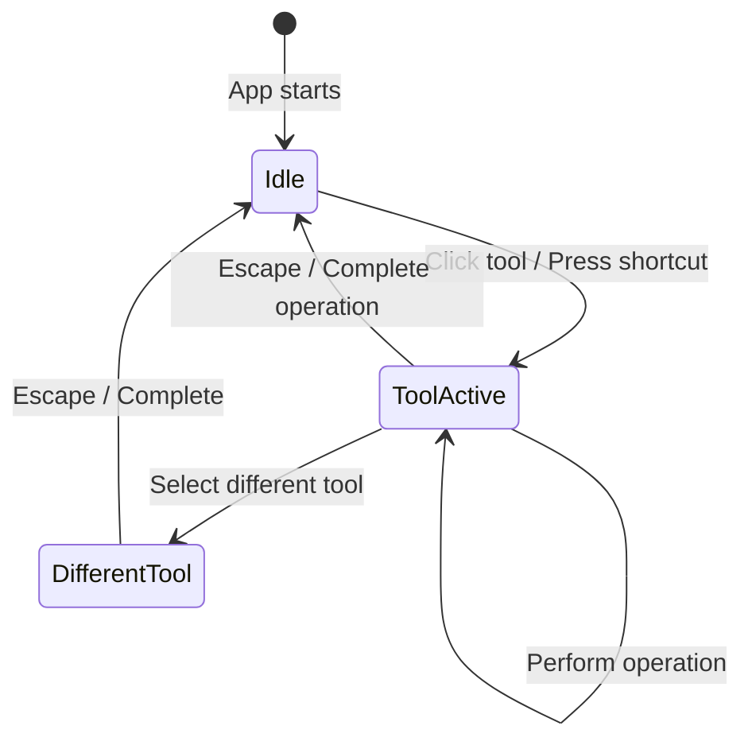

**Tool remains active** until:
- User completes operation
- User presses Escape
- User selects different tool

### 11.2 Dimension Input — Hybrid Drag + Type

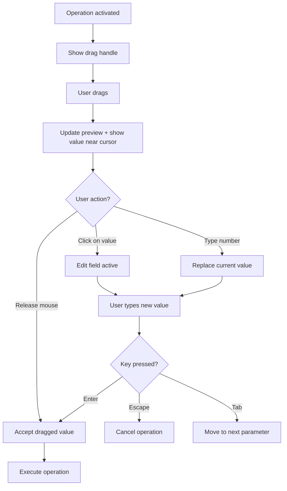

**Key Behavior:**
- Typing a number **replaces** the current value (not append)
- Tab moves between parameters (e.g., distance → draft angle)
- Unit suffix in different unit auto-converts (e.g., "2.5 cm" → 25 mm)
- Supports basic formulas and variables (e.g., "width/2")

### 11.3 Mouse/Trackpad Navigation

| Input | Action |
|-------|--------|
| **Left click** | Select entity |
| **Left drag (empty area)** | Box selection |
| **Left drag (on handle)** | Drag operation handle |
| **Right click** | Context menu |
| **Right drag** | Orbit camera (around sticky pivot) |
| **Shift + Right drag** | Pan camera |
| **Middle drag** | Pan camera |
| **Two-finger drag** | Pan camera |
| **Scroll wheel** | Zoom (centered on cursor, logarithmic) |
| **Pinch gesture** | Zoom (centered on gesture) |
| **Two-finger rotate** | Roll (rotate around view axis) |
| **Double-click face** | Start sketch on face |
| **Double-click sketch** | Enter sketch edit mode |

### 11.4 Keyboard Shortcuts

**Global:**

| Shortcut | Action |
|----------|--------|
| **Cmd+N** | New document |
| **Cmd+O** | Open document |
| **Cmd+S** | Save |
| **Cmd+Shift+S** | Save As |
| **Cmd+Z** | Undo |
| **Cmd+Shift+Z** | Redo |
| **Cmd+A** | Select all (context-dependent) |
| **Cmd+K** or **/** | Command Search |
| **Delete / Backspace** | Delete selected |
| **Escape** | Cancel / Deselect |
| **Space / Enter** | Confirm operation |

**Tools:**

| Shortcut | Tool |
|----------|------|
| **S** | Toggle sketch mode |
| **L** | Line |
| **R** | Rectangle |
| **C** | Circle |
| **A** | Arc |
| **E** | Extrude |
| **V** | Revolve |
| **F** | Fillet |
| **H** | Chamfer |
| **P** | Push/Pull |
| **U** | Union |
| **B** | Subtract |
| **I** | Intersect |
| **T** | Transform (Gizmo) |

**View:**

| Shortcut | Action |
|----------|--------|
| **1** | Front view |
| **2** | Back view |
| **3** | Left view |
| **4** | Right view |
| **5** | Top view |
| **6** | Bottom view |
| **7** | Isometric view |
| **0** | Zoom to fit |
| **G** | Toggle grid visibility |

---

## 12. Camera & Viewport System

### 12.1 Camera Architecture

Based on OCCT's `Graphic3d_Camera` with custom controller for Shapr3D-style interaction.

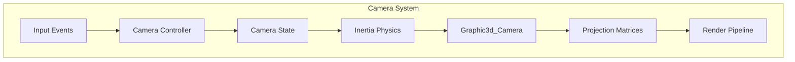

### 12.2 Default View

| Property | Value |
|----------|-------|
| Initial view | Isometric |
| Initial projection | Perspective (45° FOV) |
| Initial zoom | Fit default grid (100mm visible) |

### 12.3 Orbit — Sticky Pivot (Context-Aware)

**Core Innovation:** Orbit pivot is dynamically determined by user's focus, not static world origin.

**Pivot Determination Algorithm:**

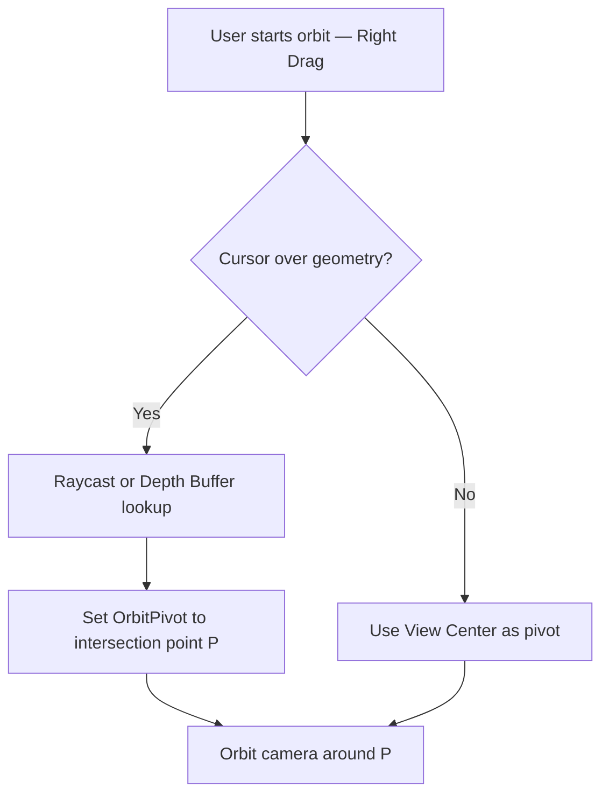

**Implementation Methods:**

| Method | Description | Performance |
|--------|-------------|-------------|
| Depth Buffer Unprojection | Read depth at pixel, unproject to 3D | O(1), instantaneous |
| Raycasting (BRepExtrema) | Analytic intersection with geometry | Precise but slower |

**Recommended:** Depth Buffer for interaction, Raycast for precision when needed.

### 12.4 Zoom — Cursor-Centric Logarithmic

| Property | Specification |
|----------|---------------|
| Zoom center | Cursor position (not screen center) |
| Zoom curve | Logarithmic (natural perception) |
| Zoom speed | Configurable in preferences |
| Zoom limits | Min: 0.001mm visible, Max: 1km visible |

**Logarithmic Formula:**
```
scale_new = scale_old * e^(wheel_delta * sensitivity)
```

### 12.5 Inertial Physics

Camera movements possess mass and friction for fluid, physical feel:

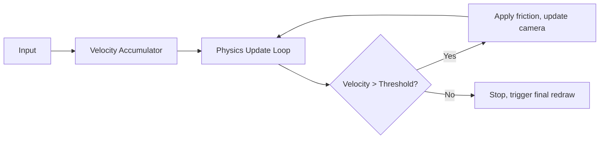

**Physics Parameters:**

| Parameter | Value | Description |
|-----------|-------|-------------|
| Friction coefficient | 0.92 | Per-frame velocity decay |
| Velocity threshold | 0.001 | Below this, stop animation |
| Update rate | 60 Hz | Animation frame rate |

### 12.6 Projection Toggle — Dolly Zoom (Vertigo Effect)

Seamless transition between Perspective and Orthographic that preserves object screen size:

**Mathematical Derivation:**

For Orthographic → Perspective transition:
```
D_new = H_viewport / (2 × S_ortho × tan(θ_target/2))
```

Where:
- `D_new` = New distance from eye to pivot
- `H_viewport` = Viewport height in pixels
- `S_ortho` = Current orthographic scale
- `θ_target` = Target perspective FOV (typically 45°)

**Transition Steps:**
1. Identify Pivot Point (P) at screen center or cursor
2. Calculate required distance
3. Animate Eye position along view vector
4. Switch projection type
5. Apply AutoZFit to prevent clipping

### 12.7 Standard View Snapping

When camera aligns near canonical axis (< 5° deviation):
- Trigger 100ms animation to snap perfectly
- "Magnetic" alignment for orthographic sketching

### 12.8 View Cube

**Location:** Top-right corner of viewport

**Interactions:**
- Click face: Snap to that standard view (animated)
- Click edge: Snap to edge view
- Click corner: Snap to isometric from that corner
- Drag on cube: Orbit camera
- Visual feedback: Highlight hovered element

**Standard Views:**

| Click Target | View |
|--------------|------|
| Front face | Front view (-Y) |
| Back face | Back view (+Y) |
| Left face | Left view (-X) |
| Right face | Right view (+X) |
| Top face | Top view (+Z) |
| Bottom face | Bottom view (-Z) |
| Top-front-right corner | Isometric |

### 12.9 Horizon Lock

**Purpose:** Prevent accidental camera roll (Z-axis rotation)

| Setting | Behavior |
|---------|----------|
| Enabled (default) | Up vector constrained, "floor" stays flat |
| Disabled | Free 3-axis rotation |

---

## 13. Transformation Gizmo System

### 13.1 Gizmo Anatomy

The universal transformation widget for Move, Rotate, Scale:

```
        Y (Green)
        │
        │    ○ (Rotation arc)
        │   ╱
        ├──●──── X (Red)
       ╱ ╲
      ╱   ╲
     Z     ▢ (XY plane tile)
   (Blue)
```

**Components:**
- 3 linear arrows (X, Y, Z axes)
- 3 planar tiles (XY, YZ, ZX planes)
- 3 rotation arcs
- Center point (pivot, draggable)
- Copy badge (+)

### 13.2 Gizmo Behaviors

| Component | Action | Result |
|-----------|--------|--------|
| Arrow | Drag along axis | Move in 1D |
| Plane tile | Drag on plane | Move in 2D |
| Rotation arc | Drag around axis | Rotate |
| Center point | Drag to vertex | Relocate pivot |
| Copy badge | Toggle | Next action creates copy |

### 13.3 Auto-Orientation

Gizmo aligns with **local geometry** of selection, not world axes:
- If object is rotated 45°, gizmo rotates 45°
- Essential for assembly operations

### 13.4 Pivot Relocation

**Critical Feature:** Drag gizmo center to any vertex/point to change rotation/scale origin.

**Example Use:** "Rotate this door around its hinge vertex"

### 13.5 Numeric Input Integration

| Property | Behavior |
|----------|----------|
| During drag | Floating dimension label updates in real-time |
| Click label | Enter precise numeric value |
| Tab | Move to next parameter field |
| Enter | Confirm value |

---

## 14. Data Model & Entity Management

### 14.1 Entity Identification

**Hierarchical Path with UUIDs:**

```
document-uuid/
├── body-uuid-1/
│   ├── face-uuid-1
│   ├── face-uuid-2
│   │   ├── edge-uuid-1
│   │   └── edge-uuid-2
│   └── ...
├── body-uuid-2/
└── sketch-uuid-1/
    ├── line-uuid-1
    ├── circle-uuid-1
    └── constraint-uuid-1
```

**Path Format:** `{parent-uuid}/{entity-uuid}`

**Benefits:**
- Globally unique identification
- Hierarchical relationships preserved
- Stable references for undo/redo
- Compatible with ElementMap

### 14.2 Entity Naming

**Auto-Generated Names:**

| Entity Type | Name Pattern | Example |
|-------------|--------------|---------|
| Body | "Body {n}" | Body 1, Body 2 |
| Sketch | "Sketch {n}" | Sketch 1 |
| Feature | "{Operation} {n}" | Extrude 1, Fillet 2 |

**Combined Body Naming:**
When bodies are combined via boolean union:
- Result name: "{Body A} + {Body B}"
- Example: "Body 1 + Body 2"

**User Rename:**
- Double-click name in navigator to edit
- Names stored in document, not derived

### 14.3 Entity Deletion Cascade

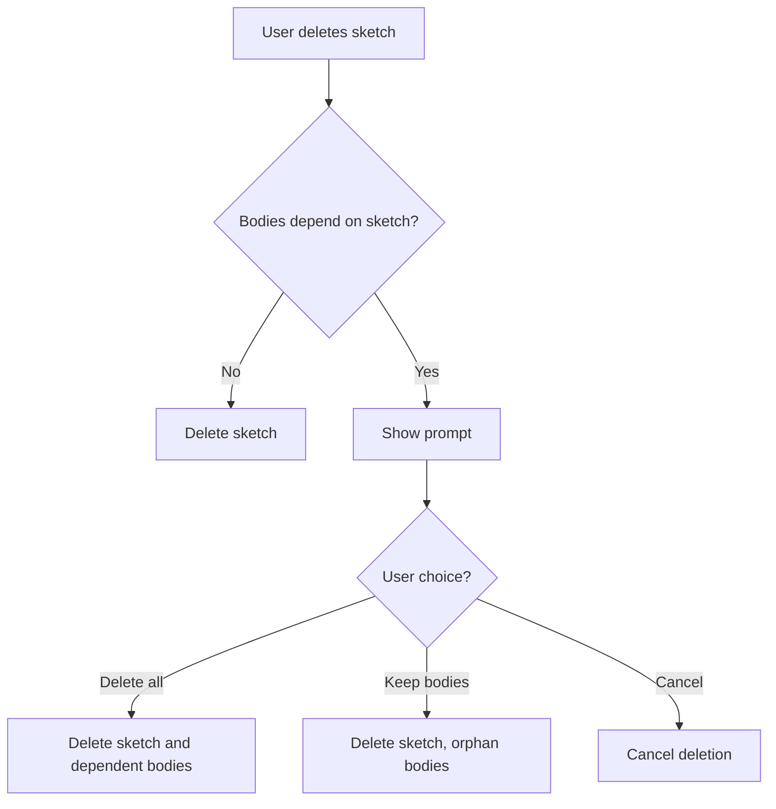

---

## 15. Topological Naming System

### 15.1 The Topological Naming Problem (TNP)

**Problem:** OCCT doesn't assign persistent IDs to sub-shapes. References are ephemeral memory pointers or indices that change when shape is recomputed.

**Impact:** Features referencing faces/edges by index break when earlier features change topology.

### 15.2 Multi-Layered Defense Architecture

OneCAD implements a **Defense-in-Depth** approach:

```mermaid
flowchart TB
    subgraph "Layer 1: History-Based Naming"
        HK[History Keeper]
        MAP[Shape Mapping per Operation]
        OCCT_API[OCCT Modified/Generated/Deleted APIs]
    end
    
    subgraph "Layer 2: Resolution Engine"
        GEO[Geometric Signatures]
        SPATIAL[Spatial Hashing]
        MATCH[Best-Match Algorithm]
    end
    
    subgraph "Layer 3: Semantic Selection"
        INTENT["Top Face" Logic]
        RULES[Semantic Rules]
        FALLBACK[Query-based Fallback]
    end
    
    subgraph "Layer 4: User Interface"
        VIS[Visual Error Indication]
        REBIND[Re-bind Dialog]
        RECOVER[Recovery Suggestions]
    end
    
    HK --> GEO
    GEO --> INTENT
    INTENT --> VIS
```

### 15.3 ElementMap Implementation

**Core Data Structure:**

```cpp
struct ElementEntry {
    ElementId id;           // Hierarchical UUID path
    ElementKind kind;       // Face, Edge, Vertex
    TopoDS_Shape shape;     // Current OCCT shape
    std::string opId;       // Operation that created/modified
    std::vector<ElementId> sources;  // Parent element IDs
    ElementDescriptor descriptor;    // Geometric signature
};

class ElementMap {
    std::unordered_map<ElementId, ElementEntry> entries_;
    std::unordered_map<TopoDS_Shape, std::vector<ElementId>> shapeToIds_;
    // ...
};
```

### 15.4 ElementDescriptor — Geometric Signatures

Rich descriptors for ambiguity resolution:

| Property | Purpose |
|----------|---------|
| Shape type | TopAbs_FACE, TopAbs_EDGE, TopAbs_VERTEX |
| Bounding box center | Spatial location |
| Size/magnitude | Area, length, or position |
| Surface/curve type | Plane, Cylinder, BSpline, etc. |
| Normal/tangent | Orientation information |
| Adjacency hash | Connected elements signature |

### 15.5 History Tracking via OCCT APIs

For each modeling operation, track topology evolution:

```cpp
// After boolean/fillet/extrude:
const BRepAlgoAPI_BooleanOperation& algo = ...;

for (auto& entry : entries_) {
    if (algo.IsDeleted(entry.shape)) {
        // Mark as deleted
    }
    
    TopTools_ListOfShape modified = algo.Modified(entry.shape);
    if (!modified.IsEmpty()) {
        // Update entry with best match from modified list
    }
    
    TopTools_ListOfShape generated = algo.Generated(entry.shape);
    // Register new elements with parent reference
}
```

### 15.6 Split Handling (Critical)

When one face splits into multiple:

```mermaid
flowchart TD
    A[Face A] -->|Cut operation| B[Face A' + Face A'']
    B --> C{Assign IDs}
    C --> D["A/split-0 = A' (best match)"]
    C --> E["A/split-1 = A'' (sibling)"]
```

**Implementation:**
- Detect multi-result `Modified()`
- Sort results deterministically (by centroid X→Y→Z)
- Create sibling IDs with stable naming
- Mark original as having split children

### 15.7 Resolution Engine

When ElementMap can't directly find a shape:

```mermaid
flowchart TD
    A[Request: Resolve ElementId] --> B{Direct lookup?}
    B -->|Found| C[Return shape]
    B -->|Not found| D[Resolution Engine]
    D --> E[Compute descriptor of target]
    E --> F[Find candidates with matching kind]
    F --> G[Score candidates by descriptor similarity]
    G --> H{Best match > threshold?}
    H -->|Yes| I[Return best match]
    H -->|No| J[Try semantic fallback]
    J --> K{Semantic rule matches?}
    K -->|Yes| L[Return semantic match]
    K -->|No| M[Report broken reference]
```

### 15.8 Semantic Selection Rules

Capture user intent beyond raw topology:

| Rule | Stored Attributes | Fallback Query |
|------|-------------------|----------------|
| "Top Face" | Normal=(0,0,1), Z=Max | Find planar face with max Z |
| "Front Face" | Normal=(0,-1,0) | Find face facing -Y |
| "Largest Face" | Area=Max | Find face with greatest area |

### 15.9 ElementMap Serialization

For document persistence:

```json
{
  "entries": [
    {
      "id": "body-uuid/extrude1/face-42",
      "kind": "Face",
      "opId": "op-extrude-uuid-1234",
      "sources": ["sketch1/region-1"],
      "descriptor": {
        "shapeType": 4,
        "center": [0.0, 0.0, 10.0],
        "size": 14.142,
        "magnitude": 100.0,
        "surfaceType": "Plane",
        "normal": [0.0, 0.0, 1.0]
      }
    }
  ]
}
```

**Note:** The `TopoDS_Shape` is reconstructed by replaying feature history. Descriptor serves as validation/matching fallback.

### 15.10 Implementation Status & Fixes Applied

| Issue | Status | Solution |
|-------|--------|----------|
| Non-deterministic ID generation | ✅ Fixed | IDs derived from parent/opId + descriptor hash + stable ordering |
| Split handling | ✅ Fixed | Multi-result Modified() creates sibling IDs |
| Serialization | ✅ Fixed | write/read methods, string round-trip |
| Rich descriptors | ✅ Fixed | Surface/curve types, normal/tangent, adjacency hash |
| Reverse map | ✅ Fixed | Shape to multiple IDs supported |
| Performance | ✅ Optimized | Fast-path for single-candidate history |

**Remaining Work:**
- Formal test suite (split/merge/pattern/persistence scenarios)
- Document-layer persistence wiring for `.onecad` format

---

## 16. Command & Undo/Redo System

### 16.1 Command Pattern Architecture

```mermaid
classDiagram
    class ICommand {
        <<interface>>
        +id: UUID
        +name: String
        +timestamp: DateTime
        +execute() Result
        +undo() Result
        +redo() Result
    }
    
    class CommandProcessor {
        -undoStack: ICommand[]
        -redoStack: ICommand[]
        -maxUndoDepth: Int
        +execute(ICommand) Result
        +undo() Result
        +redo() Result
        +canUndo() Bool
        +canRedo() Bool
        +beginTransaction(name)
        +commitTransaction()
        +rollbackTransaction()
    }
    
    class Transaction {
        -name: String
        -commands: ICommand[]
        +execute() Result
        +undo() Result
    }
    
    ICommand <|-- ExtrudeCommand
    ICommand <|-- BooleanCommand
    ICommand <|-- ConstraintCommand
    ICommand <|-- PatternCommand
    ICommand <|-- Transaction
    CommandProcessor --> ICommand
```

### 16.2 Undo/Redo Specifications

| Property | Specification |
|----------|---------------|
| Undo depth | Unlimited (memory permitting) |
| Object identity | Preserved across undo/redo |
| Transaction grouping | Related ops = single undo point |
| Redo clearing | New operation clears redo stack |
| Memory management | Old commands pruned if memory critical |

### 16.3 Transaction Grouping

Operations that create multiple internal commands appear as single undo:

| User Action | Internal Commands | Undo Shows |
|-------------|-------------------|------------|
| Create rectangle | 4 lines + 4 constraints | "Create Rectangle" |
| Pattern (5 copies) | 5 body creations | "Linear Pattern" |
| Fillet (3 edges) | 3 fillet operations | "Fillet" |

---

## 17. File System

### 17.1 File Locations

| Type | Location |
|------|----------|
| **Documents (default)** | `~/Documents/OneCAD/` |
| **Autosave** | `~/Library/Application Support/OneCAD/Autosave/` |
| **Preferences** | `~/Library/Preferences/com.onecad.app.plist` |
| **Cache** | `~/Library/Caches/OneCAD/` |
| **Logs** | `~/Library/Logs/OneCAD/` |

### 17.2 File Formats — v1.0

| Format | Extension | Direction | Description |
|--------|-----------|-----------|-------------|
| **OneCAD Native** | `.onecad` | Read/Write | Full model with history + ElementMap |
| **STEP** | `.step`, `.stp` | Import/Export | Industry standard exchange |

### 17.3 Native Format Structure

```mermaid
flowchart TB
    subgraph NativeFile[".onecad File Structure"]
        META[Metadata Section]
        
        subgraph Geometry["Geometry Section"]
            BREP[B-Rep Data — OCCT BRep format]
            EMAP[ElementMap Data]
        end
        
        subgraph Sketches["Sketches Section"]
            SKEL[Sketch Geometry]
            CONS[Constraints]
            FACES[Face Definitions]
            PROJ[Projected Edge References]
        end
        
        subgraph History["Feature History Section"]
            OPS[Operation Sequence]
            PARAMS[Parameters]
            DEPS[Dependencies]
        end
        
        subgraph Display["Display State Section"]
            CAM[Camera Position]
            VIS[Visibility States]
            NAMES[Custom Names]
        end
    end
```

### 17.4 Autosave

| Property | Value |
|----------|-------|
| Interval | 5 minutes (configurable) |
| Location | Application Support directory |
| Format | Native format with `.autosave` extension |
| Naming | `{original-name}-{timestamp}.autosave` |
| Cleanup | Remove autosaves older than 7 days |

### 17.5 Recent Files

| Property | Value |
|----------|-------|
| Count | 10 files |
| Location | File menu |
| Persistence | Stored in preferences |
| Missing file handling | Show grayed with "(not found)" |

---

## 18. Rendering System

### 18.1 Qt RHI Configuration

| Property | Specification |
|----------|---------------|
| Backend | OpenGL (for OCCT context sharing) |
| Render mode | On-demand (not continuous 60 FPS) |
| VSync | Enabled |
| Sample count | 4x MSAA |
| Reverse-Z | Enabled for depth precision |

### 18.2 On-Demand Render Loop

CAD applications should not render continuously:

```mermaid
flowchart LR
    A[Idle State] -->|Input Event| B[Event Processing]
    B --> C[Update Camera/State]
    C --> D[Request Update]
    D --> E[Render Frame]
    E --> F{Inertia active?}
    F -->|Yes| G[Schedule next frame]
    F -->|No| A
    G --> C
```

### 18.3 Display Modes

| Mode | Description | Default |
|------|-------------|:-------:|
| **Shaded + Edges** | Solid shading with edge overlay | ✅ |
| **Shaded** | Solid shading only | |
| **Wireframe** | Edges only | |

### 18.4 Progressive Tessellation

```mermaid
flowchart LR
    A[Operation Completes] --> B[Show Coarse Mesh Immediately]
    B --> C[Background: Compute Fine Mesh]
    C --> D[Swap to Fine Mesh]
    D --> E[Cache Fine Mesh]
```

| Phase | Tessellation Quality | Purpose |
|-------|---------------------|---------|
| Coarse | Linear: 1.0mm, Angular: 5° | Instant feedback |
| Medium | Linear: 0.1mm, Angular: 1° | Standard display |
| Fine | Linear: 0.01mm, Angular: 0.5° | High quality |

### 18.5 Dynamic Quality During Navigation

During camera movement (orbit/pan/zoom):
1. Disable MSAA anti-aliasing
2. Use coarse tessellation
3. Disable shadows/reflections if present

On movement stop:
1. Restore high-quality settings
2. Trigger final redraw

### 18.6 Reverse-Z Depth Buffering

For large-scale models (100m building with 2mm screws):

```cpp
view->ChangeRenderingParams().ToReverseDepth = Standard_True;
```

Provides logarithmic depth precision, preventing Z-fighting.

---

## 19. Error Handling & Visual Debugging

### 19.1 Error Handling Philosophy

Move beyond generic error messages. Implement **Visual Debugging** (inspired by "Geometry Doctor" concept):

```mermaid
flowchart TD
    A[Error Occurs] --> B[Log Technical Details]
    B --> C[Generate User Message]
    C --> D{Error Type}
    D -->|Constraint Conflict| E[Highlight conflicting constraints]
    D -->|Boolean Failure| F[Highlight problem geometry]
    D -->|Reference Broken| G[Show broken reference indicator]
    E --> H[Offer actionable fixes]
    F --> H
    G --> H
    H --> I[Display in UI]
```

### 19.2 Constraint Conflict Resolution

**Problem:** Shapr3D shows generic "This constraint would conflict" message without visual help.

**OneCAD Solution:**

| Feature | Implementation |
|---------|----------------|
| Highlight conflicting constraints | Red color on problem constraints |
| Zoom to problem area | Auto-focus on conflict location |
| Dim unrelated geometry | Isolate the problem |
| Offer "Relax Constraint" button | One-click fix option |

### 19.3 Boolean Operation Failures

**Problem:** "Operation failed because the resulting body wouldn't be valid" is a "Black Box" error.

**OneCAD Solution:**

| Feature | Implementation |
|---------|----------------|
| Highlight intersecting faces | Red highlighting on failure area |
| Heat map of problem | Gradient showing severity |
| Gap detection | Show where bodies don't touch |
| Offer "Offset Face by 0.01mm" | Automatic fix suggestion |

### 19.4 Broken Reference Handling

When ElementMap can't resolve a reference:

```mermaid
flowchart TD
    A[Broken Reference Detected] --> B[Visual Indicator on Model]
    B --> C[Red highlight where reference was]
    C --> D[Click to open Re-bind Dialog]
    D --> E[User selects new target]
    E --> F[Update reference]
```

**Re-bind Dialog:**
- Shows what was referenced
- Offers candidates for re-binding
- Allows manual selection

### 19.5 Error Message Standards

| Error Type | Technical Log | User Message | Visual Feedback |
|------------|---------------|--------------|-----------------|
| Boolean no intersection | Full stack trace | "The selected bodies do not overlap." | Highlight gap |
| Invalid geometry | OCCT exception details | "The geometry could not be processed." | Highlight problem area |
| Constraint conflict | Solver state dump | "This constraint conflicts with existing ones." | Highlight conflicting constraints |
| Reference broken | ElementId that failed | "This feature's reference could not be found." | Red indicator on feature |

### 19.6 Constraint Solver Failures

| Failure Type | Behavior |
|--------------|----------|
| Cannot solve | Revert to last valid state |
| Over-constrained | Highlight redundant constraints in orange |
| Conflicting | Highlight conflicting constraints in red |

---

## 20. Performance Requirements

### 20.1 Target Metrics

| Metric | Target | Minimum Acceptable |
|--------|--------|-------------------|
| Viewport FPS (idle) | 60 | 30 |
| Viewport FPS (orbit) | 60 | 30 |
| Selection response | < 30 ms | < 100 ms |
| Extrude operation | < 100 ms | < 300 ms |
| Boolean (simple) | < 300 ms | < 1 s |
| Boolean (complex) | < 2 s | < 5 s |
| File open (10 MB) | < 1 s | < 3 s |
| Cold start | < 2 s | < 4 s |
| Loop detection update | < 50 ms | < 100 ms |

### 20.2 Scalability Targets

| Complexity | Bodies | Faces | Expected Performance |
|------------|--------|-------|---------------------|
| Simple | < 50 | < 5,000 | Full 60 FPS |
| Medium | 50-200 | < 50,000 | Smooth interaction |
| Large | 200-500 | < 200,000 | Usable, operations slower |
| **Target Max** | **500** | **500,000** | **UI responsive** |

### 20.3 Large Model Behavior

At maximum complexity (500 bodies):
- UI remains responsive at all times
- Operations may take longer (progress shown)
- All features remain available
- Dynamic quality reduction during navigation

### 20.4 Background Operations

**All geometry operations > 100ms run on background thread:**

```mermaid
flowchart LR
    A[User Initiates] --> B[Show Progress]
    B --> C[Execute on Background]
    C --> D[Update UI on Main Thread]
    D --> E[Hide Progress]
    
    C --> F{User Cancels?}
    F -->|Yes| G[Abort, Revert State]
```

**Cancellation:**
- Operations > 500 ms show cancel button
- Clean abort with state reversion
- No partial results left in document

### 20.5 Lazy Evaluation for ElementMap

Don't construct full ID map for every operation:

| Strategy | Description |
|----------|-------------|
| Store deltas | Journal of changes per operation |
| Resolve on demand | Traverse journal only when requested |
| Complexity reduction | O(K × D) instead of O(N × M) |

Where K = queries, D = history depth, N = operations, M = faces.

### 20.6 Spatial Indexing

For geometric heuristic checks:
- Index faces in R-Tree or Octree
- Quickly discard geometrically distant candidates
- Avoid expensive exact intersection tests

---

## 21. Preferences System

### 21.1 Preference Categories

#### General

| Preference | Type | Default | Options |
|------------|------|---------|---------|
| Theme | Enum | System | Light, Dark, System |
| Language | Enum | System | English (v1) |
| Check for updates | Bool | false | — |

#### Units

| Preference | Type | Default | Options |
|------------|------|---------|---------|
| Display unit | Enum | mm | mm, cm, m |
| Precision | Int | 2 | 0-6 decimal places |

#### Sketch

| Preference | Type | Default | Options |
|------------|------|---------|---------|
| Auto-constrain | Bool | false | — |
| Grid visible | Bool | true | — |
| Snap to grid | Bool | true | — |
| Construction visibility after face | Enum | Hidden | Hidden, Visible |

#### Modeling

| Preference | Type | Default | Options |
|------------|------|---------|---------|
| Default draft angle | Float | 0° | 0-89° |
| Sketch edit behavior | Enum | Ask | Ask, Regenerate if Constrained, Always Direct |
| Preview opacity | Float | 0.35 | 0.1-0.5 |

#### View

| Preference | Type | Default | Options |
|------------|------|---------|---------|
| Default view | Enum | Isometric | Front, Top, Isometric, etc. |
| Orbit center | Enum | Cursor | World Origin, Geometry, Selection, Cursor |
| Show view cube | Bool | true | — |
| Zoom speed | Float | 1.0 | 0.5-2.0 |
| Horizon lock | Bool | true | — |
| Inertia enabled | Bool | true | — |

#### Selection

| Preference | Type | Default | Options |
|------------|------|---------|---------|
| Box select mode | Enum | Crossing | Inside, Crossing, User Direction |
| Deep select popup | Bool | true | — |

#### Files

| Preference | Type | Default | Options |
|------------|------|---------|---------|
| Autosave interval | Int | 5 | 1-30 minutes |
| Autosave enabled | Bool | true | — |
| Create backup on save | Bool | true | — |
| Recent files count | Int | 10 | 5-20 |

#### Performance

| Preference | Type | Default | Options |
|------------|------|---------|---------|
| Tessellation quality | Enum | Medium | Low, Medium, High |
| Memory warning threshold | Int | 80% | 50-95% |
| Dynamic quality during navigation | Bool | true | — |

### 21.2 Navigation Presets

For users coming from other CAD software:

| Preset | Orbit | Pan | Zoom |
|--------|-------|-----|------|
| OneCAD (default) | Right drag | Shift+Right or Middle | Scroll |
| SolidWorks | Middle drag | Ctrl+Middle | Scroll |
| Fusion 360 | Shift+Middle | Middle | Scroll |

### 21.3 Preference Storage

| Property | Value |
|----------|-------|
| Location | macOS Preferences system |
| Format | Property list |
| Bundle ID | com.onecad.app |
| iCloud sync | v2.0 |

---

## 22. OCCT Integration

### 22.1 Required Modules

| Module | Purpose |
|--------|---------|
| TKernel | Foundation classes |
| TKMath | Mathematical utilities |
| TKG2d | 2D geometry |
| TKG3d | 3D geometry |
| TKGeomBase | Basic geometric entities |
| TKBRep | B-Rep topology |
| TKTopAlgo | Topological algorithms |
| TKPrim | Primitive creation |
| TKBO | Boolean operations |
| TKFillet | Fillets and chamfers |
| TKOffset | Offsets and drafts |
| TKXS | STEP I/O |
| TKMesh | Tessellation |

### 22.2 Key Operations Mapping

| OneCAD Operation | OCCT Class/Method |
|------------------|-------------------|
| Extrude | BRepPrimAPI_MakePrism |
| Revolve | BRepPrimAPI_MakeRevol |
| Union | BRepAlgoAPI_Fuse |
| Subtract | BRepAlgoAPI_Cut |
| Intersect | BRepAlgoAPI_Common |
| Fillet | BRepFilletAPI_MakeFillet |
| Chamfer | BRepFilletAPI_MakeChamfer |
| Draft | BRepOffsetAPI_DraftAngle |
| Push/Pull | BRepPrimAPI_MakePrism + BRepAlgoAPI_Fuse/Cut |
| Offset Face | BRepOffsetAPI_MakeOffset |
| Tessellation | BRepMesh_IncrementalMesh |
| STEP Import | STEPControl_Reader |
| STEP Export | STEPControl_Writer |

### 22.3 History API Usage

```cpp
// After any modeling operation:
const BRepAlgoAPI_BooleanOperation& algo = ...;

// Check what happened to each original shape
TopTools_ListOfShape modified = algo.Modified(oldShape);
TopTools_ListOfShape generated = algo.Generated(oldShape);
bool deleted = algo.IsDeleted(oldShape);
```

### 22.4 Camera Integration

Use `AIS_ViewController` as base, customize for sticky pivot:

```cpp
class OneCadCameraController : public AIS_ViewController {
    gp_Pnt orbitPivot_;
    
    void UpdateOrbitPivot(const gp_Pnt& cursor3D) {
        orbitPivot_ = cursor3D;
    }
    
    void HandleOrbit(double dx, double dy) override {
        // Rotate around orbitPivot_, not view center
        // ...
    }
};
```

### 22.5 OCCT Licensing

| Property | Value |
|----------|-------|
| License | LGPL 2.1 with Open CASCADE Exception |
| Commercial use | ✅ Permitted |
| Attribution required | ✅ Yes |
| Source disclosure | Only if OCCT modified |

---

## 23. PlaneGCS Integration

### 23.1 Solver Configuration

| Property | Value |
|----------|-------|
| Primary algorithm | DogLeg |
| Fallback algorithm | Levenberg-Marquardt |
| Tolerance | 1e-10 |
| Max iterations | 100 |
| Redundancy detection | Enabled |

### 23.2 Solver Behavior

| Scenario | Behavior |
|----------|----------|
| Solution found | Update geometry positions |
| No solution | Revert to last valid state |
| Redundant constraint | Allow with warning (orange) |
| Conflicting constraints | Highlight conflicts (red), revert |

### 23.3 Solver Integration Architecture

**Library Location:**

```
third_party/planegcs/         # PlaneGCS library source (extracted from FreeCAD)
├── GCS.cpp
├── Constraints.cpp
├── SubSystem.cpp
└── ...

src/core/sketch/solver/       # Wrapper layer
├── ConstraintSolver.h/cpp    # Wrapper for GCS::System
├── SolverAdapter.h/cpp       # Sketch → PlaneGCS conversion
└── SolverTypes.h             # Type definitions
```

**Build Configuration:**

```cmake
# third_party/planegcs/CMakeLists.txt
add_library(planegcs STATIC
    GCS.cpp
    Constraints.cpp
    SubSystem.cpp
)

# src/core/sketch/solver/CMakeLists.txt
target_link_libraries(onecad_sketch PRIVATE planegcs)
```

**Licensing Compliance:**
- PlaneGCS: LGPL 2.1+
- OneCAD: MIT
- **Approach:** Static linking with object file provision for LGPL compliance
- **Documentation:** Include LGPL compliance notice in LICENSE file

### 23.4 Solver Wrapper Implementation

**Constraint Solver Class:**

```cpp
// src/core/sketch/solver/ConstraintSolver.h
namespace onecad::core::sketch {

class ConstraintSolver {
public:
    ConstraintSolver();

    // Configuration
    void setTolerance(double tol);        // Default: 1e-4mm (optimized)
    void setMaxIterations(int max);       // Default: 100
    void setAlgorithm(Algorithm algo);    // DogLeg (primary), LM (fallback)

    // Solving
    enum class SolveStatus { Success, Failed, NumericalIssue, Timeout };
    SolveStatus solve();

    // DOF analysis
    int degreesOfFreedom() const;
    double getResidual() const;  // For drag resistance calculation

    // Conflict detection
    struct ConflictInfo {
        std::vector<SketchConstraint::ID> conflictingConstraints;
        std::string description;
    };
    std::optional<ConflictInfo> detectConflicts() const;

    // Parameter management
    void addParameter(const std::string& name, double* value);
    void addConstraint(GCS::ConstraintType type, /* params */);
    void clear();

private:
    std::unique_ptr<GCS::System> m_gcsSystem;
    double m_tolerance = 1e-4;   // Optimized for maker CAD
    int m_maxIterations = 100;
    std::map<int, SketchConstraint::ID> m_constraintIdMap;  // GCS index → Sketch ID
};

} // namespace onecad::core::sketch
```

**Solver Configuration Decisions:**

| Property | Value | Rationale |
|----------|-------|-----------|
| **Tolerance** | 1e-4mm (0.1 micron) | Sufficient for 3D printing, faster convergence |
| **Max iterations** | 100 | PlaneGCS default, proven in FreeCAD |
| **Algorithm** | DogLeg → LM fallback | Automatic, user-transparent |
| **Redundancy detection** | Enabled | Critical for conflict warnings |

**Tolerance Note:**
Original §23.1 suggested 1e-10, but this is over-precision for maker CAD. 3D printing tolerance ~0.1mm, so 1e-4mm is 1000× finer and provides faster solver convergence.

### 23.5 Solver Adapter — Sketch to PlaneGCS Conversion

**Direct Parameter Binding:**

```cpp
class SolverAdapter {
public:
    static void populateSolver(Sketch& sketch, ConstraintSolver& solver) {
        solver.clear();

        // Direct binding: PlaneGCS owns pointers to sketch entity data
        for (auto& [id, point] : sketch.points()) {
            gp_Pnt2d& pos = point->position();
            solver.addParameter("point_" + id + "_x", &pos.ChangeCoord(1));
            solver.addParameter("point_" + id + "_y", &pos.ChangeCoord(2));
        }

        // Convert sketch constraints to PlaneGCS constraints
        for (const auto& constraint : sketch.constraints()) {
            addConstraintToSolver(constraint, solver);
        }
    }

private:
    static void addConstraintToSolver(const SketchConstraint* constraint, ConstraintSolver& solver) {
        switch (constraint->type()) {
            case ConstraintType::Distance:
                solver.addConstraint(GCS::ConstraintType::Distance, ...);
                break;
            case ConstraintType::Parallel:
                solver.addConstraint(GCS::ConstraintType::Parallel, ...);
                break;
            case ConstraintType::Tangent:
                solver.addConstraint(GCS::ConstraintType::Tangent, ...);
                break;
            // ... other types
        }
    }
};
```

### 23.6 Solver Execution Timing & Threading

**Interactive Drag Performance:**

| Configuration | Value | Rationale |
|---------------|-------|-----------|
| **Solve frequency** | 30 FPS (33ms throttle) | Smooth dragging, not overkill |
| **Background thread threshold** | >100 entities | Prevents UI freezing |
| **Threading method** | QtConcurrent::run | Simple, Qt-integrated |
| **Solver timeout** | 5 seconds | Prevents infinite hangs |

**Throttled Solving:**

```cpp
void SketchEngine::onMouseMove(QMouseEvent* event) {
    auto now = std::chrono::steady_clock::now();
    auto elapsed = now - m_lastSolveTime;

    if (elapsed > std::chrono::milliseconds(33)) {  // 30 FPS
        if (m_constraints.empty()) {
            applyDirectDrag();  // Bypass solver optimization
        } else {
            m_solver->solve();
            m_lastSolveTime = now;
        }
        update();
    }
}
```

**Background Threading:**

```cpp
void SketchEngine::solve() {
    if (m_sketch->entities().size() > 100) {
        m_solveFuture = QtConcurrent::run([this]() {
            QElapsedTimer timer;
            timer.start();

            auto status = m_solver->solve(GCS::Algorithm::DogLeg);
            if (status == ConstraintSolver::SolveStatus::Failed) {
                status = m_solver->solve(GCS::Algorithm::LevenbergMarquardt);
            }

            if (timer.elapsed() > 5000) {
                return ConstraintSolver::SolveStatus::Timeout;
            }
            return status;
        });

        connect(&m_futureWatcher, &QFutureWatcher<ConstraintSolver::SolveStatus>::finished,
                this, &SketchEngine::onSolveComplete);
        m_futureWatcher.setFuture(m_solveFuture);
    } else {
        m_solver->solve();  // Synchronous for simple sketches
    }
}
```

### 23.7 Solver Failure Handling

**Failure Recovery:**

```cpp
void SketchEngine::onMouseDrag(const gp_Pnt2d& targetPos) {
    gp_Pnt2d oldPos = m_draggedEntity->position();

    m_draggedEntity->setPosition(targetPos);
    auto status = m_solver->solve();

    if (status != ConstraintSolver::SolveStatus::Success) {
        // Revert to pre-drag state
        m_draggedEntity->setPosition(oldPos);
        m_solver->solve();
        showTransientTooltip("Cannot move: constraints violated");
    }
    update();
}
```

**Conflict Detection:**

```cpp
std::optional<ConflictInfo> ConstraintSolver::detectConflicts() const {
    GCS::VEC_I redundant;
    m_gcsSystem->detectRedundant(redundant);

    if (!redundant.empty()) {
        ConflictInfo info;
        for (int idx : redundant) {
            info.conflictingConstraints.push_back(m_constraintIdMap[idx]);
        }
        info.description = "The following constraints are redundant or conflicting:";
        return info;
    }
    return std::nullopt;
}
```

### 23.8 DOF Calculation & Constraint Equations

**DOF Formula:**

```cpp
int Sketch::degreesOfFreedom() const {
    int totalDOF = 0;
    totalDOF += m_points.size() * 2;       // Points: 2 DOF (x, y)
    totalDOF += m_lines.size() * 0;        // Lines: 0 additional
    totalDOF += m_arcs.size() * 3;         // Arcs: 3 DOF (r, θ₁, θ₂)
    totalDOF += m_circles.size() * 1;      // Circles: 1 DOF (r)

    for (const auto& c : m_constraints) {
        totalDOF -= c->degreesRemoved();
    }
    return std::max(0, totalDOF);
}
```

**Constraint DOF Removal:**

| Constraint | DOF Removed |
|------------|-------------|
| Horizontal/Vertical | 1 |
| Distance | 1 |
| Coincident | 2 |
| Parallel/Perpendicular | 1 |
| Tangent | 1 |

---

## 24. Platform & Distribution

### 24.1 Application Identity

| Property | Value |
|----------|-------|
| Application name | OneCAD |
| Bundle identifier | com.onecad.app |
| Version scheme | Semantic (1.0.0) |

### 24.2 Distribution — v1.0

| Method | Status |
|--------|--------|
| Direct download (website) | ✅ Primary |
| Homebrew Cask | ✅ Supported |
| Mac App Store | ❌ Not in v1 |

### 24.3 Code Signing — v1.0

| Property | Status |
|----------|--------|
| Developer certificate | ❌ Not in v1 |
| Notarization | ❌ Not in v1 |
| Distribution | Local build / ad-hoc |

**Note:** Users will need to allow app in System Preferences > Security.

### 24.4 Auto-Update — v1.0

| Property | Status |
|----------|--------|
| Auto-update | ❌ Not in v1 |
| Update check | ❌ Not in v1 |
| Manual update | Download new version from website |

---

## 25. Open Source Strategy

### 25.1 Repository

| Property | Value |
|----------|-------|
| Platform | GitHub |
| Visibility | Public |
| License | MIT or Apache 2.0 |

### 25.2 Repository Structure

```
onecad/
├── CMakeLists.txt
├── LICENSE
├── README.md
├── CONTRIBUTING.md (v2)
├── src/
│   ├── app/              # Application layer
│   │   ├── commands/     # Command implementations
│   │   ├── tools/        # Tool state machines
│   │   ├── adaptive/     # Adaptive UI controller
│   │   └── document/     # Document management
│   ├── core/             # CAD core layer
│   │   ├── sketch/       # Sketch engine
│   │   ├── modeling/     # Modeling operations
│   │   ├── pattern/      # Pattern engine
│   │   └── loop/         # Loop detection
│   ├── kernel/           # OCCT wrappers
│   │   ├── shape/        # Shape wrappers
│   │   ├── elementmap/   # Topological naming
│   │   ├── resolution/   # Resolution engine
│   │   └── solver/       # PlaneGCS wrapper
│   ├── render/           # Qt RHI rendering
│   │   ├── viewport/     # Main viewport
│   │   ├── camera/       # Camera controller
│   │   ├── tessellation/ # Mesh generation
│   │   ├── gizmo/        # Transformation gizmo
│   │   └── visual/       # Visual feedback
│   ├── ui/               # Qt Widgets UI
│   │   ├── mainwindow/   # Main window
│   │   ├── toolbar/      # Adaptive toolbar
│   │   ├── inspector/    # Property inspector
│   │   ├── navigator/    # Model navigator
│   │   ├── history/      # History sidebar
│   │   ├── search/       # Command search
│   │   └── viewcube/     # View cube widget
│   └── io/               # File I/O
│       ├── native/       # Native format
│       └── step/         # STEP import/export
├── tests/
├── resources/
│   ├── icons/
│   ├── themes/
│   └── shaders/
└── third_party/
    ├── occt/
    ├── eigen/
    └── planegcs/
```

### 25.3 CI/CD

| Property | Value |
|----------|-------|
| Platform | GitHub Actions |
| Trigger | Every commit to main branch |
| Build targets | macOS (Apple Silicon) |
| Artifacts | Application bundle |

### 25.4 Governance — v1.0

| Property | Value |
|----------|-------|
| Decision making | Project maintainer |
| Issue templates | Not in v1 |
| PR templates | Not in v1 |
| Code of conduct | Not in v1 |

### 25.5 Documentation Strategy — v1.0

| Type | Strategy |
|------|----------|
| **Code Documentation** | Minimal, focus on self-explanatory code |
| **User Manual** | None for v1.0. Defer to v2.0. |
| **Help System** | None for v1.0. |

---

## 26. Implementation Roadmap

### 26.1 Timeline Overview

```mermaid
gantt
    title OneCAD v1.0 Development — 16 Months
    dateFormat YYYY-MM
    
    section Phase 1: Foundation
    Project setup, CMake, dependencies      :p1a, 2025-02, 3w
    Qt 6 application shell                  :p1b, after p1a, 3w
    OCCT wrapper layer                      :p1c, after p1b, 4w
    ElementMap + Resolution Engine          :p1d, after p1c, 4w
    Qt RHI viewport + OpenGL                :p1e, after p1d, 4w
    Camera controller with inertia          :p1f, after p1e, 3w
    View cube + navigation                  :p1g, after p1f, 2w
    
    section Phase 2: Sketching
    Sketch plane + grid system              :p2a, 2025-07, 3w
    PlaneGCS integration                    :p2b, after p2a, 3w
    Sketch tools (line, rect, circle, arc)  :p2c, after p2b, 4w
    Loop detection engine                   :p2d, after p2c, 3w
    Region highlighting                     :p2e, after p2d, 2w
    Constraint system + blue/green UI       :p2f, after p2e, 4w
    Face creation workflow                  :p2g, after p2f, 2w
    Sketch on face + edge projection        :p2h, after p2g, 3w
    
    section Phase 3: Modeling
    Extrude with draft angle                :p3a, 2025-11, 3w
    Revolve                                 :p3b, after p3a, 2w
    Boolean ops + visual error feedback     :p3c, after p3b, 4w
    Push/Pull direct modeling               :p3d, after p3c, 3w
    Transformation Gizmo                    :p3e, after p3d, 2w
    Fillet + Chamfer (variable)             :p3f, after p3e, 3w
    Linear + Circular patterns              :p3g, after p3f, 3w
    
    section Phase 4: Polish
    Adaptive UI + Command Search            :p4a, 2026-03, 3w
    Selection system (cycling, deep select) :p4b, after p4a, 3w
    Undo/Redo system                        :p4c, after p4b, 2w
    Native file format + ElementMap persist :p4d, after p4c, 3w
    STEP import/export                      :p4e, after p4d, 2w
    Light/Dark theme                        :p4f, after p4e, 2w
    Performance optimization                :p4g, after p4f, 3w
    Testing + bug fixes                     :p4h, after p4g, 4w
```

### 26.2 Phase 1: Foundation (Months 1-5)

**Deliverables:**
- CMake build system with all dependencies
- Qt 6 main window with menu structure
- OCCT C++ wrapper classes
- **ElementMap + Resolution Engine** (critical path)
- Qt RHI viewport with OpenGL backend
- Camera controller with sticky pivot and inertia
- View cube with click interaction
- On-demand render loop

**Critical:** ElementMap and Resolution Engine must be implemented in Phase 1.

### 26.3 Phase 2: Sketching (Months 6-10)

**Deliverables:**
- Sketch plane selection (standard planes + faces)
- Adaptive grid with snap
- PlaneGCS constraint solver
- Line, Rectangle, Circle, Arc, Ellipse tools
- **Automatic loop detection engine**
- **Real-time region highlighting**
- Constraint application with **blue/green visual feedback**
- Construction geometry workflow
- Face creation from detected regions
- Sketch on face with automatic edge projection

### 26.4 Phase 3: Modeling (Months 11-14)

**Deliverables:**
- Extrude with draft angle and smart boolean
- Revolve operation with helix support
- Boolean union, subtract, intersect with **visual error feedback**
- Push/pull face manipulation with body selection
- **Transformation Gizmo** with pivot relocation
- Variable radius fillet
- Variable distance chamfer
- Combined fillet/chamfer tool (drag direction)
- Linear and circular patterns

### 26.5 Phase 4: Polish (Months 15-16)

**Deliverables:**
- **Adaptive UI controller** with tool prediction
- **Command Search** feature
- Complete selection system with cycling and deep select
- Full undo/redo with transactions
- Native file format with ElementMap persistence
- STEP import/export
- Light and dark themes
- Dynamic quality during navigation
- Progressive tessellation
- Performance optimization
- Testing and bug fixes

---

## 27. Future Versions

### 27.1 v2.0 Planned Features

| Category | Features |
|----------|----------|
| **Extrude** | Symmetric, asymmetric, to face, through all |
| **New Operations** | Shell, sweep, loft |
| **Sketch Tools** | Spline/Bezier curves, text |
| **Patterns** | Pattern along path |
| **Export** | STL, OBJ, 3MF |
| **Import** | IGES |
| **Platform** | Intel Mac support (Universal Binary) |
| **UX** | Onboarding tutorial, in-app help, Navigation Wizard |
| **Infrastructure** | Auto-update (Sparkle), iCloud preferences sync |
| **File Recovery** | Partial recovery from corrupted files |
| **History** | History Optimizer (merge consecutive tweaks) |

### 27.2 Future Roadmap

| Version | Focus |
|---------|-------|
| v2.0 | Extended operations, more formats, Intel support |
| v3.0 | Windows/Linux support, plugin API |
| v4.0 | iPad version with Apple Pencil |
| v5.0 | AI-assisted features, collaboration |

---

## 28. Glossary

| Term | Definition |
|------|------------|
| **Adaptive UI** | Interface that predicts and shows relevant tools based on selection |
| **B-Rep** | Boundary Representation — solid modeling using faces, edges, vertices |
| **Construction Geometry** | Sketch elements used for reference, not creating faces |
| **Deep Select** | Popup to disambiguate overlapping entities at cursor |
| **Direct Modeling** | Modifying geometry without parametric history |
| **DOF** | Degrees of Freedom — free parameters in sketch |
| **Dolly Zoom** | Camera transition preserving object screen size |
| **ElementMap** | System for tracking topology through modeling operations |
| **Face** | Closed region in sketch ready for 3D operations |
| **Gizmo** | Visual widget for transformation operations |
| **Inertia** | Physics simulation for smooth camera movement |
| **Loop** | Closed path of connected edges in a sketch |
| **OCCT** | OpenCASCADE Technology — geometry kernel |
| **Parametric** | Model with editable feature history |
| **PlaneGCS** | 2D geometric constraint solver |
| **Push/Pull** | Direct face manipulation technique |
| **Qt RHI** | Qt's GPU abstraction layer |
| **Region** | Area enclosed by a detected loop |
| **Resolution Engine** | System for finding shapes when ElementMap fails |
| **Sticky Pivot** | Orbit center at cursor intersection point |
| **TNP** | Topological Naming Problem |
| **Topological Naming** | Stable identification of geometry through operations |

---

## 29. Appendix

### 29.1 Reference Links

**Qt Framework:**
- Qt 6: https://www.qt.io/product/qt6
- Qt RHI: https://doc.qt.io/qt-6/topics-graphics.html
- Qt Licensing: https://doc.qt.io/qt-6/licensing.html

**OpenCASCADE:**
- Documentation: https://dev.opencascade.org/doc/overview/html/
- Graphic3d_Camera: https://dev.opencascade.org/doc/refman/html/class_graphic3d___camera.html
- AIS_ViewController: https://unlimited3d.wordpress.com/2019/11/06/ais_viewcontroller-in-occt-7-4-0/
- Licensing: https://dev.opencascade.org/resources/licensing

**FreeCAD/PlaneGCS:**
- FreeCAD: https://github.com/FreeCAD/FreeCAD
- PlaneGCS: https://github.com/FreeCAD/FreeCAD/tree/main/src/Mod/Sketcher/App/planegcs
- TNP Algorithm: https://github.com/realthunder/FreeCAD_assembly3/wiki/Topological-Naming-Algorithm

**Eigen:**
- Documentation: https://eigen.tuxfamily.org/dox/

**Shapr3D Reference:**
- Help Center: https://support.shapr3d.com
- Design History: https://support.shapr3d.com/hc/en-us/articles/design-history

### 29.2 Color Reference

**Selection Colors (Light Mode):**
| State | Hex | RGB |
|-------|-----|-----|
| Pre-selection | #8080FF40 | 128, 128, 255, 64 |
| Primary | #2060FF | 32, 96, 255 |
| Secondary | #8040FF | 128, 64, 255 |
| Invalid | #FF8020 | 255, 128, 32 |

**Selection Colors (Dark Mode):**
| State | Hex | RGB |
|-------|-----|-----|
| Pre-selection | #6060FF40 | 96, 96, 255, 64 |
| Primary | #4080FF | 64, 128, 255 |
| Secondary | #A060FF | 160, 96, 255 |
| Invalid | #FFA040 | 255, 160, 64 |

**Sketch Constraint Colors:**
| State | Color | Hex |
|-------|-------|-----|
| Under-constrained | Blue | #4080FF |
| Fully constrained | Green | #40C040 |
| Over-constrained | Orange | #FFA000 |
| Conflicting | Red | #FF4040 |

### 29.3 Camera State Interpolation

| Parameter | Method | Reason |
|-----------|--------|--------|
| Eye Position | Linear (Lerp) | Euclidean space |
| Orientation | Spherical (Slerp) | Prevents distortion |
| FOV | Linear | Small range perception |
| Scale | Logarithmic | Human perception |
| Distance | Logarithmic | Prevents "crashing" |

### 29.4 Input Event Mapping (Shapr3D Style)

| Input | Context | Camera Action |
|-------|---------|---------------|
| Right Drag | Background | Orbit around View Center |
| Right Drag | Object | Orbit around Intersection (Sticky Pivot) |
| Shift + Right Drag | Any | Pan |
| Scroll Wheel | Any | Zoom towards Cursor (Logarithmic) |
| 2-Finger Rotate | Trackpad | Roll |
| 2-Finger Pinch | Trackpad | Zoom |
| 2-Finger Pan | Trackpad | Pan |
| Double Click | Face | Align Camera Normal to Face |

---

## Document History

| Version | Date | Changes |
|---------|------|---------|
| 1.0 | 2025-01 | Initial specification |
| 1.1 | 2025-01 | Added product decisions, v1/v2 scope, construction-first workflow |
| 1.2 | 2025-01 | Comprehensive update: sketch system, loop detection, selection cycling, ElementMap, error handling |
| 1.3 | 2026-01 | Refined: Startup behavior, draft angle input, documentation strategy |
| 1.4 | 2026-01 | Major update incorporating research: Adaptive UI, camera physics, transformation gizmo, topological naming multi-layer architecture, visual debugging, command search, Shapr3D UX patterns |

---

*End of OneCAD Specification Document v1.4*